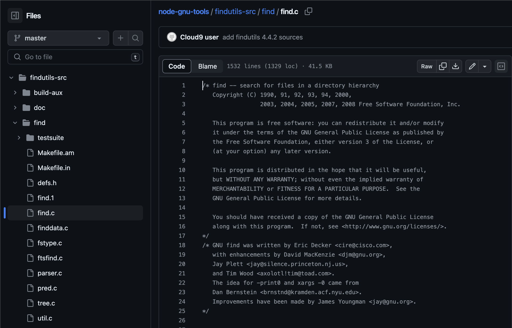

## 一、命令介绍

Linux find命令是类unix操作系统中最重要和最常用的命令行实用程序之一。find命令用于根据指定的条件搜索和定位与参数匹配的文件和目录列表。 
 
find命令提供了广泛的选项，允许用户在不同的条件下使用它。它使个人能够根据多种标准搜索文件，包括权限、用户、组、文件类型、日期、大小和各种其他参数。

find作为程序员工作台项目的一部分出现在Unix版本5中，由Dick Haight与cpio一起编写，它们被设计为一起使用。 
 
GNU查找实现最初是由Eric Decker编写的。后来大卫·麦肯齐、杰伊·普雷特和蒂姆·伍德对它进行了改进。 

## 二、语法介绍

`find [-H|-L] path... [operand_expression...]`

## 三、选项介绍

```shell
-P：如果查找到的文件时符号链接，则不跟查找随源文件，这是默认行为；

-L：与-P相反，会查找符号链接的源文件；

-H：不跟随符号链接，除非在处理命令行参数；

-amin<分钟>：查找在指定时间曾被存取过的文件或目录，单位以分钟计算；

-anewer<参考文件或目录>：查找其存取时间较指定文件或目录的存取时间更接近现在的文件或目录；

-atime<24小时数>：查找在指定时间曾被存取过的文件或目录，单位以24小时计算；

-cmin<分钟>：查找在指定时间之时被更改过的文件或目录；

-cnewer<参考文件或目录>查找其更改时间较指定文件或目录的更改时间更接近现在的文件或目录；

-ctime<24小时数>：查找在指定时间之时被更改的文件或目录，单位以24小时计算；

-daystart：从本日开始计算时间；

-depth：从指定目录下最深层的子目录开始查找；

-empty：寻找文件大小为0 Byte的文件，或目录下没有任何子目录或文件的空目录；

-exec<执行指令>：假设find指令的回传值为True，就执行该指令；

-false：将find指令的回传值皆设为False；

-fls<列表文件>：此参数的效果和指定“-ls”参数类似，但会把结果保存为指定的列表文件；

-follow：排除符号连接；

-fprint<列表文件>：此参数的效果和指定“-print”参数类似，但会把结果保存成指定的列表文件；

-fprint0<列表文件>：此参数的效果和指定“-print0”参数类似，但会把结果保存成指定的列表文件；

-fprintf<列表文件><输出格式>：此参数的效果和指定“-printf”参数类似，但会把结果保存成指定的列表文件；

-fstype<文件系统类型>：只寻找该文件系统类型下的文件或目录；

-gid<群组识别码>：查找符合指定之群组识别码的文件或目录；

-group<群组名称>：查找符合指定之群组名称的文件或目录；

-help或--help：在线帮助；

-ilname<范本样式>：此参数的效果和指定“-lname”参数类似，但忽略字符大小写的差别；

-iname<范本样式>：此参数的效果和指定“-name”参数类似，但忽略字符大小写的差别；

-inum<inode编号>：查找符合指定的inode编号的文件或目录；

-ipath<范本样式>：此参数的效果和指定“-path”参数类似，但忽略字符大小写的差别；

-iregex<范本样式>：此参数的效果和指定“-regexe”参数类似，但忽略字符大小写的差别；

-links<连接数目>：查找符合指定的硬连接数目的文件或目录；

-lname<范本样式>：指定字符串作为寻找符号连接的范本样式；

-ls：假设find指令的回传值为True，就将文件或目录名称列出到标准输出；

-maxdepth<目录层级>：设置最大目录层级；

-mindepth<目录层级>：设置最小目录层级；

-mmin<分钟>：查找在指定时间曾被更改过的文件或目录，单位以分钟计算；

-mount：此参数的效果和指定“-xdev”相同；

-mtime<24小时数>：查找在指定时间曾被更改过的文件或目录，单位以24小时计算；

-name<范本样式>：指定字符串作为寻找文件或目录的范本样式；

-newer<参考文件或目录>：查找其更改时间较指定文件或目录的更改时间更接近现在的文件或目录；

-nogroup：找出不属于本地主机群组识别码的文件或目录；

-noleaf：不去考虑目录至少需拥有两个硬连接存在；

-nouser：找出不属于本地主机用户识别码的文件或目录；

-ok<执行指令>：此参数的效果和指定“-exec”类似，但在执行指令之前会先询问用户，若回答“y”或“Y”，则放弃执行命令；

-path<范本样式>：指定字符串作为寻找目录的范本样式；

-perm<权限数值>：查找符合指定的权限数值的文件或目录；

-print：假设find指令的回传值为True，就将文件或目录名称列出到标准输出。格式为每列一个名称，每个名称前皆有“./”字符串；

-print0：假设find指令的回传值为True，就将文件或目录名称列出到标准输出。格式为全部的名称皆在同一行；

-printf<输出格式>：假设find指令的回传值为True，就将文件或目录名称列出到标准输出。格式可以自行指定；

-prune：不寻找字符串作为寻找文件或目录的范本样式;

-regex<范本样式>：指定字符串作为寻找文件或目录的范本样式；

-size<文件大小>：查找符合指定的文件大小的文件；

-true：将find指令的回传值皆设为True；

-type<文件类型>：只寻找符合指定的文件类型的文件；

-uid<用户识别码>：查找符合指定的用户识别码的文件或目录；

-used<日数>：查找文件或目录被更改之后在指定时间曾被存取过的文件或目录，单位以日计算；

-user<拥有者名称>：查找符和指定的拥有者名称的文件或目录；

-version或——version：显示版本信息；

-xdev：将范围局限在先行的文件系统中；

-xtype<文件类型>：此参数的效果和指定“-type”参数类似，差别在于它针对符号连接检查。
```

## 四、实例说明

### 通过文件名查找

1. 指定文件名：

`find . -name document.pdf`

2. 指定文件名，不区分大小写：

`find . -iname document.pdf`

3. 使用 `-not` 指定不等于此文件名的：

`find . -not -name "document.pdf"`

4. 使用 `!` 指定不等于此文件名的：

`find . \! -name "document.pdf"`

(所有特殊符号必要要用反斜杠转义)

5. 使用 `*` 号来匹配文件名

`find . -name "*.text"`

6. 前后都可使用 `*` 号来匹配

`find . -path "*local*text"`

(匹配文件路径或文件)

7. 指定多个文件名匹配

`find . \( -name "*.txt" -o -name "*.pdf" \)`

或

`find . -name "*.txt" -o -name "*.pdf"`

8. 基于正则表达式匹配

`find . -regex ".*\(\.txt\|\.pdf\)$"`

9. 基于正则表达式匹配忽略大小写

`find . -iregex ".*\(\.txt\|\.pdf\)$"`

10. 查找当前目录及子目录下所有文件和文件夹

`find .`

### 通过文件类型查找

文件类型如下：

```shell
f：普通文件
d：目录
l：符号链接
c：字符设备
b：块设备
p：FIFO
s：socket
```

1. 搜索普通文件

`find . -type f -name "*.conf"`

2. 搜索字符设备文件

`find /dev -type c`

其他类似

### 通过文件大小来查找

大小类型分类：

```
b —— 块（512字节）
c —— 字节
w —— 字（2字节）
k —— 千字节
M —— 兆字节
G —— 吉字节
```

1. 搜索等于指定大小的文件

`find . -type f -size 1M`

2. 搜索大于指定大小的文件

`find . -type f -size +1M`

3. 搜索小于指定大小的文件

`find . -type f -size -1M`

4. 搜索在两者范围内大小的文件

`find . -type f -size +1M -size 21M`

### 通过文件的时间来查找

文件的时间分类：

```
访问时间 （-atime/天，-amin/分钟）：用户最近一次访问时间。
修改时间 （-mtime/天，-mmin/分钟）：文件最后一次修改时间。
变化时间 （-ctime/天，-cmin/分钟）：文件数据元（例如权限等）最后一次修改时间。
```

1. 搜索最近七天内被访问过的所有文件

`find . -type f -atime -7`

2. 搜索恰好在七天前被访问过的所有文件

`find . -type f -atime 7`

3. 搜索超过七天内被访问过的所有文件

`find . -type f -atime +7`

4. 搜索访问时间超过10分钟的所有文件

`find . -type f -amin +10`

5. 找出比file.log修改时间更长的所有文件

`find . -type f -newer file.log`

6. 以今天开始计算时间查找修改时间大于等于30天的文件

`find . -mtime +30 -daystart`

### 通过权限来查找

1. 指定精确的权限查找

`find / -perm 644`

2. 指定所有者（用户、组、其他人）至少有一个拥有此权限即可

`find / -perm /644`

3. 指定文件最低权限查找，即大于等于

`find / -perm -644`

4. 查找文件不是指定的权限（取反）

`find / ! -perm 644`

5. 查找所有只读的文件

`find . -perm /u=r`

6. 查找所有可执行文件

`find . -perm /a=x`

### 通过所有者来查找

1. 指定所属的用户

`find . -user syslog`

2. 指定所属的组

`find . -group www`

### 基于目录深度搜索

1. 向下最大深度限制为3

`find . -maxdepth 3 -type f`

2. 搜索深度距离当前目录至少2个子目录的所有文件 

`find . -mindepth 2 -type f`

### 删除匹配的文件

`find . -type f -name "*.txt" -delete`

### 使用 `-exec` 选项来执行其他命令

语法固定格式：`-exec [other command] {} \;`

语法解释：

* `{}` 表示匹配到的每一个文件，此处花括号作为占位符
* `\;` `;` 表示 `-exec` 选项的结束标记，`\` 则用来转义 `;`

实例：

1. 查找当前目录下，所属用户为root的文件，并把匹配到的每一个文件通过 `chown` 修改所有者为 `tom`。

`find . -type f -user root -exec chown tom {} \;`

2. 查找家目录下面，以 `.txt` 结尾的文件，并把匹配到的每一个文件执行删除操作，`-ok` 与 `-exec` 不同之处在于会提示需要用户是否要执行此操作

`find ~ -name "*.txt" -ok rm {} \;`

3. 查找当前目录下，以 `.txt` 结尾的文件，并把匹配到的每一个文件通过 `cat` 命令显示屏幕上，然后执行 `> /all.txt` 把结果写入到 `all.txt` 文件中

`find . -type f -name "*.txt" -exec cat {} \;> /all.txt`

4. 将30天前的.log文件移动到old目录中

`find . -type f -mtime +30 -name "*.log" -exec mv {} old \;`

5. 找出当前目录下所有.txt文件并以“File:文件名”的形式打印出来

`find . -type f -name "*.txt" -exec printf "File: %s\n" {} \;`

6. `-exec` 后面接 `sh` 脚本文件，可执行多个命令

`-exec ./text.sh {} \;`

7. 查找当前目录或者子目录下所有.txt文件，但是跳过子目录sk

`find . -path "./sk" -prune -o -name "*.txt" -print`

8. 查找指定目录，忽略多个目录，用 `-o` 连接

`find . \( -path ./sk -o  -path ./st \) -prune -o -name "*.txt" -print`

### 其他实例：

1. 删除空文件

`find . -type f -empty -delete`

2. 删除空目录

`find . -type d -empty -delete`

3. 忽略错误信息，使用 `2 > /dev/null` 重定向到垃圾桶

`find / -name "abc.txt" 2 > /dev/null`

4. 在知道部分路径名的情况下，使用 `-ipath` 来搜索

`find / -type d -name 'img' -ipath "*public_html/example.com*"`

5. 查找大文件进行删除

`find / -type f -size +100M -exec rm -f {} \;`

6. 配合 `grep` 使用

`find . -type f -name "*.txt" -exec grep 'Geek'  {} \;`

## 五、关键点说明

1. find 不指定路径，则表示在当前目录查找
2. 文件名最好加上双引号
3. `-o` 是或的意思，默认不加则为且
4. 所有特殊符号都必须要用 `\` 反斜杠转义
5. `.` 是当前目录，`~` 是家目录，`/` 是根目录

## 六、命令源码地址

> https://github.com/c9/node-gnu-tools/blob/master/findutils-src/find/find.c



## 七、相关命令

* `locate`
* `grep`