## 一、什么是systemd？

systemd是Linux系统的一套基本构建模块。它提供了一个系统和服务管理器，作为PID 1运行并启动系统的其余部分。 
 
systemd提供积极的并行化功能，使用套接字和D-Bus激活来启动服务，提供按需启动守护进程，使用Linux控制组跟踪进程，维护挂载和自动挂载点，并实现一个精心设计的基于事务依赖的服务控制逻辑。systemd支持SysV和LSB初始化脚本，可以替代sysvinit。

其他部分包括日志记录守护进程、控制基本系统配置(如主机名、日期、区域设置)的实用程序、维护登录用户和正在运行的容器和虚拟机列表、系统帐户、运行时目录和设置的实用程序，以及管理简单网络配置、网络时间同步、日志转发和名称解析的守护进程。

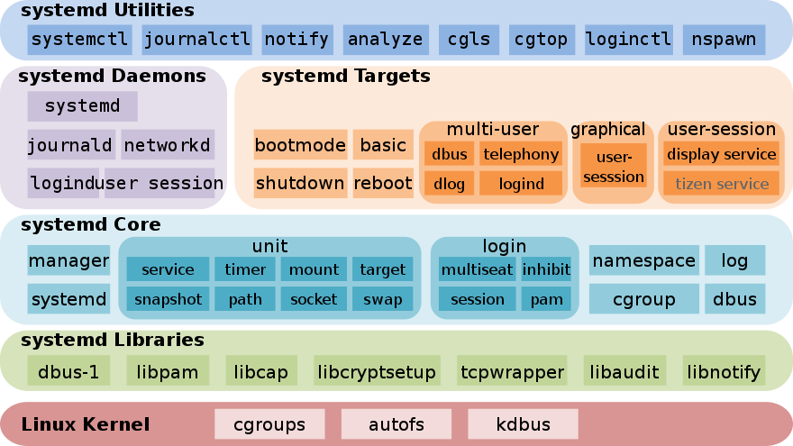

## 二、systemd出世的目的？

希望改进表示依赖关系的软件框架，允许在系统引导期间并发或并行地完成更多的处理，并减少shell的计算开销，以取代Linux传统的System V init。

## 三、systemd的特性及一些组件

与init守护进程一样，systemd是一个管理其他守护进程的守护进程，这些守护进程(包括systemd本身)都是后台进程。

systemd是在引导期间启动的第一个守护进程，也是在关闭期间终止的最后一个守护进程。

systemd守护进程作为用户空间进程树的根; 第一个进程(PID 1)在Unix系统上具有特殊的作用，因为当原始父进程终止时，它将替换父进程。

因此，第一个进程特别适合用于监视守护进程。

核心组件：

* systemd

* systemctl

* systemd-analyze

其他组件：

* kernel-install：用于自动将内核及其各自的 initramfs 映像移动到启动分区的脚本

* systemd-boot：简单的UEFI引导管理器

* systemd-creds：安全地存储和检索 systemd 单元使用的凭据

* systemd-cryptenroll：将 PKCS#11、FIDO2、TPM2 令牌/设备注册到 LUKS2 加密卷

* systemd-firstboot：首次启动前的基本系统设置初始化

* systemd-homed：便携式用户帐户管理

* systemd-logind：会话管理

* systemd-networkd：网络配置管理

* systemd-nspawn：轻量级命名空间容器

* systemd-resolved：网络名称解析

* systemd-stub：用于创建统一内核映像的 UEFI 引导存根

* systemd-sysusers：创建系统用户和组，并在软件包安装或启动时将用户添加到组中

* systemd-timesyncd：通过网络同步系统时间

* systemd/Timers：用于控制 .service 文件或事件的单调或实时计时器，是 cron 的合理替代方案

* systemd-journald：系统日志管理

* systemd-localed： 管理系统区域设置

* systemd-tmpfiles：是一个负责创建和清理临时文件和目录的实用程序。它通常在启动时运行一次，然后以指定的时间间隔运行。

以上组件未详尽，更多组件请参考官方文档

## 四、systemctl命令的用法

**注意** ：PATTERN、UNIT等其他的变量值后面带...，表示可以传递多个，用空格隔开

UNIT单元不用写后缀，如.service、.target等，systemd会根据子命令的类型自动推断后缀，如下：

```shell
systemctl start sshd

与 systemctl start sshd.service 对等
```

```shell
systemctl isolate default

与 systemctl isolate default.target 对等
```

> 单元命令

* `list-units [PATTERN…]`：此为默认命令，即 只使用systemctl调用的也是此命令。

列出systemd当前在内存中的单元。这包括直接引用或通过依赖项引用的单元，由应用程序以编程方式固定的单元，或者过去活跃但失败的单元。

默认情况下，只显示活动的、有待处理任务或失败的单元; 可以通过选项--all进行更改。

注意，这个命令不显示单元模板，而只显示单元模板的实例。未实例化的单元模板是不可运行的，因此永远不会出现在该命令的输出中。

具体来说，这意味着foo@.Service永远不会显示在这个列表中——除非实例化，例如foo@bar.service。使用list-unit-files列出已安装的单元模板文件。

pattern要接单元类型后缀，如：systemctl list-units nginx.service

示例：

```shell
systemctl list-units 列出所有单元

systemctl list-units nginx.service 指定单元
```

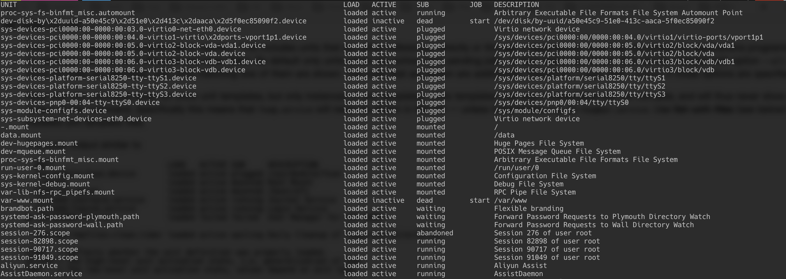

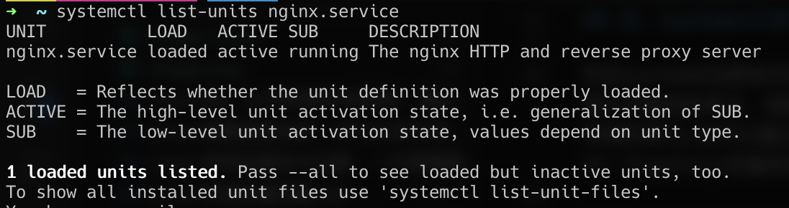

LOAD字段可能的值有：loaded, not-found, bad-setting, error, masked;

ACTIVE字段可能的值有：active, reloading, inactive, failed, activating, deactivating。

* `is-active [PATTERN…]`：检查指定的单元是否是激活状态

示例：

```shell
systemctl is-active nginx php-fpm
```

* `is-failed [PATTERN…]`：检查指定的单元是否是失败状态

示例：

```shell
systemctl is-failed nginx php-fpm
```

* `status [PATTERN…|PID…]]`：显示单元的运行时状态信息，如果不接单元名或进程id，则显示整个系统单元的状态信息，整个系统单元的状态会以树状结构来显示输出。

示例：

```shell
systemctl status

systemctl status nginx php-fpm

systemctl status 924，924是PID，此时对应的是php-fpm进程
```

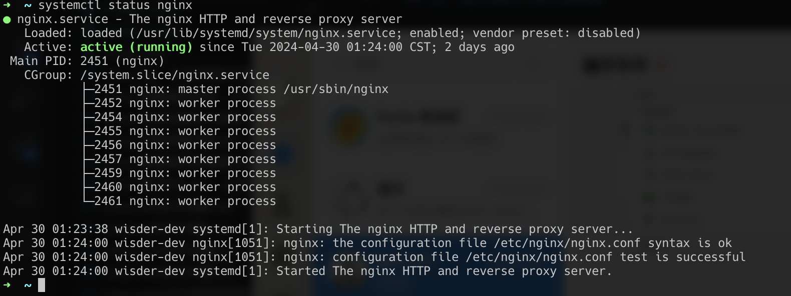

status命令输出人类可读的格式文本，如果想要输出计算机可解析的格式，则使用show命令代替。

status命令只显示正在运行，或最近运行过并尚未从内存中释放的单元的信息，要获取早期运行过的单元日志信息，使用journalctl命令获取。

**注意**：status命令会隐式加载单元，如果以此返回的状态信息来判断单元是否已经被加载有时是不准确的，因为隐式加载后可能随后就会快速取消加载。

点图标的颜色和形状表示的状态：

“未激活”或“维护”是一个白色圆圈(“〇”)，“激活”是一个绿色圆点<span style="color:green">(“●”)</span>，“停用”是一个白点，“失败”或“错误”是一个红色的十字(“x”)，“重新加载”是一个绿色的顺时针圆形箭头("↻")。

* `show [PATTERN…|JOB…]`：

显示一个或多个单元、任务或systemd本身的属性。如果没有指定参数，将显示systemd的属性。

如果指定了单元名称，则显示单元的属性; 如果指定了任务ID，则显示任务的属性。

默认情况下，空属性将被抑制。使用--all来显示这些。

要选择要显示的特定属性，使用--property=来指定。该命令用于任何需要计算机可解析输出的情况。

示例：

```shell
systemctl show

systemctl show nginx
```
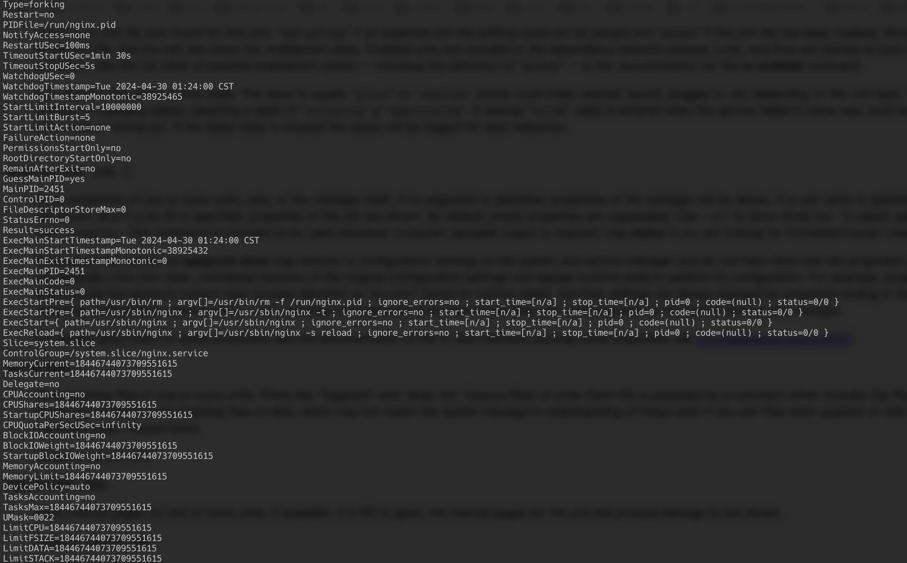

* `cat PATTERN…`：显示单元的配置文件内容，每个文件前面都有一个包含文件名的注释，如果磁盘上的任何单元文件被更新，并且没有发出daemon-reload命令，此时显示的配置文件内容不是最新的。

示例：

```shell
systemctl cat nginx php-fpm
```
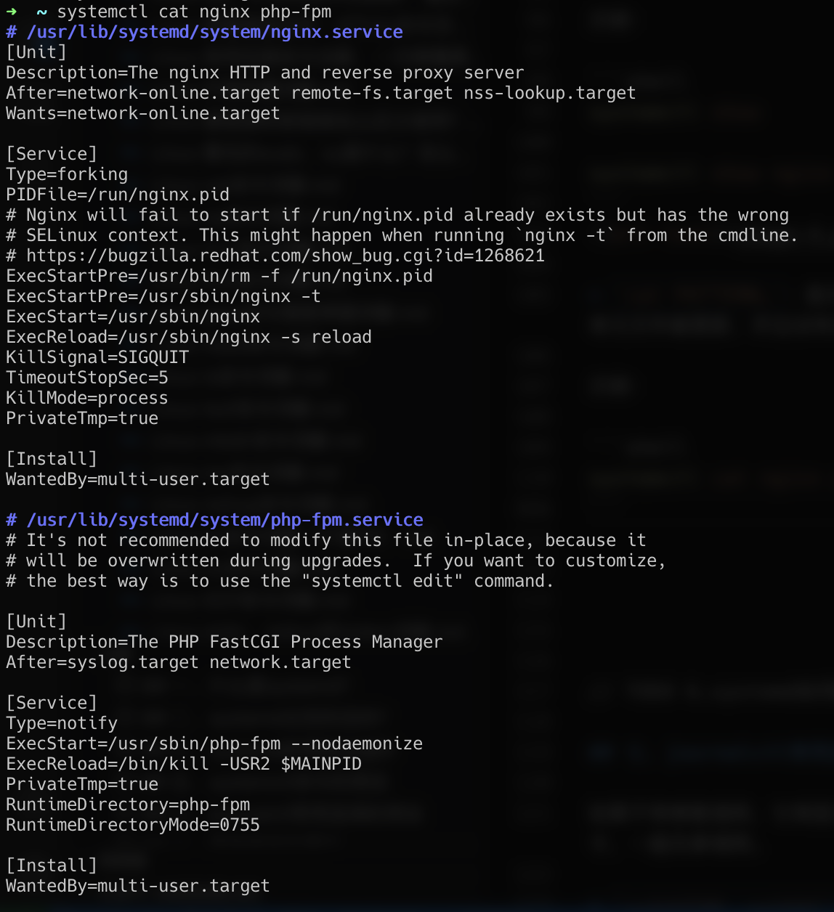

* `help PATTERN…|PID…`：显示指定单元的手册页，也可传PID，当然如果在配置中没有定义手册这一项，则不会输出。

示例：

```shell
systemctl help nginx
```
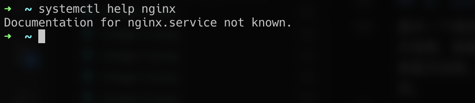

* `list-dependencies [UNIT...]`：显示指定单位所需和想要的依赖单位。这将递归列出遵循 Requires=、Requisite=、Wants=、ConsistsOf=、BindsTo= 和 Upholds= 依赖项的单元。如果未指定单位，则默认是default.target。

默认情况下，仅递归扩展目标单元。当--all 被传递时，所有其他单元也会递归扩展。

示例：

```shell
systemctl list-dependencies

systemctl list-dependencies nginx
```

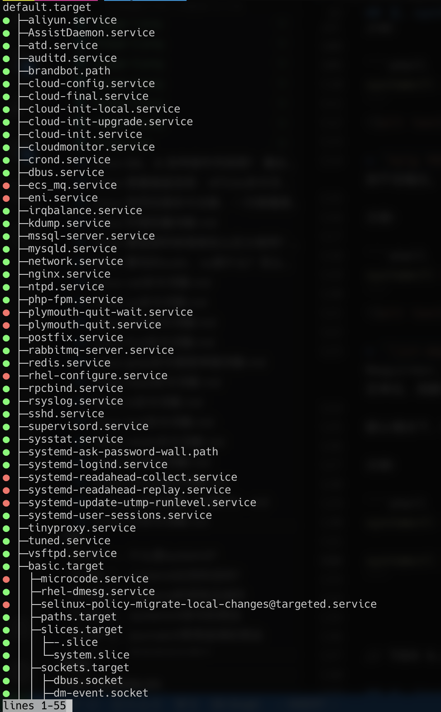

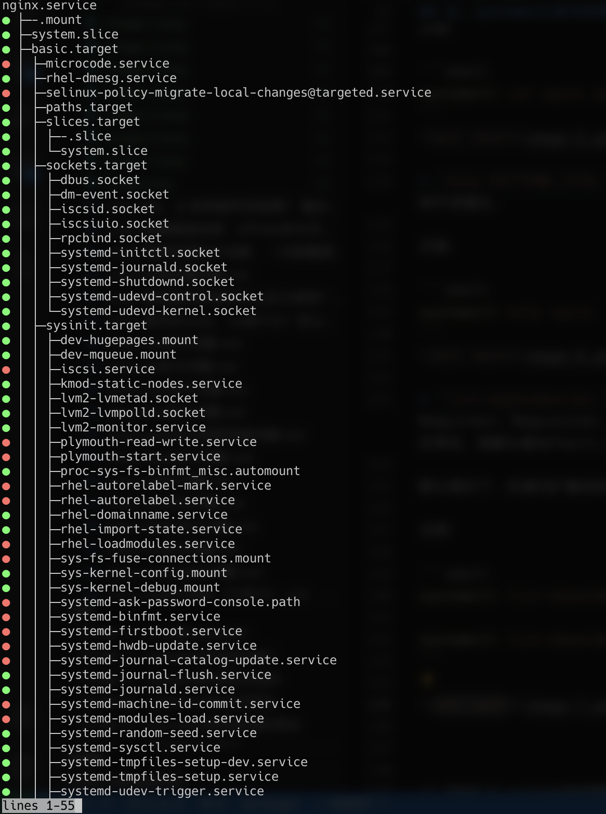

* `start PATTERN…`：启动单元，或者叫激活指定的单元，可以传--all启动所有单元

示例：

```shell
systemctl start nginx php-fpm

systemctl start --all
```

* `stop PATTERN…`：停止单元，或者叫停用指定的单元

如果单元不存在或已经停止则会操作失败;

如果单元配置了ExecStop=选项，则stop命令不会失败，因为systemd将会强制终止单元。

示例：

```shell
systemctl stop nginx php-fpm
```

* `reload PATTERN…`：重新加载单元里面指定的服务进程配置文件，例如：nginx、php-fpm的自身的配置文件，不是systemd的单元配置文件。

示例：

```shell
systemctl reload nginx php-fpm
```

* `restart PATTERN…`：重启指定的单元，内部逻辑为：先停止后启动，如果单元没有在运行，则只会启动。

注意到，此命令是平滑重启，单元储存的资源会保留，只要单元有一个待办的任务，并且只有在单元完全停止并且不再有任务待办时才会被清除。

示例：

```shell
systemctl restart nginx php-fpm
```

* `try-restart PATTERN…`：停止然后启动指定的单元且仅仅在单元是运行状态时，如果单元不在运行，则不做任何操作。

示例：

```shell
systemctl try-restart nginx php-fpm
```

* `reload-or-restart PATTERN…`：如果单元支持重载配置，即配置了ExecReload选项时，则执行重载操作，否则执行重启操作；如果单元没有在运行，则执行启动操作。

示例：

```shell
systemctl reload-or-restart nginx php-fpm
```

* `try-reload-or-restart PATTERN…`：与reload-or-restart相似，不同的是当单元没有在运行，则不执行任何操作。

示例：

```shell
systemctl try-reload-or-restart nginx php-fpm
```

* `isolate [UNIT]`：启动指定的单元及其依赖项并停止所有其他单元，除非它们具有 IgnoreOnIsolate=yes选项。如果给出的单元名称没有扩展名，则将假定扩展名为“.target”。

此命令很危险，因为它会立即停止新目标中未启用的进程，可能包括您当前正在使用的图形环境或终端。

此命令仅在启用了AllowIsolate的设备上才允许执行此操作。

示例：

```shell
systemctl isolate nginx
```

* `freeze PATTERN…`：冻结指定的单元

冻结该单元将导致cgroup中与该单元对应的所有进程被挂起。被挂起意味着单元的进程在解冻之前不会被安排在CPU上运行。注意，该命令仅支持使用统一cgroup层次结构的系统。单元在我们对单元执行作业之前自动解冻，例如，在单元停止之前。

示例：

```shell
systemctl freeze nginx php-fpm
```

* `thaw PATTERN…`：解冻指定的单元

这是 freeze 命令的逆操作，恢复单元 cgroup 中进程的执行。

示例：

```shell
systemctl thaw nginx php-fpm
```

* `set-property UNIT PROPERTY=VALUE…`：

在运行时设置支持的指定单元属性。这允许在运行时更改配置参数属性，例如资源控制设置。并非所有属性都可以在运行时更改，但是许多资源控制设置可以。这些更改将立即应用，并存储在磁盘上以备以后的引导，除非传递了——runtime参数，在这种情况下，这些设置只应用到下一次重新引导。

如果指定的单元处于非活动状态，则更改将仅存储在磁盘上，因此它们将在单元启动时生效。

示例：

```shell
systemctl set-property foobar.service CPUWeight=200
```

可以一次性设置多个属性

示例：

```shell
systemctl set-property foobar.service CPUWeight=200 MemoryMax=2G IPAccounting=yes
```

与单元文件配置设置一样，分配空设置通常会将属性重置为其默认值

示例：

```shell
systemctl set-property avahi-daemon.service IPAddressDeny=
```

> 单元文件相关的命令

* `list-unit-files [PATTERN…]`：列出系统上安装的单元文件，连同它们的启用状态，与 list-units 不同，此命令除了显式实例化的单元外还将列出模板单元。

* `enable UNIT…, enable PATH…`：

启用一个或多个单元或单元实例。将创建一组符号链接，在创建了符号链接之后，系统管理器配置将被重新加载(在某种程度上相当于daemon-reload)，这并不会同时启动任何已启用的单元，只是systemd读取到了此单元，可以在systemd开机自启时自动启动，如果需要启用后立马启动，则可以接--now，内部调用start命令启动。

示例：

```shell
systemctl enable nginx php-fpm
```

* `disable UNIT…`：

禁用一个或多个单位，使得不能在开机时自动启动。这将从单元配置目录中删除到支持指定单元的单元文件的所有符号链接，并因此撤消由enable或link所做的任何更改。

除了指定的单元外，此单元文件的 [Install] 部分中包含的 Also= 设置中列出的所有单元均被禁用。

该命令在完成操作后隐式地重新加载系统管理器配置，即执行daemon-reload。注意，该命令不会隐式停止正在禁用的单元。如果需要这样做，可以将该命令与--now开关结合使用，内部调用了stop命令。

示例：

```shell
systemctl disable nginx php-fpm
```

* `reenable UNIT…`：

重新启用一个或多个单元。这是disable和enable的组合，用于将单元文件启用的符号链接重置为[Install]节中配置的默认值。这个命令只需要单元名，它不接受单元文件的路径。

示例：

```shell
systemctl reenable nginx php-fpm
```

* `is-enabled UNIT…`：检查指定的单元是否是启用状态

示例：

```shell
systemctl is-enabled nginx php-fpm
```


* `mask UNIT…`：

屏蔽指定的单元。这将把这些单元文件链接到/dev/null，使它们无法启动。这是一个更强的disable版本，因为它禁止所有类型的单元激活，包括启用和手动激活。请谨慎使用此选项。这允许--runtime选项暂时屏蔽，直到下次重新启动系统。--now选项可用于确保单元也被停止。这个命令只需要有效的单元名，它不接受单元文件路径。

示例：

```shell
systemctl mask nginx php-fpm
```

* `unmask UNIT…`：取消屏蔽指定的单元。

示例：

```shell
systemctl unmask nginx php-fpm
```

* `revert UNIT…`：撤销或者叫还原指定单元的配置到厂商原配置

将指定单元文件还原到它们的供应商版本。该命令删除修改指定单元的插入式配置文件，以及覆盖匹配供应商提供的单元文件的任何用户配置的单元文件。

具体来说，对于一个单元“foo.service“匹配的目录”foo.service.D/"及其包含的所有文件被删除，包括持久配置目录和运行时配置目录(即/etc/systemd/system和/run/systemd/system)下的文件;

同样，如果一个单元被屏蔽，它将被解除屏蔽。

实际上，此命令可用于撤消使用 systemctl edit、systemctl set-property 和 systemctl mask 所做的所有更改，并使原始单元文件及其设置重新生效。

示例：

```shell
systemctl revert nginx php-fpm
```

* `edit UNIT…`：编辑单元文件，用来扩展或覆写原来的单元文件

根据是否指定了--system(默认值)、--user或--global，该命令将为系统、调用用户或所有用户的所有未来登录的每个单元创建一个插入文件。然后，在临时文件上调用编辑器，如果编辑器成功退出，这些临时文件将被写入实际位置。

1. 如果指定了--drop-in=[filename]，则将使用给定的 drop-in 文件名而不是默认的 override.conf。

2. 如果指定了--full，将复制原始单元文件而不是创建嵌入式文件。

3. 如果指定了--force，并且任何单位尚不存在，则将打开新的单位文件进行编辑。

4. 如果指定了--runtime，则更改将暂时在 /run/ 中进行，并且它们将在下次重新启动时丢失。

如果退出时临时文件为空，则取消相关单元的修改。

编辑单元后，将重新加载 systemd 配置（以相当于调用了daemon-reload）。

示例：

```shell
systemctl edit nginx php-fpm
```

* `get-default`：获取默认target的单元名称，实际上是default.target的符号链接。

示例：

```shell
systemctl get-default
```

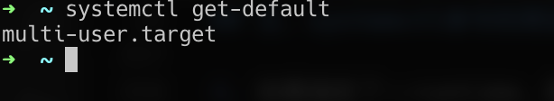

* `set-default TARGET`：设置默认的target，实际上是将default.target的符号链接设置为指定的目标单元

示例：

```shell
systemctl set-default multi-user.target
```

> 机器命令

* `list-machines [PATTERN…]`：列出主机和所有正在运行的本地容器及其状态。

示例：

```shell
systemctl list-machines
```

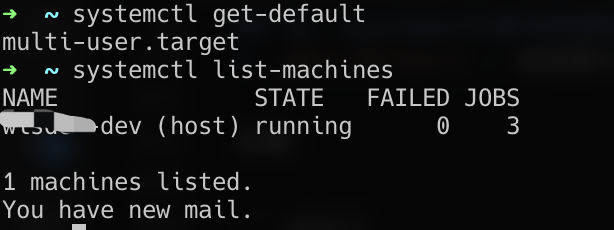

> 任务命令

* `list-jobs [PATTERN…]`：列出正在进行的任务

示例：

```shell
systemctl list-jobs
```

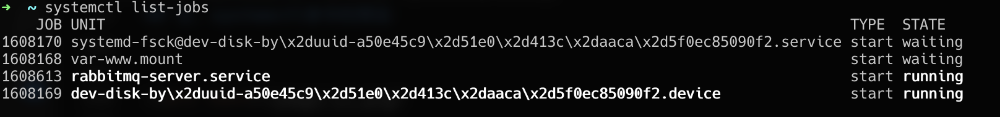

* `cancel [JOBID…]`：取消指定的任务，通过任务id来指定，如果没有指定任务id，则取消所有待处理的任务。

示例：

```shell
systemctl cancel 1608941
```

> 管理器状态命令

* `daemon-reload`：

重新加载systemd管理器配置，重新加载所有单元文件，并重新创建整个依赖树。

示例：

```shell
systemctl daemon-reload
```

> 系统命令

* `is-system-running`：检查systemd系统是否正在运行

示例：

```shell
systemctl is-system-running
```

输出的值有如下几种：

1. initializing：正在初始化

2. starting：正在启动

3. running：正在运行

4. degraded：系统正在运行，但一个或多个单元出现故障。

5. maintenance：系统处于维护模式

6. stopping：系统正在停止

7. offline：系统已经离线

8. unknown：未知错误，由于缺乏资源或其他错误原因，无法确定操作状态。

* `default`：进入默认模式，相当于调用了 **systemctl isolate default.target**

示例：

```shell
systemctl default
```

* `rescue`：进入拯救模式，相当于调用了 **systemctl isolate rescue.target**

示例：

```shell
systemctl rescue
```

* `emergency`：进入紧急模式，相当于调用了 **systemctl isolate emergency.target**

示例：

```shell
systemctl emergency
```

* `halt`：关闭并停止系统，但硬件还是处于开机状态，相当于调用了 **systemctl start halt.target**。

如果接 --force，则强制停止系统，所有进程将被杀死。

如果接 --when=，when指定时间戳，则在指定的时间戳之后停止系统，如果--when=cancel，则取消关闭系统的操作。

示例：

```shell
systemctl halt
```

* `poweroff`：停止系统并关机，硬件处于关机状态，相当于调用了 **systemctl start poweroff.target**。

也可以接 --force和--when，行为与上述相似

示例：

```shell
systemctl poweroff
```

* `reboot`：关闭并重新启动系统，相当于调用了 **systemctl start reboot.target**。

也可以接 --force和--when，行为与上述相似

示例：

```shell
systemctl reboot
```

* `suspend`：暂停或者叫挂起系统，内部会触发调用 **suspend.target**

示例：

```shell
systemctl suspend
```

* `hibernate`：使系统休眠，内部会触发调用 **hibernate.target**

示例：

```shell
systemctl hibernate
```

* `hybrid-sleep`：休眠并挂起系统，内部会触发调用 **hybrid-sleep.target**

示例：

```shell
systemctl hybrid-sleep
```

> 常用的选项

* `-t, --type=`：显示指定类型的单元，多个类型用逗号隔开；例如指定为service、socket，多用于 **list-units**, **list-dependencies**, **show**, **status** 子命令。

注意，如果指定 -t help，则打印出所有可用的类型值

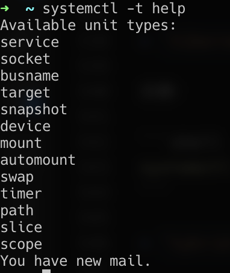

示例：

```shell
systemctl status -t service
```

* `--state=`：显示指定状态的单元，多个状态用逗号隔开；例如指定为failed、active，多用于 **list-units, list-dependencies, show, status**

示例：

```shell
systemctl status --state=failed
```

* `-p, --property=`：显示指定的unit/job/manager的属性，多个属性名用逗号隔开；例如：MainPID

示例：

```shell
systemctl show -p LogLevel
```

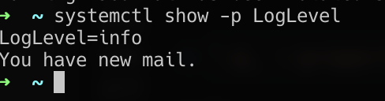

* `-a, --all`：

用途场景如下：

1. 当使用 list-units 列出单位时，还显示非活动单位和跟随其他单位的单位。

2. 当显示单位/任务/manager属性时，显示所有属性，无论是否设置。

3. 当显示单位的依赖时：**list-dependencies**，递归地显示所有依赖单元的依赖关系。

4. 当与status一起使用时，显示完整的日志消息，即使它们包含不可打印的字符。

示例：

```shell
systemctl list-units -a
```

* `--with-dependencies`：
  
当与 status、cat、list-units 和 list-unit-files 一起使用时，这些命令会打印所有指定的单元以及这些单元的依赖关系。

示例：

```shell
systemctl status --with-dependencies
```

* `-q, --quiet`：
  
禁止打印各种命令的结果以及关于截断的日志行的提示。但错误总是打印出来。

示例：

```shell
systemctl start nginx -q
```

* `--no-warn`：抑制警告信息

示例：

```shell
systemctl start nginx --no-warn
```

* `--no-block`：不同步等待请求的操作完成。

使systemd耗时的操作变为异步，此选项与 **--wait** 选项互斥。

示例：

```shell
systemctl default --no-block
```

* `--wait`：同步等待请求的操作完成。

与 **--no-block** 互斥。

示例：

```shell
systemctl default --wait
```

* `-f, --force`：强制操作

使用场景如下：

1. 使用 **enable** 时，覆盖掉任何已存在冲突的符号链接

2. 使用 **edit** 时，如果指定的单元不存在，则自动创建

3. 在使用 **halt, poweroff, reboot**时，会强制关闭系统，强制杀死进程。

* `-o, --output=`：控制在使用 **status** 时的输出格式，详情参考下方 **journal**的说明。

示例：

```shell
systemctl status -o short-iso
```

* `--plain`：当在使用 **list-dependencies, list-units, list-machines** 时，输出为列表的形式而不是树形结构。

示例：

```shell
systemctl list-units --plain
```

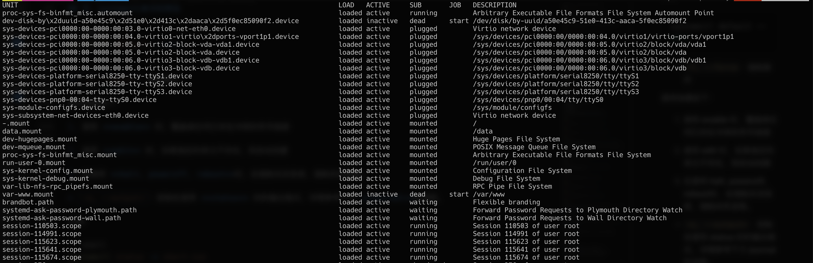

* `-h, --help`：打印帮助信息

示例：

```shell
systemctl -h
```

* `--version`：打印版本号

```shell
systemctl --version
```

## 五、systemd如何配置？

单元文件是一种纯文本ini样式的文件，单元有如下类型的后缀：

1. service：描述如何管理服务或应用程序。这包括如何启动或停止服务，重新加载其配置文件，服务在什么条件下自动启动，以及相关单元文件的依赖项或层次结构信息。

2. socket：描述 systemd 用于基于套接字激活的网络、IPC 套接字或 FIFO 缓冲区。当在该单元定义的套接字上看到活动时，会启动一个关联的 .service 文件。

3. device：定义已指定由 udev 或 sysfs 文件系统进行 systemd 管理的设备。

4. mount：定义系统上由 systemd 管理的挂载点。该文件以挂载路径命名，斜杠改为破折号。 /etc/fstab 中的条目可以自动创建单元。

5. automount：定义自动挂载的挂载点。以它引用的挂载点命名该文件。需要匹配的 .mount 单元文件来定义安装的细节。

6. swap：定义系统上的交换空间。单元文件的名称必须反映空间的设备或文件路径。

7. target：目标单元用于对单元进行分组并设置同步点以排序与其他单元文件的依赖关系。

8. path：定义基于路径的激活的路径。默认情况下，会激活具有相同基本名称的 .service 单元文件。

9. timer：定义由 systemd 管理的计时器。这类似于用于延迟或计划激活的 cron 任务。当计时器到达时，将启动具有相同名称但文件扩展名为 .service 的单元文件。

10. slice：关联Linux Control Group节点，它允许将资源分配或限制给与切片关联的任何进程。该名称表示控件树中的层次结构。根据单元的类型，单元被默认放置在切片中。

11. scope：该单元文件由 systemd 根据从 D-Bus 接口接收到的信息自动创建，用于管理外部创建的系统进程集。

单元名称可以通过一个称为“实例名称”的参数化。然后，该单元是基于一个“模板文件”构建的，该文件用作多个服务或其他单元的定义。

模板单元必须在单元名称前缀的末尾有一个“@”(就在类型后缀之前)。通过在“@”和单元类型后缀之间插入实例名，形成完整单元的名称。

可以通过在单元搜索路径中创建一个从新名称到现有名称的符号链接，也叫做别名。

例如systemd-networkd.service的别名是dbus-org.freedesktop.network1.service，在安装过程中作为符号链接创建，因此当通过D-Bus请求systemd加载dbus-org.freedesktop.network1.service时，它将加载systemd-network.service。

另一个例子是default。在引导时启动的default target，通常是multi-user.target 或 graphical.target。

别名可以用在像disable、start、stop、status和类似的命令中，也可以用在所有的单元依赖指令中，包括Wants=、Requires=、Before=、After=。

别名遵循以下限制:

1. 一个特定类型的单位例如：**.service、.socket** 只能使用具有相同类型后缀的名称作为别名。

2. 普通单元(不是模板或实例)只能使用普通名称作为别名。
   
3. 一个模板实例只能被另一个模板实例别名，并且实例部分必须相同。

4. 一个模板可以被另一个模板别名(在这种情况下，别名应用于该模板的所有实例)。

5. 作为一种特殊情况，模板实例(例如:"alias@inst.service")可能是指向不同模板的符号链接(例如:“template@inst.service”)。在这种情况下，只有这个特定的实例被别名，而模板的其他实例(例如:“alias@foo.service”，“alias@bar.service”)没有别名。

单元文件可以通过[Install]节中的Alias=指令指定别名。当单元被启用时，将为这些名称创建符号链接，并在单元被禁用时删除符号链接。

如果一个单元文件是空的(即文件大小为0)或符号链接到/dev/null，它的配置将不会被加载，并且它的加载状态显示为masked，并且不能被激活。使用这个作为一个有效的方式来完全禁用一个单位，使它无法启动，甚至手动。

### 节选项配置

> [Unit] 节包含以下指令

* Description=：单元的描述

* Documentation=：单元中程序的文档，多个用空格隔开

接受的uri类型有：http、https、file、info、man。

此选项也可以指定多次，最后会被合并到一起

* Wants=：

配置对其他单元的需求依赖，比Requires依赖关系更弱。

此选项可以指定多次，或者可以在一个选项中指定多个空格分隔的单元

在这种情况下，将创建所有列出的名称的依赖项。这种类型的依赖也可以在单元配置文件之外通过向单元文件附带的.wants/目录添加符号链接来配置。

如果列出的任何单元未成功启动，则不会影响单元激活。

例如，如果单元A的Wants=单元B，则当单元A运行时，单元B也会运行。但单元B启动成功与否，并不影响单元A正常运行。

* Requires=：

类似于Wants=，但是声明了一个更强的需求依赖。

这种类型的依赖也可以通过在单元文件的.require/目录中添加一个符号链接来配置。

如果此单元被激活，列出的单元也将被激活。如果其他单元中的一个未能激活，并且在失败单元上设置了顺序依赖After=，则该单元将不会启动。此外，无论是否指定After=，如果其他单元中的一个显式停止(或重新启动)，则该单元将被停止(或重新启动)。

通常，使用Wants=而不是Requires=是更好的选择，以便在处理失败的服务时实现更健壮的系统。

* Conflicts=：

配置负需求依赖。如果一个单位在另一个单位上有一个Conflicts=设置，启动前者将停止后者，反之亦然。

* Before=, After=：申明单元启动的顺序

此选项可以指定多次，或者可以在一个选项中指定多个空格分隔的单元

例如：

如果单元A的Before=单元B，则当两个单元都运行时，单元A在单元B之前执行，即单元B延迟到单元A完全启动后才启动。

如果单元A的After=单元B，则当两个单元都运行时，单元B在单元A之前执行，即单元A延迟到单元B完全启动后才启动。

* OnFailure=：

指定当该单元出于失败状态时激活的单元，此选项可以指定多此，用空格分隔。

* OnSuccess=：

指定当该单元处于非活动状态时激活的单元，此选项可以指定多此，用空格分隔。

* IgnoreOnIsolate=：

用于使用systemctl isolate命令时的场景，设置了此选项则会被isolate忽略。

值为布尔值：true、false

> [Install] 节选项

这个部分在运行时不会被systemd解析；在[Install] 节，由systemctl enable和disable命令使用。

* Alias=：

单元的别名，systemctl enable将创建从这些名称到单元文件名的符号链接。

可以指定多个，用空格分隔。

* WantedBy=, RequiredBy=：

当systemctl enable安装该单元时，会在列出的每个单元的 .wants/、.require/、.upholds/目录中创建一个符号链接。这就产生了从列出的单元添加到当前单元的Wants=，Requires= 类型依赖的效果。

* Also=：

当安装或卸载此单元时，Also列出的单元也会被安装或卸载，用于 **systemctl enable 和 systemctl disable** 命令的调用。

此选项可以指定多个，用空格分隔，也可以指定多次。

> [Service] 节选项

* Type=：
  
Service的类型如下所示：

1. simple，默认类型，如果指定了ExecStart=，但Type=和BusName=均未指定，则默认为simple

2. exec，exec类型与simple类型类似，但服务管理器会在执行主服务二进制文件后立即认为单元已启动。

3. forking，以 ExecStart 启动的进程会生成一个子进程，该子进程成为服务的主进程。启动完成后父进程退出。

4. dbus，dbus 的行为与 simple 类似；然而，这种类型的单元必须指定 BusName=，并且当获取指定的总线名称时，服务管理器将考虑该单元。如果指定 BusName=，则此类型是默认类型。

5. notify，此类型与 simple 类似，但只有在通过 sd_notify() 函数发送通知消息后才会启动后续单元。

6. oneshot，这对于执行单个任务然后退出的脚本非常有用。

* PIDFile=：指向service的PID文件的路径，对于Type=forking时，建议使用此选项。

PID文件通常在/var/run/或/run下面。

现代项目中应该避免使用PID文件。尽可能使用Type=notify或Type=simple，这样不需要使用PID文件来确定服务的主进程。

* BusName=：获取此service将使用的D-Bus目的地名称。对于Type=dbus的service，此选项是必需的。如果知道此属性，建议始终设置此属性，以便于将service名称映射到D-Bus目的地。

* ExecStart=：服务启动时执行的命令或脚本。

如果没有指定ExecStart=，那么服务必须有RemainAfterExit=yes和至少一个ExecStop=行设置。

除非设置了 Type=forking，否则通过该命令行启动的进程将被视为守护进程的主进程。

* ExecStartPre=, ExecStartPost=：

分别在 ExecStart= 中的命令之前或之后执行的附加命令。语法与 ExecStart= 相同，不同之处在于允许多个命令行，并且命令按顺序一个接一个地执行。

ExecStart= 命令仅在所有不带“-”前缀的 ExecStartPre= 命令成功退出后运行。

ExecStartPost=命令仅在ExecStart=中指定的命令被成功调用后运行。

ExecStartPre=不能用于启动长时间运行的进程。通过ExecStartPre=调用的进程派生的所有进程将在下一个服务进程运行之前被杀死。

* ExecReload=：配置服务重新加载配置

例如配置nginx重载配置：/usr/sbin/nginx -s reload

也可以用 **kill -HUP $MAINPID**

HUP是hang up的缩写，$MAINPID是服务的主进程的进程ID，此命令作用是重新加载进程的配置或重启主进程。

* ExecStop=：用于停止通过ExecStart=启动的服务的命令或脚本。

* ExecStopPost=：服务停止后执行的其他命令。

* Restart=：配置服务进程退出、终止或超时时是否重启服务。

服务进程可以是主服务进程，但也可以是用ExecStartPre=、ExecStartPost=、ExecStop=、ExecStopPost=或ExecReload=指定的进程之一。

当进程的死亡是系统操作(例如服务停止或重启)的结果时，服务将不会重新启动。

可用的值包括：no、on-success、on-failure、on-abnormal、on-watchdog、on-abort、always。

> 如果设置为no(默认值)，则不会重新启动服务。

> 如果设置为on-success，则只有在服务进程干净退出时才会重启。

干净退出是指以下情况:

1. 退出码为0

2. 对于 Type=oneshot 以外的类型，且信号是SIGHUP、SIGINT、SIGTERM 或 SIGPIPE 之一；

3. SuccessExitStatus= 中指定的退出状态和信号。

> 如果设置为on-failure，则当进程以非零退出码退出时，服务将重新启动。

> 如果设置为on-abnormal，则当进程被某个信号终止(包括core dump，不包括上述四种信号)、操作超时或看门狗超时触发时，服务将重新启动。

> 如果设置为on-abort，则只有当服务进程由于未捕获的信号(未指定为干净退出状态)而退出时，服务才会重新启动。

> 如果设置为on-watchdog，则只有当服务的看门狗超时时才会重启服务。

> 如果设置为always，则服务将无条件重新启动，无论它是否干净地退出，是否被信号异常终止，或者是否超时。

对于长时间运行的服务，建议将其设置为on-failure，以便通过尝试从错误中自动恢复来提高可靠性。

对于能够自行选择终止(并避免立即重新启动)的服务，on-abnormal是另一种选择。

* RestartMode=：重启模式

如果设置为normal（默认），服务将通过failed/inactive状态重新启动。

如果设置为direct，则服务在自动重启期间直接转换到激活状态，跳过failed/inactive状态。

* RestartPreventExitStatus=：指定阻止重启的退出码

退出状态定义可以是数字退出代码或终止信号名称，多个用空格分隔。

例如：RestartPreventExitStatus=1 6 SIGABRT

* RestartForceExitStatus=：指定强制重启的退出码

格式如上。

* RestartSec=：重启服务的间隔时间
  
单位默认是秒，但值是不带单位的，只有数字，默认是100毫秒，即RestartSec=100

也可以用时间跨度值，例如：5min 20s

* TimeoutStartSec=：配置等待启动的时间。如果守护进程服务没有在配置的时间内发出启动完成的信号，则该服务将被视为失败，并将再次关闭，值的单位与RestartSec一致。

* TimeoutStopSec=：配置等待每个ExecStop=命令的时间。如果其中任何一个超时，则跳过后续的ExecStop=命令，值的单位如上。

* TimeoutSec=：TimeoutStartSec=和TimeoutStopSec=的简写

* RuntimeMaxSec=：服务运行的最大时间。如果使用了此选项，并且服务活动的时间超过了指定的时间，那么它将被终止并进入故障状态。

> 修改现有单元文件的方法

系统上安装的服务带有默认的单元文件，存储在/usr/lib/systemd/system/目录下。

系统管理员不应该直接修改这些文件，因此任何定制都必须限制在/etc/systemd/system/目录中的配置文件中。

/etc/systemd/system 的优先级比 /usr/lib/systemd/system 要高，所以前者有相同配置项则会覆盖后者。

1. 第一种方法：

在/etc/systemd/system/[custom.service].d/下创建一个目录存放补充配置文件。

对于大多数用例，推荐使用这种方法。它允许使用附加功能扩展默认配置，同时仍然引用原始单元文件。

因此，随着包升级而引入的对默认单元的更改将自动应用。

注意：custom.service为服务的名称，在.d此目录下的配置文件后缀必须是以.conf结尾

示例：扩展httpd.service配置

```shell
# 创建服务同名的.d目录，并创建自定义配置文件
mkdir /etc/systemd/system/httpd.service.d/
touch /etc/systemd/system/httpd.service.d/custom_script.conf

# custom_script.conf内容
[Service]
ExecStartPost=/usr/local/bin/custom.sh

# 保存后重新加载systemd并重启httpd服务
systemctl daemon-reload
systemctl restart httpd
```

2. 第二种方法：

在/etc/systemd/system/中创建一个原始单元文件/usr/lib/systemd/system/的副本。

副本将覆盖原始文件，因此不会应用包更新时引入的更改。

这种方法对于进行重要的单元更改非常有用，无论包更新如何，这些更改都应该持续存在。

示例：扩展httpd.service配置

```shell
# 复制一份到/etc/systemd/system中
cp /usr/lib/systemd/system/httpd.service /etc/systemd/system/httpd.service

# 修改部分内容
[Service]
TimeoutStartSec=10

[Install]
WantedBy=multi-user.target

# 重新加载systemd
systemctl daemon-reload
```

以上操作可以用edit子命令代替：

```shell
systemctl edit --full httpd
```

## 六、journalctl常用选项的用法

如果不带参数调用，它将显示调用用户可访问的日志内容，从最早的历史日志开始显示，所以内容多的话会很卡，一般无参调用。

* `--system, --user`：显示来自系统服务和内核的消息（使用 --system）。显示来自当前用户服务的消息（使用 --user）。如果两者均未指定，则显示用户可以看到的所有消息。

示例：

```shell
journalctl --user
```

* `-u, --unit=UNIT|PATTERN`：指定服务单元名称，或单元匹配模式，此选项可使用多次。

示例：

```shell
journalctl -u nginx
```

* `-p, --priority=`：通过优先级过滤日志信息，可指定单个日志级别或范围级别。

日志有8个级别，可用数字表示，也可用文本表示，如下：

1. emerg(Emergency): 0, // 紧急，表示系统无法使用，需要立即处理。

2. alert(Alert): 1, // 警报，表示需要立即采取行动来解决关键问题。

3. crit(Critical): 2, // 严重，表示程序中需要干预以防止系统故障的关键条件。

4. err(Error): 3, // 错误，表示影响某些操作但不如紧急情况严重的错误情况。

5. warning(Warning): 4, // 警告，表示如果不解决，将来可能会导致错误或意外行为的潜在问题。

6. notice(Notice): 5, // 注意，适用于可能需要监测的正常但重要的情况。

7. info(Informational): 6, // 信息，包括提供系统正常运行记录的消息。

8. debug(Debug): 7 // debug信息，用于记录有关系统的详细信息以进行调试。

如果指定的是单个级别，则会显示小于等于指定级别的日志信息，例如：指定的是4，则显示 <=4 的日志信息；

如果指定的是级别范围，格式为：FROM..TO，之间是两个点，则会显示包括开始和结束边界值的日志信息，例如：指定 1..4，则显示1、2、3、4的日志信息。

示例：

```shell
journalctl -p 4

journalctl -p 1..4
```

* `-g, --grep`：使用正则表达式匹配过滤

如果模式字符串全小写，则匹配是不区分大小写的，否则是区分的，也可以接--case-sensitive覆盖此行为

示例：

```shell
journalctl -g ^ng
```

* `--case-sensitive[=BOOLEAN]`：接上，指定匹配是否区分大小写，值为：true或false。

示例：

```shell
journalctl -g ^nG --case-sensitive=true
```

* `-k, --dmesg`：仅仅显示内核日志信息，此选项相当于隐式使用了 -b，和添加了 _TRANSPORT=kernel。

示例：

```shell
journalctl -k
```

* `-o, --output=`：控制日志的输出格式，有如下多个格式可选。

1. short：此为默认格式，生成的输出与经典系统日志文件的格式基本相同，每个日志条目显示一行。

2. short-full：与short显示的时间戳信息不同，此模式在输出中包含工作日、年份和时区信息，并且与语言环境无关。

3. short-iso：时间戳显示的ISO 8601的时间格式，如：2024-04-30T01:23:38+0800。

4. short-iso-precise：与short-iso相似，但包含完整的微秒部分。

5. short-precise：与short相似，但包含完整的微秒部分。

6. short-unix：与short相似，但显示的是unix时间戳，自 UTC 1970年1月1日以来经过的秒数，并包含微秒部分。

7. verbose：显示完整结构的日志信息。

8. json：显示成json格式，一条记录一行。
   
如果字段超过4096个字节，将会编码为null值，但可接 --all来取消这个默认行为。

日志条目允许同一日志条目中存在非唯一字段。 JSON 不允许对象内存在非唯一字段。因此，如果遇到非唯一字段，则会使用 JSON 数组作为字段值，将所有字段值列出为元素。

包含不可打印或非 UTF8 字节的字段被编码为包含单独格式化为无符号数字的原始字节的数组。

9. json-pretty：美化输出json格式，每个字段占一行。

10. cat：生成一个简洁的输出，仅仅显示日志本身的信息，不附带元数据和时间戳。

11. with-unit：与short-full类似，但前缀为单元和用户单元名称，而不是传统的syslog标识符。使用模板化实例时很有用，因为它将在单元名称中包含参数。

* `--output-fields=`：指定日志信息输出的字段，多个用逗号隔开，只对显示所有字段的输出模式有效，包括：verbose, export, json, json-pretty, json-sse, json-seq, cat。

可用的字段参考json格式输出的字段。

示例：

```shell
journalctl -u nginx -o json-pretty --output-fields=PRIORITY,__CURSOR
```

* `-r, --reverse`：反转输出，最新的日志展示在上面。

* `-a, --all`：完整显示所有字段，即使它们包含不可打印的字符或非常长。默认情况下，具有不可打印字符的字段缩写为“blob data”。

* `-f, --follow`：仅仅显示最新的日志，只要有新日志追加进来则一直打印输出，与tail -f 相似。

* `-q, --quiet`：禁止所有信息性消息（即“-- Journal begins at”、“-- Reboot --”）以及以普通用户身份运行时有关无法访问的系统日志的任何警告消息。

* `--disk-usage`：显示所有日志文件的当前磁盘使用情况。这显示了所有已归档和活动日志文件的磁盘使用量总和。

* `-h, --help`：打印帮助信息

* `--version`：打印版本号

## 七、其他组件的用法 

> hostnamectl

可用于打印主机名、图标名、设备类型、机器ID、操作系统类型、内核及其架构类型等等。

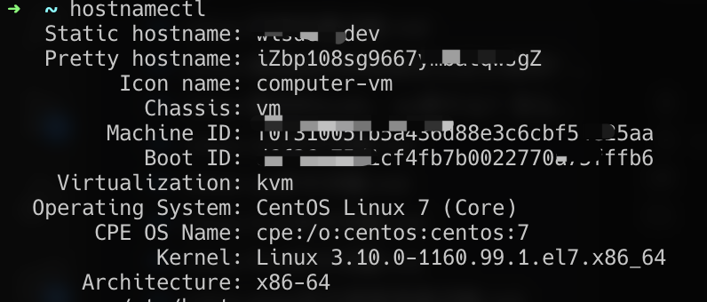

> systemd-analyze

使用systemd-analyze命令可以分析系统启动过程的性能。

该命令还可用于从系统和服务管理器检索其他状态和跟踪信息。

它用于检查单元文件是否正确，也用于访问高级系统管理器调试有用的特殊功能。

例如：

1. 查看系统启动所需的时间

```shell
systemd-analyze time

Startup finished in 3.404s (kernel) + 2.415s (initrd) + 13.125s (userspace) = 18.945s
graphical.target reached after 13.117s in userspace
```

2. 获得服务启动过程的高级概述，其中包括启动的服务和每个服务启动所需的时间

```shell
systemd-analyze critical-chain
```

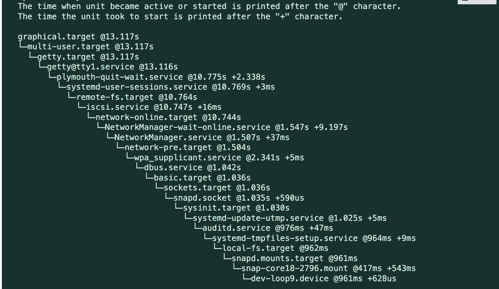

该命令为每个指定的单元或默认目标打印时间关键单元树。

3. 查看服务启动过程中启动的服务列表，并显示每个服务所花费的时间

```shell
systemd-analyze blame
```

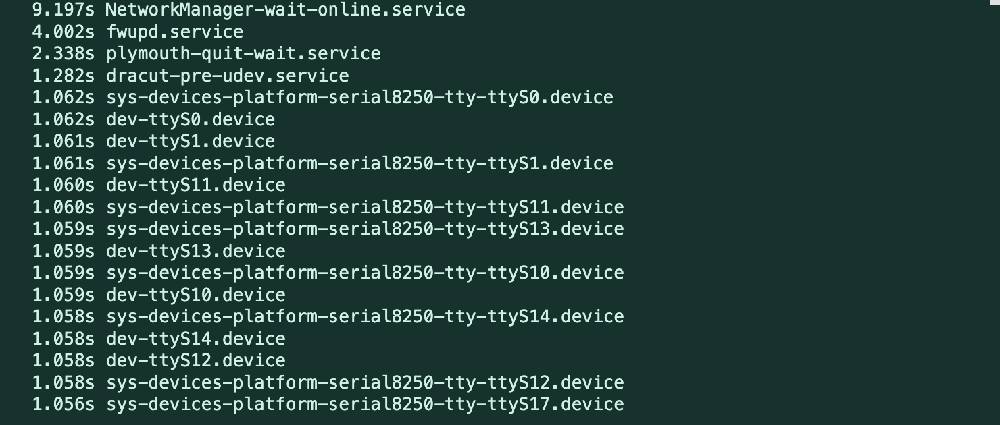

4. 可用使用systemd-analyze生成一个矢量图形文件，显示启动过程中发生的事件

```shell
systemd-analyze plot > /temp/sample.svg
```

LibreOffice Draw 等应用程序可以使用这些向量来生成图形。

5. 使用 systemd-analyze verify 检查 systemd 单元文件的语法

```shell
systemd-analyze verify /etc/systemd/system/my-custom-service.service
```

该命令分析单元文件并报告任何语法错误、丢失文件或其他问题。

## 八、总结

systemd整个系统架构非常复杂，此处只是基本使用，欲深入研究其内部细节，需查看官方文档或源码研究学习。


