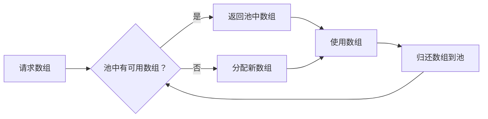

### 简介

`ArrayPool<T>` 是 `.NET` 中一个高性能的内存管理工具，位于 `System.Buffers` 命名空间。它通过重用数组而非频繁分配新数组，显著减少 `GC`（垃圾回收）压力，提升内存敏感型应用的性能。特别适合处理大型数组和临时缓冲区。

#### 工作原理图解



### 背景与动机

* `GC` 和大对象开销：频繁分配与释放大数组（特别是超过 `LOH` 阈值 ~85 KB 的数组）会导致大量垃圾回收压力和内存碎片化，影响吞吐和响应延迟。

* 重用与零分配：通过在运行时复用已有数组，避免重复的堆分配和回收开销。

* 通用、高性能：`ArrayPool<T>` 提供了线程安全、可配置的数组池，实现零散内存的集中管理，适用于高性能场景如网络协议解析、图像处理、流式 `IO` 等。

### 主要功能

* 数组租用：通过 `Rent` 方法从池中获取指定大小的数组。

* 数组归还：通过 `Return` 方法将数组归还到池中以供复用。

* 共享和自定义池：提供默认的共享池（`ArrayPool<T>.Shared`）和支持自定义池（`ArrayPool<T>.Create`）。

* 线程安全：内置线程安全机制，适合多线程环境。

* 泛型支持：支持任意类型的数组（如 `byte[]、int[]` 等）。

| 功能                                         | 描述                                               |
| -------------------------------------------- | -------------------------------------------------- |
| `ArrayPool<T>.Shared`                        | 获取全局共享的静态池实例                           |
| `ArrayPool<T>.Create(...)`                   | 创建自定义配置的独立池，可指定最大数组长度和池大小 |
| `Rent(int minimumLength)`                    | 从池中租用至少 `minimumLength` 大小的数组          |
| `Return(T[] array, bool clearArray = false)` | 将数组归还给池，可选择是否清零以防泄漏上一轮数据   |

### 支持环境与安装 

* 框架

    * `.NET Core 2.1+`（内置于 `System.Buffers`）

    * `.NET 5/6/7/8/9`

    * `.NET Standard 2.0+`（可通过 `NuGet` 引用 `System.Buffers`）

    * `.NET Framework 4.6.1+`（需安装 `System.Buffers` 包）

* 安装（仅限旧版或 `.NET Framework`）

```shell
Install-Package System.Buffers
```

* 引用命名空间

```shell
using System.Buffers;
```

### 基本使用

```csharp
using System;
using System.Buffers;

class Program
{
    static void Main()
    {
        // 从共享池租用至少 1024 个字节的数组
        byte[] buffer = ArrayPool<byte>.Shared.Rent(1024);

        try
        {
            // 使用数组
            for (int i = 0; i < 100; i++)
            {
                buffer[i] = (byte)i;
            }
            Console.WriteLine($"First byte: {buffer[0]}");
        }
        finally
        {
            // 归还数组
            ArrayPool<byte>.Shared.Return(buffer);
        }
    }
}
```

* `Rent(1024)` 返回一个至少 1024 字节的数组（可能更大，如 2048 字节，取决于池的桶策略）。

* 使用 `try-finally` 确保数组始终归还，避免内存泄漏。

### 主要 API 用法

#### 获取实例

```csharp
// 最常用：全局共享池
var pool = ArrayPool<byte>.Shared;

// 定制池：最大保留 100 个 ≤1 024 长度的数组
var customPool = ArrayPool<byte>.Create(maxArrayLength: 1024, maxArraysPerBucket: 100);
```

#### 租用数组

```csharp
// 租用至少 4096 个元素的 byte 数组
byte[] buffer = pool.Rent(4096);

// 注意：获得的数组长度可能 ≥ requested；请仅使用 [0..requestedLength) 区间
int needed = 4096;
int actualLength = buffer.Length;  // 可能大于 needed
```

#### 使用数组

```csharp
// 例如从网络流读取
int bytesRead = await stream.ReadAsync(buffer, 0, needed);
Process(buffer, bytesRead);
```

#### 归还数组

```csharp
// 归还时可选择是否清零已使用区，默认为 false
pool.Return(buffer, clearArray: true);
```

#### 与 Span/Memory 集成

```csharp
using System.Buffers;

public async Task ProcessStreamAsync(Stream stream)
{
    byte[] buffer = ArrayPool<byte>.Shared.Rent(8192);
    try
    {
        int bytesRead = await stream.ReadAsync(buffer.AsMemory(0, 8192));
        Span<byte> data = buffer.AsSpan(0, bytesRead);
        // 处理数据
        Console.WriteLine($"Read {bytesRead} bytes");
    }
    finally
    {
        ArrayPool<byte>.Shared.Return(buffer);
    }
}
```

* 说明：`AsMemory` 和 `AsSpan` 允许零拷贝操作，适合 `I/O` 操作。

#### 线程安全

`ArrayPool<T>` 是线程安全的，可在多线程环境中使用：

```csharp
Parallel.For(0, 10, i =>
{
    byte[] buffer = ArrayPool<byte>.Shared.Rent(1024);
    try
    {
        // 使用数组
    }
    finally
    {
        ArrayPool<byte>.Shared.Return(buffer);
    }
});
```

### 实现原理

* 池化机制：

    * `ArrayPool<T>` 维护一个内部数组池，分为多个“桶”（buckets），每个桶存储特定大小范围的数组（如 16、32、64 字节等）。

    * 桶大小通常按 2 的幂次增长（如 16、32、64、128...），以优化内存分配。

* 租用和归还：

    * `Rent`：从适合的桶中获取数组，若无可用数组则分配新数组。

    * `Return`：将数组放回对应桶，若桶已满则丢弃（交给 `GC`）。

* 共享池：

    * `ArrayPool<T>.Shared` 是一个单例池，维护全局共享的数组集合。

    * 使用分层桶（per-core buckets）支持线程本地存储，减少锁竞争。

* 自定义池：

    * 允许开发者控制桶大小和数组数量，适合特定场景优化。

* `GC` 交互：

    * 归还的数组不立即释放，而是保留在池中供复用，降低 `GC` 压力。

    * 如果池中数组过多或大小超出限制，数组可能被 `GC` 回收。

### 使用场景

#### 网络 I/O 缓冲区

* 在读写 `NetworkStream、Socket` 或 `HttpClient` 时，频繁申请大块缓冲区会触发 `LOH` 分配。

* 使用 `ArrayPool<byte>.Shared.Rent(bufferSize)` 来租用缓冲区，读完后归还，显著降低 `GC` 触发次数。

```csharp
// 处理网络数据包
async Task ProcessNetworkStream(NetworkStream stream)
{
    ArrayPool<byte> pool = ArrayPool<byte>.Shared;
    byte[] buffer = pool.Rent(4096); // 租用4KB缓冲区
    
    try
    {
        int bytesRead;
        while ((bytesRead = await stream.ReadAsync(buffer)) > 0)
        {
            // 仅处理实际读取部分
            var dataSpan = new ReadOnlySpan<byte>(buffer, 0, bytesRead);
            ParsePacket(dataSpan);
        }
    }
    finally
    {
        pool.Return(buffer); // 确保归还
    }
}
```

#### 文件/流式读取与写入

* 处理大文件或日志时，一次性读取或写入数十 `KB`、数百 `KB`，避免每次 `new` 数组带来的开销。

* 示例：分块读取大型日志文件并逐块处理。

```csharp
void ProcessLargeFile(string path)
{
    using var fs = File.OpenRead(path);
    ArrayPool<byte> pool = ArrayPool<byte>.Shared;
    byte[] buffer = pool.Rent(1024 * 1024); // 1MB缓冲
    
    try
    {
        int bytesRead;
        while ((bytesRead = fs.Read(buffer)) > 0)
        {
            // 使用Span避免额外复制
            var chunk = buffer.AsSpan(0, bytesRead);
            CompressData(chunk);
        }
    }
    finally
    {
        pool.Return(buffer);
    }
}
```

#### JSON/XML 序列化与反序列化

* 大型对象图（或批量数据）在 `JsonSerializer` 内部会申请中等大小缓冲区用于拼接文本。

* 可以自定义 `IBufferWriter<byte>`，从 `ArrayPool<byte>` 获取底层缓冲，减少中间分配。

```csharp
byte[] SerializeToJson<T>(T obj)
{
    ArrayPool<byte> pool = ArrayPool<byte>.Shared;
    byte[] buffer = pool.Rent(initialSize: 1024);
    
    try
    {
        using var ms = new MemoryStream(buffer);
        JsonSerializer.Serialize(ms, obj);
        
        // 返回精确大小的副本
        return buffer[..(int)ms.Position];
    }
    finally
    {
        pool.Return(buffer);
    }
}
```

#### Socket 通信

```csharp
async Task ProcessSocketAsync(Socket socket)
{
    var pool = ArrayPool<byte>.Shared;
    byte[] buffer = pool.Rent(4096); // 租用4KB缓冲区
    
    try
    {
        int received;
        while ((received = await socket.ReceiveAsync(buffer, SocketFlags.None)) > 0)
        {
            // 处理接收的数据
            ProcessData(buffer.AsSpan(0, received));
        }
    }
    finally
    {
        pool.Return(buffer); // 归还缓冲区
    }
}
```

#### HTTP请求处理

```csharp
public async Task<string> ReadResponseContentAsync(HttpResponseMessage response)
{
    var pool = ArrayPool<byte>.Shared;
    byte[] buffer = pool.Rent(8192); // 8KB缓冲区
    StringBuilder content = new StringBuilder();

    try
    {
        using var stream = await response.Content.ReadAsStreamAsync();
        int bytesRead;
        while ((bytesRead = await stream.ReadAsync(buffer, 0, buffer.Length)) > 0)
        {
            content.Append(Encoding.UTF8.GetString(buffer, 0, bytesRead));
        }
        return content.ToString();
    }
    finally
    {
        pool.Return(buffer);
    }
}
```

#### 文件压缩/解压缩

```csharp
byte[] CompressData(byte[] input)
{
    var pool = ArrayPool<byte>.Shared;
    byte[] buffer = pool.Rent(8192); // 8KB压缩缓冲区
    
    try
    {
        using var outputStream = new MemoryStream();
        using var compressStream = new GZipStream(outputStream, CompressionMode.Compress);
        
        compressStream.Write(input, 0, input.Length);
        compressStream.Flush();
        
        return outputStream.ToArray();
    }
    finally
    {   
        pool.Return(buffer);
    }
}
```

#### 批量数据转换

```csharp
byte[] ConvertEncoding(byte[] source, Encoding from, Encoding to)
{
    var pool = ArrayPool<byte>.Shared;
    byte[] buffer = pool.Rent(source.Length);
    
    try
    {
        // 编码转换
        char[] chars = from.GetChars(source);
        int byteCount = to.GetBytes(chars, buffer);
        
        // 返回转换结果
        byte[] result = new byte[byteCount];
        Array.Copy(buffer, result, byteCount);
        return result;
    }
    finally
    {
        pool.Return(buffer);
    }
}
```

#### CSV/Excel数据处理

```csharp
void ProcessCsvFile(Stream csvStream)
{
    var pool = ArrayPool<char>.Shared;
    char[] buffer = pool.Rent(4096); // 4K字符缓冲区
    
    try
    {
        using var reader = new StreamReader(csvStream);
        int charsRead;
        while (!reader.EndOfStream)
        {
            charsRead = reader.Read(buffer, 0, buffer.Length);
            ProcessCsvChunk(buffer.AsSpan(0, charsRead));
        }
    }
    finally
    {
        pool.Return(buffer);
    }
}
```

#### AES加密操作

```csharp
byte[] EncryptAes(byte[] plaintext, byte[] key)
{
    var pool = ArrayPool<byte>.Shared;
    byte[] buffer = pool.Rent(plaintext.Length + 16); // 额外空间用于填充
    
    try
    {
        using var aes = Aes.Create();
        aes.Key = key;
        aes.GenerateIV();
        
        int encryptedBytes;
        using (var encryptor = aes.CreateEncryptor())
        {
            encryptedBytes = encryptor.TransformBlock(
                plaintext, 0, plaintext.Length, buffer, 0);
        }
        
        // 组合结果：IV + 加密数据
        byte[] result = new byte[aes.IV.Length + encryptedBytes];
        Buffer.BlockCopy(aes.IV, 0, result, 0, aes.IV.Length);
        Buffer.BlockCopy(buffer, 0, result, aes.IV.Length, encryptedBytes);
        
        return result;
    }
    finally
    {
        pool.Return(buffer);
    }
}
```

#### 密码哈希计算

```csharp
byte[] ComputePasswordHash(string password, byte[] salt)
{
    var pool = ArrayPool<byte>.Shared;
    
    // 计算所需缓冲区大小
    int byteCount = Encoding.UTF8.GetByteCount(password);
    byte[] buffer = pool.Rent(byteCount + salt.Length);
    
    try
    {
        // 将密码和盐复制到缓冲区
        Encoding.UTF8.GetBytes(password, buffer);
        Buffer.BlockCopy(salt, 0, buffer, byteCount, salt.Length);
        
        // 计算哈希
        return SHA256.HashData(buffer.AsSpan(0, byteCount + salt.Length));
    }
    finally
    {
        pool.Return(buffer);
    }
}
```

#### 图像／声音／视频处理

* 编解码或滤镜操作需要访问像素／样本数组，多次分配会严重影响实时性能。

* 租用一个足够大的 `T[]` 池，重复利用，提升帧处理吞吐。

```csharp
void ProcessImagePixels(Bitmap image)
{
    var pool = ArrayPool<byte>.Shared;
    
    // 计算缓冲区大小（像素数 * 每个像素字节数）
    int bufferSize = image.Width * image.Height * 4; // RGBA格式
    byte[] buffer = pool.Rent(bufferSize);
    
    try
    {
        // 将像素复制到缓冲区
        var bitmapData = image.LockBits(/* ... */);
        Marshal.Copy(bitmapData.Scan0, buffer, 0, bufferSize);
        image.UnlockBits(bitmapData);
        
        // 处理像素数据
        ProcessPixels(buffer.AsSpan(0, bufferSize));
        
        // 复制回图像
        Marshal.Copy(buffer, 0, bitmapData.Scan0, bufferSize);
    }
    finally
    {
        pool.Return(buffer);
    }
}
```

#### 文本处理与字符缓冲

* 使用 `Span<char>` 或 `Memory<char>` 拼接大段文本、正则匹配、语法分析等场景。

* 通过 `ArrayPool<char>` 租用临时字符缓冲，减少 `StringBuilder` 扩容次数。

#### 高并发队列／管道（Pipelines）

* 在 `System.IO.Pipelines` 或自定义流水线中传递数据块，`Pool` 模式能统一管理内存，避免碎片化。

* 租用后写入管道，消费端处理完归还。

#### 临时大数组计算

* 大规模矩阵乘法、`FFT`、统计分析等算法中，需要一次性申请几 `MB` 数组用于中间计算。

* 将这些中间缓冲改为池化数组，可减少内存波动，保持长期稳定性能。

```csharp
float[] MatrixMultiplication(float[,] a, float[,] b)
{
    int rows = a.GetLength(0);
    int cols = b.GetLength(1);
    int inner = a.GetLength(1);
    
    var pool = ArrayPool<float>.Shared;
    float[] resultBuffer = pool.Rent(rows * cols);
    
    try
    {
        // 使用Span进行高效矩阵乘法
        var resultSpan = resultBuffer.AsSpan();
        
        for (int i = 0; i < rows; i++)
        {
            for (int k = 0; k < inner; k++)
            {
                float temp = a[i, k];
                for (int j = 0; j < cols; j++)
                {
                    resultSpan[i * cols + j] += temp * b[k, j];
                }
            }
        }
        
        // 返回结果副本
        float[] result = new float[rows * cols];
        resultSpan[..result.Length].CopyTo(result);
        return result;
    }
    finally
    {
        pool.Return(resultBuffer);
    }
}
```

#### 大数据集合处理

```csharp
void ProcessLargeDataset(IEnumerable<DataRecord> records)
{
    var pool = ArrayPool<DataRecord>.Shared;
    const int batchSize = 1000;
    DataRecord[] buffer = pool.Rent(batchSize);
    
    try
    {
        int index = 0;
        foreach (var record in records)
        {
            buffer[index++] = record;
            
            if (index >= batchSize)
            {
                ProcessBatch(buffer.AsSpan(0, batchSize));
                index = 0;
            }
        }
        
        // 处理剩余记录
        if (index > 0)
        {
            ProcessBatch(buffer.AsSpan(0, index));
        }
    }
    finally
    {
        pool.Return(buffer);
    }
}
```

#### 自定义缓冲区池

* 如果某种特定大小的缓冲区（如 1024、4096、16384）申请频率极高，可创建专属 `ArrayPool<T>.Create(...)`，精细控制池容量和分桶策略。

### 不适用 ArrayPool 的场景

* 长期持有数据（> 分钟级）

* 超小数组（< 1KB）

* 复杂对象数组

### 优缺点

优点

* 高性能：减少内存分配和 `GC` 开销，适合高吞吐量场景。

* 线程安全：内置支持多线程，无需额外同步。

* 灵活性：支持任意类型数组，结合 `Span<T>` 和 `Memory<T>` 提供现代内存操作。

* 共享池：`ArrayPool<T>.Shared` 提供开箱即用的全局池。

* 自定义池：允许精细控制内存使用，适合特定场景。

缺点

* 手动管理：开发者必须显式调用 `Return`，否则可能导致内存泄漏。

* 数组大小不精确：`Rent` 返回的数组可能比请求的大，需检查实际大小。

* 清空开销：`clearArray = true` 会增加性能开销。

* 有限的桶大小：共享池的桶大小固定，可能不适合极端的数组大小需求。

* 学习曲线：需理解池化机制和 `Span<T>/Memory<T>` 的使用。

### 与其他工具的对比

#### 与普通数组（`new T[]`）

* 普通数组：每次分配新数组，增加 `GC` 压力，适合小规模或长期使用的场景。

* `ArrayPool<T>`：复用数组，减少分配和 `GC`，适合临时、频繁使用的场景。

#### 与 `List<T>`

* `List<T>`：动态调整大小，适合需要动态增长的场景，但频繁扩容会导致性能开销。

* `ArrayPool<T>`：固定大小，适合已知大小的临时缓冲区，性能更高。

#### 与 `MemoryPool<T>`

* `MemoryPool<T>`：更通用，管理任意内存块（不仅限于数组），返回 `IMemoryOwner<T>`。

* `ArrayPool<T>`：专注于数组，API 更简单，适合大多数缓冲区场景。

* 选择建议：优先使用 `ArrayPool<T>`，除非需要非数组内存（如自定义缓冲区）。

### 使用注意事项

* 边界管理

    * 仅使用有效区间：`Rent(n)` 返回的数组长度可能 `> n`，切勿访问或依赖额外元素的初始值。

    * 勿跨越归还后重用：一旦调用 `Return`，立即停止对该数组的任何读写操作。

* 安全性

    * 敏感数据：若数组中含有敏感信息（如密码、密钥、个人隐私），归还前务必传入 `clearArray: true`，以删除残留数据。

    * 并发归还：同一个数组实例绝不能被多次归还或同时归还；否则会破坏池的内部结构。

* 池配置

    * 对于 大小集中 的场景，可使用全局 `Shared` 池；对 特殊长度 或 池容量 有严格需求的，建议自行 `Create` 并控制参数。

    * `maxArrayLength` 参数限制了池中单个数组的最大允许长度；若请求超出此值，`Rent` 将直接 `new` 并不入池。

* 内存占用

    * 池会缓存若干对象以应对下次租用，但不会无限制膨胀；不同实现可能对“水桶”数量和每桶容量有默认策略。

    * 在极端内存受限场景，应评估并监控池的默认行为或采用自定义实现。

### 替代方案对比

|  方案   |  适用场景   |  与ArrayPool比较   |
| --- | --- | --- |
|  stackalloc   |  小型栈分配数组   |  更高效但大小受限(1MB)   |
|  NativeMemory   |  非托管内存   |  更底层，无GC但需手动管理   |
|  MemoryPool   |  I/O管道缓冲区   |  面向Span/Memory的抽象   |
|  new[]   |  长期持有数组   |  简单但GC压力大   |

> 经验法则：应用存在以下情况时，考虑使用 `ArrayPool`
>
> 1. 频繁分配/回收超过 1KB 的数组
>
> 2. 遇到垃圾回收 (GC) 性能问题
>
> 3. 处理大型数据集或高吞吐量数据流
>
> 4. 在内存受限环境中运行

### ASP.NET Core 示例

```csharp
using Microsoft.AspNetCore.Mvc;
using System.Buffers;
using System.IO;
using System.Threading.Tasks;

[ApiController]
[Route("api/data")]
public class DataController : ControllerBase
{
    [HttpPost]
    public async Task<IActionResult> ProcessData()
    {
        byte[] buffer = ArrayPool<byte>.Shared.Rent(8192);
        try
        {
            using var ms = new MemoryStream();
            int bytesRead;
            while ((bytesRead = await Request.Body.ReadAsync(buffer, 0, buffer.Length)) > 0)
            {
                await ms.WriteAsync(buffer, 0, bytesRead);
            }
            // 处理 ms 中的数据
            return Ok($"Processed {ms.Length} bytes");
        }
        finally
        {
            ArrayPool<byte>.Shared.Return(buffer);
        }
    }
}
```

