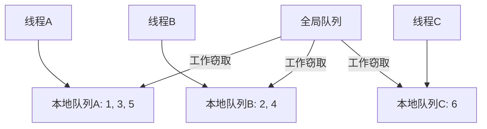

### 简介

`ConcurrentBag<T>` 是 `System.Collections.Concurrent` 命名空间下的线程安全的无序集合，专为 “多线程同时添加 / 移除元素” 设计，核心特点是基于线程局部存储（`TLS`）优化，在 “同一线程频繁添加和移除元素” 的场景下性能最优，是 `.NET` 中处理无序线程安全集合的核心工具。

### 核心定位与价值

在多线程场景中，普通的 `List<T>` 非线程安全（多线程操作会抛出异常或数据损坏），而 `lock` 包裹的 `List<T>` 存在锁竞争问题（性能低）。`ConcurrentBag<T>` 的核心价值：

* 无锁核心路径：通过线程局部存储（`TLS`）让每个线程优先操作自己的私有数据段，减少跨线程锁竞争；

* 无序存储：不保证元素的顺序（插入顺序≠遍历顺序），牺牲顺序换取性能；

* 线程安全：所有操作（`Add/TryTake` 等）均线程安全，无需手动加锁；

* 适配特定场景：尤其适合 “生产者和消费者为同一线程” 的场景（如线程池线程自产自销）。

### 核心特点

| 特性                | ConcurrentBag<T>               | ConcurrentQueue<T> | ConcurrentStack<T> | 典型使用场景         |
| ------------------- | ------------------------------ | ------------------ | ------------------ | -------------------- |
| 顺序保证            | 无序（完全不保证）             | FIFO               | LIFO               | 不关心顺序的场景     |
| 线程安全            | 是                             | 是                 | 是                 | 多线程并发           |
| 元素重复取出风险    | 可能（同一个线程可能先取后放） | 不可能             | 不可能             | 允许“偷取”工作       |
| 内存使用            | 较低（分段 + 线程本地袋）      | 中等               | 中等               | 大量小对象           |
| 支持 Peek           | 不支持                         | 支持               | 支持               | —                    |
| 典型模式            | 工作窃取（work-stealing）      | 生产者-消费者      | 后进先出任务栈     | 并行任务池、负载均衡 |

### 内部实现原理

`ConcurrentBag` 的高性能来源于线程本地存储 + 工作窃取的设计：

* 每个线程拥有一个私有小袋（`bag`）（通常是链表或数组）

* 线程 `Add/Take` 时优先操作自己的私有袋（几乎无锁）

* 当自己袋子为空时，会去 **“偷”** 其他线程的袋子（ `work-stealing`）

* 这种设计导致：

    * 同一个线程插入的元素，很可能被同一个线程先取出（局部性好）

    * 但跨线程看，完全无序，而且可能出现同一个元素被同一个线程先取后放的情况

* 轻量级锁：仅在跨线程窃取元素时加锁，核心路径（同线程存取）无锁，性能远超全局锁的 `List<T>`。



### 核心 API

#### 核心构造函数

* `ConcurrentBag<T>()`: 创建空的线程安全集合

* `ConcurrentBag<T>(IEnumerable<T>)`: 用指定集合初始化`ConcurrentBag<T>`

#### 核心方法 / 属性

* `Add(T item)`: 向集合添加元素（线程安全），无返回值

* `TryTake(out T result)`: 尝试从集合移除并返回任意元素：成功返回`true`，集合为空返回 `false`

* `Count`: 获取集合中元素的数量（线程安全，但值为瞬时快照）

* `IsEmpty`: 判断集合是否为空（线程安全，瞬时快照）

* `GetEnumerator()`: 返回遍历集合的枚举器（遍历的是瞬时快照，不保证后续元素不变）

#### 常用操作

```csharp
var bag = new ConcurrentBag<string>();

// 插入（极快）
bag.Add("任务A");
bag.Add("任务B");

// 尝试取出（非阻塞）
if (bag.TryTake(out var item))
{
    Console.WriteLine($"取出: {item}");
}

// 尝试偷取（TryPeek 不存在！）
if (bag.TryTake(out var stolen)) { /* 处理 */ }

// 计数（注意：有一定开销）
int count = bag.Count;

// 清空（不常用）
bag.Clear();

// 检查是否为空
bool isEmpty = bag.IsEmpty;
```

### 用法示例

#### 多线程添加与消费

```csharp
using System;
using System.Collections.Concurrent;
using System.Threading.Tasks;

class ConcurrentBagBasicDemo
{
    static void Main()
    {
        // 创建线程安全的ConcurrentBag
        var bag = new ConcurrentBag<int>();

        // 1. 多线程添加元素（4个线程，每个添加5个元素）
        Parallel.For(0, 4, threadId =>
        {
            for (int i = 1; i <= 5; i++)
            {
                int value = threadId * 100 + i;
                bag.Add(value);
                Console.WriteLine($"线程{threadId}：添加 {value}");
            }
        });

        Console.WriteLine($"\n集合总元素数：{bag.Count}\n");

        // 2. 多线程消费元素（直到集合为空）
        Parallel.For(0, 2, threadId =>
        {
            while (!bag.IsEmpty)
            {
                if (bag.TryTake(out int value))
                {
                    Console.WriteLine($"线程{threadId}：取出 {value}");
                }
                // 避免空循环占用CPU
                Task.Delay(10).Wait();
            }
        });

        Console.WriteLine($"\n最终集合是否为空：{bag.IsEmpty}");
    }
}
```

输出结果

```
线程0：添加 1
线程1：添加 101
线程0：添加 2
线程2：添加 201
...（添加顺序无序）
集合总元素数：20

线程0：取出 2
线程1：取出 101
线程0：取出 1
线程1：取出 201
...（取出顺序≠添加顺序，且优先取当前线程添加的元素）
最终集合是否为空：True
```

核心现象：

* 添加和取出的顺序完全无序，符合 `ConcurrentBag<T>` “无序集合” 的特性；

* 同一线程优先取出自己添加的元素（`TLS` 优化的体现）。

#### 并行处理大量独立小文件

```csharp
var files = Directory.GetFiles("big_folder", "*.txt");
var bag = new ConcurrentBag<string>(files);

Parallel.ForEach(bag, new ParallelOptions { MaxDegreeOfParallelism = Environment.ProcessorCount },
    file =>
    {
        ProcessFile(file);
    });
```

#### 对象池实现

```csharp
public class ObjectPool<T>
{
    private readonly ConcurrentBag<T> _objects;
    private readonly Func<T> _objectGenerator;

    public ObjectPool(Func<T> objectGenerator)
    {
        _objects = new ConcurrentBag<T>();
        _objectGenerator = objectGenerator;
    }

    public T Get()
    {
        return _objects.TryTake(out T item) ? item : _objectGenerator();
    }

    public void Return(T item)
    {
        _objects.Add(item);
    }
}

// 使用示例
var pool = new ObjectPool<StringBuilder>(() => new StringBuilder());
var sb = pool.Get();
try
{
    sb.Append("Hello");
    Console.WriteLine(sb.ToString());
}
finally
{
    pool.Return(sb);
}
```

### 关键特性与适用场景

#### 核心特性

* 顺序性: 无序（`Add` 顺序≠遍历 / `Take` 顺序）

* 线程安全: 所有操作线程安全，无需手动加锁

* 性能:	同线程存取：极高（无锁）；跨线程窃取：中（轻量级锁）

* 空值支持:	允许添加 `null`（若T为引用类型）

* 遍历特性:	遍历的是 “瞬时快照”，遍历过程中集合可修改，不抛出异常

* 容量: 无固定容量限制，动态扩容

#### 最佳适用场景

* 线程自产自销：线程池线程添加元素后，自己快速取出处理（如线程本地缓存）；

* 无序批量处理：多线程收集数据，无需保证顺序（如日志收集、临时数据存储）；

* 低锁竞争场景：大多数操作由同一线程完成，跨线程操作少。

* 对象池实现：重用对象减少分配

* 并行计算中间结果收集

* 生产者即消费者模式

#### 不适用场景

* 需要有序存取：如 `FIFO`（用 `ConcurrentQueue<T>` ）、`LIFO`（用`ConcurrentStack<T>`）；

* 高跨线程窃取：多线程频繁添加，且其他线程频繁取走（此时锁竞争多，性能低于`ConcurrentQueue<T>` ）；

* 索引访问：`ConcurrentBag<T>` 无索引（如 `bag[0]` ），需索引访问用`ConcurrentDictionary<TKey, TValue>` 或手动封装。

### 最佳实践

#### 优先用于生产者-消费者同线程场景

```csharp
   // 同一线程添加和取出
   var threadLocalBag = new ConcurrentBag<WorkItem>();
   
   void Process()
   {
       threadLocalBag.Add(CreateWork());
       if (threadLocalBag.TryTake(out var work))
       {
           Execute(work);
       }
   }
```

#### 避免用于生产者-消费者分离场景

```csharp
   // 生产者消费者分离
   var sharedBag = new ConcurrentBag<Data>();
   
   // 生产者线程
   Task.Run(() => sharedBag.Add(produce()));
   
   // 消费者线程
   Task.Run(() => 
   {
       if (sharedBag.TryTake(out var data))
       {
           consume(data);
       }
   });
```

### 总结

`ConcurrentBag<T>` 是 `.NET` 并发集合中的特殊工具：

* ✅ 在生产者即消费者场景中性能卓越

* ✅ 内置工作窃取机制

* ✅ 无锁实现减少竞争

* ✅ 线程本地存储优化

最佳适用场景：

* 线程处理自己生成的任务

* 对象池实现

* 并行计算的结果收集

* 工作窃取模式的任务分发