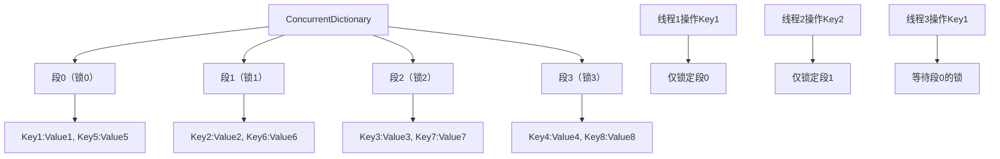

### 简介

`ConcurrentDictionary<TKey, TValue>` 是 `System.Collections.Concurrent` 命名空间下的线程安全的键值对集合，专为高并发读写场景设计 —— 相比传统 `Dictionary<TKey, TValue> +lock` 的方案，它采用细粒度锁（分段锁） 替代全局锁，大幅降低锁竞争，是 `.NET` 中实现线程安全键值存储的首选工具。

### 核心定位与价值

普通 `Dictionary<TKey, TValue>` 非线程安全（多线程读写会抛出`InvalidOperationException` 或数据损坏），而用 `lock` 包裹的 `Dictionary` 存在 “全局锁” 问题：所有线程争抢同一把锁，高并发下性能极差。

`ConcurrentDictionary<TKey, TValue>` 的核心价值：

* 细粒度分段锁：将集合拆分为多个 “段（`Segment`）”，每个段有独立锁，线程仅竞争目标 `Key` 所在段的锁，而非全局锁；

* 原子操作 `API`：提供 `GetOrAdd、AddOrUpdate` 等原子方法，避免 “检查 - 添加”“检查 - 更新” 等复合操作的竞态条件；

* 线程安全：所有读写操作（增删改查）均线程安全，无需手动加锁；

* 高性能：高并发下性能远超 “`lock + Dictionary`”，且支持动态扩容。

> 关键区别：与 `Hashtable`（线程安全但全局锁）不同，`ConcurrentDictionary` 的分段锁设计使其在高并发场景下性能提升数倍甚至数十倍。

### 核心 API 

#### 构造函数

* `ConcurrentDictionary<TKey, TValue>()`: 创建空的线程安全字典

* `ConcurrentDictionary<TKey, TValue>(IEnumerable<KeyValuePair<TKey, TValue>>`: 用指定键值对初始化

* `ConcurrentDictionary<TKey, TValue>(int concurrencyLevel, int capacity)`: 指定并发级别（分段数）和初始容量

#### 核心方法 / 属性

* `TryAdd(TKey key, TValue value)`:
   尝试添加键值对：`Key` 不存在则添加，返回 `true`；`Key` 已存在返回 `false`

* `TryGetValue(TKey key, out TValue value)`:
   尝试获取值：`Key` 存在返回 `true`，`out` 为对应值；否则返回 `false`

* `TryRemove(TKey key, out TValue value)`:
   尝试移除键值对：`Key` 存在则移除，返回 `true`；否则返回 `false`

* `TryUpdate(TKey key, TValue newValue, TValue comparisonValue)`:
   尝试更新：仅当当前值等于 `comparisonValue` 时更新为 `newValue`，返回是否成功

* `GetOrAdd(TKey key, TValue value)`:
   获取值：`Key` 存在则返回现有值；不存在则添加 `key-value` 并返回新值

* `GetOrAdd(TKey key, Func<TKey, TValue> valueFactory)`:
   延迟创建值：`Key` 不存在时执行工厂方法生成值（避免不必要的对象创建）

* `AddOrUpdate(TKey key, TValue addValue, Func<TKey, TValue, TValue> updateFactory)`:
  添加或更新：`Key` 不存在则添加；存在则执行工厂方法更新值 

* `this[key] = value`: 强制设置（会覆盖）

* `Count`: 获取键值对数量（瞬时快照，非实时）

* `IsEmpty`: 判断是否为空（瞬时快照）

* `Keys/Values`: 获取键 / 值集合（只读，快照）

* `Clear()`: 清空

### 用法示例

#### 创建实例

```csharp
// 创建空字典
var dict = new ConcurrentDictionary<int, string>();

// 带初始数据创建
var initialData = new List<KeyValuePair<int, string>>
{
    new KeyValuePair<int, string>(1, "One"),
    new KeyValuePair<int, string>(2, "Two")
};
var dict = new ConcurrentDictionary<int, string>(initialData);

// 自定义比较器
var caseInsensitiveDict = new ConcurrentDictionary<string, int>(
    StringComparer.OrdinalIgnoreCase);
```

#### 最经典的 GetOrAdd（延迟初始化/缓存）

```csharp
private readonly ConcurrentDictionary<string, ExpensiveService> _services = new();

public ExpensiveService GetService(string name)
{
    return _services.GetOrAdd(name, key => new ExpensiveService(key));
}
```

`GetOrAdd` 的强大之处：

* 原子操作：多个线程同时调用，只有一个会执行工厂函数

* 其余线程等待并拿到同一个结果（防重复创建）

#### AddOrUpdate（更新计数器、累加等）

```csharp
private readonly ConcurrentDictionary<string, int> _requestCounters = new();

public void RecordRequest(string endpoint)
{
    _requestCounters.AddOrUpdate(
        key: endpoint,
        addValue: 1,                    // 第一次出现时设为 1
        updateValueFactory: (key, old) => old + 1  // 已有则累加
    );
}
```

#### TryUpdate 的 CAS 风格更新（防 ABA 问题）

```csharp
public bool TryIncrementCounter(string key, int expected, out int newValue)
{
    return _requestCounters.TryUpdate(key, expected + 1, expected);
}
```

#### 高并发读写

```csharp
using System;
using System.Collections.Concurrent;
using System.Threading.Tasks;

class ConcurrentDictionaryBasicDemo
{
    static void Main()
    {
        // 创建线程安全字典，存储“用户ID-访问次数”
        var userAccessCount = new ConcurrentDictionary<int, int>();

        // 1. 高并发更新：1000个线程，每个线程模拟10次用户访问
        Parallel.For(0, 1000, userId =>
        {
            for (int i = 0; i < 10; i++)
            {
                // 原子操作：获取或添加（初始值0），然后递增
                userAccessCount.AddOrUpdate(
                    key: userId,
                    addValue: 1, // Key不存在时添加，值为1
                    updateFactory: (k, v) => v + 1 // Key存在时，值+1
                );
            }
        });

        Console.WriteLine($"字典总键数：{userAccessCount.Count}"); // 输出1000
        Console.WriteLine($"用户ID=100的访问次数：{userAccessCount[100]}"); // 输出10

        // 2. 尝试获取/移除值
        if (userAccessCount.TryGetValue(500, out int count))
        {
            Console.WriteLine($"用户ID=500的访问次数：{count}"); // 输出10
        }

        if (userAccessCount.TryRemove(500, out int removedCount))
        {
            Console.WriteLine($"移除用户ID=500，访问次数：{removedCount}");
        }

        // 3. 延迟创建值（GetOrAdd工厂方法）
        var userInfo = new ConcurrentDictionary<int, string>();
        // Key=999不存在时，执行工厂方法生成值（避免提前创建不必要的对象）
        string info = userInfo.GetOrAdd(999, key => $"用户{key}的信息（动态生成）");
        Console.WriteLine(info); // 输出：用户999的信息（动态生成）
    }
}
```

#### 原子更新复杂对象（值为自定义类型）

```csharp
// 自定义类型：用户信息
public class UserInfo
{
    public string Name { get; set; }
    public int Age { get; set; }
    // 注意：自定义类型的修改需保证线程安全（此处用Interlocked更新Age）
    public void IncrementAge() => Interlocked.Increment(ref Age);
}

class ConcurrentDictionaryComplexValue
{
    static void Main()
    {
        var userDict = new ConcurrentDictionary<int, UserInfo>();

        // 1. 原子添加用户信息
        var user = userDict.GetOrAdd(1, key => new UserInfo { Name = "张三", Age = 20 });
        Console.WriteLine($"初始信息：{user.Name}，{user.Age}");

        // 2. 高并发更新用户年龄
        Parallel.For(0, 100, _ =>
        {
            // 先获取用户对象，再原子更新Age
            if (userDict.TryGetValue(1, out var u))
            {
                u.IncrementAge();
            }
        });

        Console.WriteLine($"更新后年龄：{userDict[1].Age}"); // 输出120
    }
}
```

#### 结合 Lazy<T>实现懒加载缓存

```csharp
// 缓存：Key=配置名，Value=Lazy<配置对象>（延迟初始化+线程安全）
var configCache = new ConcurrentDictionary<string, Lazy<Config>>();

// 获取配置（懒加载，仅第一次调用时创建Config对象）
Config GetConfig(string configName)
{
    // GetOrAdd原子操作：确保仅创建一次Lazy<Config>
    var lazyConfig = configCache.GetOrAdd(configName, key =>
    {
        Console.WriteLine($"创建配置{key}的Lazy实例");
        return new Lazy<Config>(() =>
        {
            Console.WriteLine($"实际加载配置{key}");
            // 模拟从文件/数据库加载配置
            return new Config { Name = key, Value = $"配置值-{key}" };
        });
    });
    // 访问Value触发初始化（Lazy<T>保证线程安全）
    return lazyConfig.Value;
}

// 测试：多次调用GetConfig，仅第一次触发实际加载
var config1 = GetConfig("AppSettings");
var config2 = GetConfig("AppSettings");
var config3 = GetConfig("Database");

// 配置类
public class Config
{
    public string Name { get; set; }
    public string Value { get; set; }
}
```

输出：

```
创建配置AppSettings的Lazy实例
实际加载配置AppSettings
创建配置Database的Lazy实例
实际加载配置Database
```

#### 实时计数器

```csharp
public class CounterService
{
    private readonly ConcurrentDictionary<string, int> _counters = new();
    
    public void Increment(string counterName)
    {
        _counters.AddOrUpdate(counterName, 1, (_, old) => old + 1);
    }
    
    public int GetCount(string counterName)
    {
        return _counters.TryGetValue(counterName, out int value) ? value : 0;
    }
}
```

#### 线程安全注册表

```csharp
public class ServiceRegistry
{
    private readonly ConcurrentDictionary<Type, object> _services = new();
    
    public void Register<T>(T service) where T : class
    {
        _services[typeof(T)] = service;
    }
    
    public T GetService<T>() where T : class
    {
        if (_services.TryGetValue(typeof(T), out object service))
        {
            return service as T;
        }
        return null;
    }
}
```

### 底层原理：分段锁（Segment Lock）

`ConcurrentDictionary<TKey, TValue>` 的高性能核心源于分段锁设计，简化原理如下：

* 分段存储：将字典的哈希表拆分为多个独立的 “段（`Segment`）”，每个段对应一个哈希区间，并有自己的锁；

* 哈希定位段：根据 `Key` 的哈希值计算所属的段，线程仅需锁定该段，而非整个字典；

* 细粒度锁竞争：不同 `Key` 若属于不同段，多线程操作时无锁竞争；仅同一网段的 `Key` 才会竞争锁；

* 动态扩容：当某个段的元素过多时，仅扩容该段（而非全局扩容），进一步降低锁竞争。



### 关键特性与适用场景

#### 核心特性

* 线程安全: 所有操作线程安全，无需手动加锁

* 锁粒度: 分段锁（细粒度），高并发下锁竞争少

* 原子操作: 提供 `GetOrAdd/AddOrUpdate` 等原子方法，避免复合操作竞态条件

* 顺序性: 无序（键值对按哈希存储，遍历顺序≠添加顺序）

* 空值支持: `Value` 可设为 `null`（若 `TValue` 为引用类型），`Key` 不可为 `null`

* 性能: 高并发读写性能远优于 `lock + Dictionary`

#### 最佳适用场景

* 高并发缓存：如应用级缓存、分布式缓存本地副本（多线程读写缓存）；

* 计数统计：如接口访问次数、用户操作计数（高并发更新）；

* 共享状态存储：多线程共享的键值对数据（如配置、会话信息）；

* 延迟初始化：通过 `GetOrAdd` 的工厂方法实现键值对的懒加载。

#### 不适用场景

* 有序键值对：需按 `Key` 排序的场景（改用 `SortedDictionary<TKey, TValue>` + 手动锁）；

* 频繁扩容：若 `Key` 的哈希分布不均，导致单个段元素过多，会增加锁竞争（需优化哈希算法）；

* 只读 / 极少写：若字典几乎只读，`Dictionary<TKey, TValue> + ReaderWriterLockSlim` 性能更高。

### ConcurrentDictionary vs 其他集合

| 需求场景                       | 首选集合                                       | 理由简述                       |
| ------------------------------ | ---------------------------------------------- | ------------------------------ |
| 多线程键值缓存、配置、单例工厂 | **ConcurrentDictionary**                       | 原子 GetOrAdd/AddOrUpdate 完美 |
| 严格 FIFO 生产者-消费者        | Channel<T> 或 ConcurrentQueue                  | 需要顺序                       |
| 无序、最大吞吐量的小任务池     | ConcurrentBag                                  | 工作窃取 + 极致性能            |
| 需要 Peek / 顺序               | ConcurrentQueue                                | FIFO + 支持 Peek               |
| 键值对 + 去重 + 线程安全       | **ConcurrentDictionary**                       | 天然支持                       |
| 极致性能 + 单线程写多线程读    | Dictionary + Immutable 或 ConcurrentDictionary | —                              |

### 注意事项

* 不要在枚举期间修改 `foreach (var pair in dict)` 或 `dict.Keys` 期间修改会抛 `InvalidOperationException`。

* `Count` 有开销 `dict.Count` 需要扫描所有桶，高并发下不要频繁调用。

* 不要依赖枚举顺序，枚举顺序是完全无序的，与插入顺序无关。

* 值如果是可变对象 `dict[key].SomeProperty = xxx` 不是线程安全的！
需要自己加锁或使用不可变对象。


> ConcurrentDictionary 的本质不是“线程安全的 Dictionary”，
而是一组“为并发而生的原子 Key-Value 操作 API”。