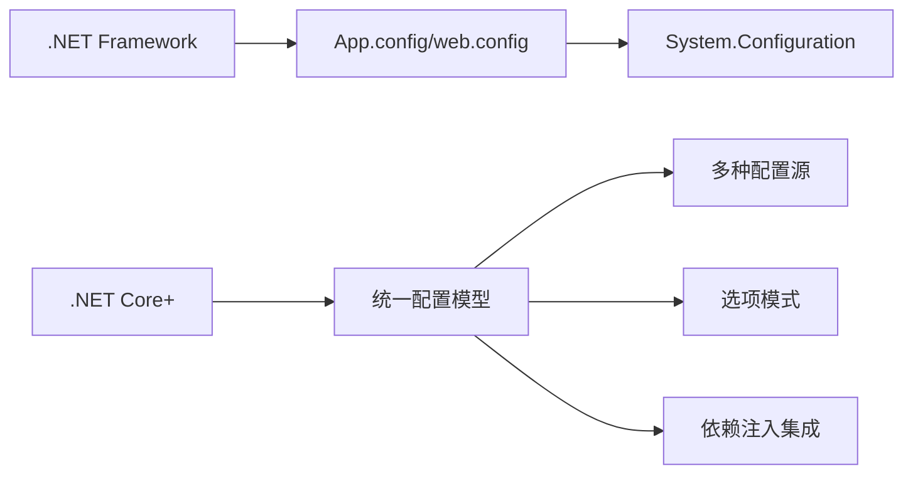

### 简介

`ASP.NET Core` 的配置系统旨在提供统一、灵活的方式来读取应用程序设置。它具备以下特点：

* 支持多种配置源：JSON、XML、INI、环境变量、命令行、内存、用户机密、数据库、自定义等；

* 层级合并与覆盖：后添加的配置源会覆盖前面的同名键；

* 键名称统一：默认使用 “冒号”分隔的层级键（如 `Logging:LogLevel:Default`）；

* 与 `DI` 整合：通过 `IConfiguration` 及 `IOptions<T>` 注入到服务中；

* 动态重载：部分配置源（如 `JSON` 文件）支持文件更改时自动刷新。

整个流程通常是在程序启动时通过 `ConfigurationBuilder` 构建一个 `IConfigurationRoot`，并将其注册到依赖注入容器。

#### 配置系统架构演进



配置系统演进：

* `.NET Framework` 时代：基于 `XML` 的 `app.config/web.config`，通过 `ConfigurationManager`访问

* `.NET Core+` 时代：灵活的统一配置模型，支持多种配置源和格式

#### 核心特性

* 多源配置：

    * 支持多种配置提供程序（`Providers`），如 `JSON、XML、INI`、环境变量、命令行、`Azure Key Vault` 等。

    * 配置按添加顺序合并，后添加的提供程序覆盖前面的值。

* 类型安全绑定：

    * 使用 `Bind` 方法或 `Options Pattern` 将配置映射到 `C#` 对象。

    * 示例：`services.Configure<MySettings>(configuration.GetSection("MySettings"))`。

* 热加载（`Hot Reload`）：

    * 支持文件更改时自动重新加载配置（如 `appsettings.json`）。

    * 示例：`AddJsonFile("appsettings.json", optional: true, reloadOnChange: true)`。

* 环境特定配置：

    * 支持基于环境的配置文件，如 `appsettings.Development.json`。

    * 示例：`AddJsonFile($"appsettings.{env.EnvironmentName}.json", optional: true)`。

* 依赖注入集成：

    * 通过 `IOptions<T>、IOptionsSnapshot<T>` 或 `IOptionsMonitor<T>` 注入配置。

    * 示例：`services.AddOptions<MySettings>()`。

* 层次结构支持：

    * 支持嵌套配置（如 `JSON` 对象），通过 : 分隔符访问。
    
    * 示例：`configuration["Database:ConnectionString"]`。

* 扩展性：

    * 支持自定义配置提供程序。

    * 与 `Azure Key Vault、Consul` 等集成。

* 安全性：

    * 支持从 `Azure Key Vault` 或环境变量加载敏感数据（如密码、`API` 密钥）。


### 核心接口与类

* `IConfiguration`

    * 只读接口，表示配置键值对集合。

    * 通过索引器 `configuration["Section:Key"]` 访问。

* `IConfigurationRoot`（继承自 `IConfiguration`）

    * 代表已构建完成的配置根，可调用 `Reload()` 触发重新加载。

* `IConfigurationBuilder`

    * 用于逐步添加各类配置源（`Providers`），最终通过 `Build()` 生成 `IConfigurationRoot`。

* `IConfigurationProvider`

    * 配置提供者接口，负责从具体源读取键值并加载到内存；

* `IConfigurationSource`

    * 配置提供者的“工厂”，负责创建对应的 `IConfigurationProvider`。

在 `ASP.NET Core` 中，`WebApplication.CreateBuilder(args)` 会自动创建并添加常见配置源，然后将构建的 `IConfiguration` 注册到服务容器中。

### 配置提供程序 (Providers)

* `JSON`: `.AddJsonFile("appsettings.json")`

* 环境变量: `.AddEnvironmentVariables()`

* 命令行参数: `.AddCommandLine(args)`

* `Azure Key Vault`: `.AddAzureKeyVault()`

* 用户机密 (开发环境): `.AddUserSecrets<Program>()`

### 内置配置源

#### appsettings.json / appsettings.{Environment}.json

```json
// appsettings.json
{
  "Logging": {
    "LogLevel": {
      "Default": "Information",
      "Microsoft": "Warning"
    }
  },
  "ConnectionStrings": {
    "Default": "Server=.;Database=MyApp;..."
  }
}
```

* 默认会加载 `appsettings.json`，再加载 `appsettings.Development.json`（根据 `ASPNETCORE_ENVIRONMENT` 环境变量）；

* `JSON` 文件支持层级结构，且可设置 `reloadOnChange: true` 以监控文件变动。

#### 环境变量

* 读取系统环境变量，键名以“__”（双下划线）代表层级分隔，例如 `Logging__LogLevel__Default=Debug`；

* 环境变量优先级高于 `JSON`。

#### 命令行参数

```shell
dotnet run --Logging:LogLevel:Default=Trace --MyOption:Sub=Value
```

* 命令行参数形式必须是 --键=值，覆盖所有前面加载的源。

#### 其他常见源

* `INI` 文件：`builder.AddIniFile("config.ini")`;

* `XML` 文件：`builder.AddXmlFile("config.xml")`;

* 内存字典：适合单元测试或运行时动态添加：

```csharp
builder.AddInMemoryCollection(new Dictionary<string,string>{
  ["MyKey"]="MyValue"
});
```

### 配置优先级（从高到低）

* 命令行参数

* 环境变量

* 用户机密 (开发)

* `appsettings.{Environment}.json`

* `appsettings.json`

### 基础使用

```csharp
// 获取配置值
string connectionString = configuration["ConnectionStrings:DefaultConnection"];
string apiKey = configuration["ApiKey"];
int timeout = configuration.GetValue<int>("Timeout", 30);  // 获取值，带默认值

// 获取配置节
IConfigurationSection databaseSection = configuration.GetSection("Database");
string server = databaseSection["Server"];
string database = databaseSection["Name"];
```

### 构建与注册

在 `Program.cs`（最简版）中：

```csharp
var builder = WebApplication.CreateBuilder(args);
// builder.Configuration 已经包含：
// 1. appsettings.json
// 2. appsettings.{Env}.json
// 3. 环境变量
// 4. 命令行

// 可继续添加自定义源
builder.Configuration
       .AddJsonFile("custom.json", optional:true, reloadOnChange:true)
       .AddUserSecrets<Program>();

// 注册 Options
builder.Services.Configure<MySettings>(builder.Configuration.GetSection("MySettings"));

var app = builder.Build();  
```

### 强类型绑定（Options 模式）

直接从 `IConfiguration` 获取字符串较为零散，推荐使用 `Options` 模式将配置映射为 `POCO` 对象，并通过 `DI` 获取。

#### 定义配置对象

```csharp
public class MySettings
{
    public string Url { get; set; }
    public int RetryCount { get; set; }
    public NestedSettings Nested { get; set; }
}
public class NestedSettings
{
    public bool Enabled { get; set; }
}
```

对应 `appsettings.json`：

```json
"MySettings": {
  "Url": "https://api.example.com",
  "RetryCount": 3,
  "Nested": {
    "Enabled": true
  }
}
```

#### 在 Program.cs 中绑定

```csharp
builder.Services
       .AddOptions<MySettings>()
       .Bind(builder.Configuration.GetSection("MySettings"))
       .ValidateDataAnnotations()   // 可选：启用数据注解验证
       .Validate(s => s.RetryCount >= 0, "RetryCount must be non-negative");
```

#### 在业务中注入使用

```csharp
public class MyService
{
    private readonly MySettings _settings;
    public MyService(IOptions<MySettings> opts)
    {
        _settings = opts.Value;
    }
    public void Run() {
        Console.WriteLine(_settings.Url);
    }
}
```

也可注入 `IOptionsMonitor<T>`（支持变更监听）或 `IOptionsSnapshot<T>`（每次请求新的快照，仅限 `Scoped` 服务）。

### 动态重载与变更监听

对于支持 `reloadOnChange: true` 的配置源（如 `JSON` 文件、环境变量不支持文件监控），`IOptionsMonitor<T>` 可感知配置变更并触发回调：

```csharp
services.AddOptions<MySettings>()
        .Bind(config.GetSection("MySettings"))
        .ValidateDataAnnotations();

services.AddSingleton<IHostedService, MonitorService>();

public class MonitorService : BackgroundService
{
    private readonly IOptionsMonitor<MySettings> _monitor;
    public MonitorService(IOptionsMonitor<MySettings> monitor)
        => _monitor = monitor;

    protected override Task ExecuteAsync(CancellationToken ct)
    {
        _monitor.OnChange(s => 
            Console.WriteLine($"New URL: {s.Url}")
        );
        return Task.CompletedTask;
    }
}
```
