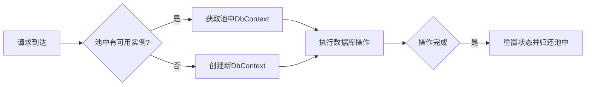

### 简介

`DbContext` 池是 `Entity Framework Core` 中的高性能数据库连接管理机制，通过重用已初始化的 `DbContext` 实例，显著减少创建和销毁上下文对象的开销，特别适合高并发场景。尤其在高并发场景（如 Web API）中，频繁创建和释放 `DbContext` 会导致：

* 性能瓶颈：实例化 `DbContext` 涉及反射、元数据初始化和连接池分配。

* 内存压力：频繁创建和释放会导致垃圾回收（`GC`）压力。

* 连接管理问题：不恰当的 `DbContext` 生命周期可能导致数据库连接泄漏。

`DbContext` 池通过以下方式解决问题：

* 复用实例：维护一个固定大小的 `DbContext` 实例池，租用和归还实例。

* 降低开销：减少实例化和释放的成本，优化性能。

* 线程安全：内置线程安全机制，适合高并发环境。

* 状态清理：每次归还时自动重置 `DbContext` 的跟踪状态，确保实例干净。

### 主要功能

* 实例池化：维护一个固定大小的 `DbContext` 实例池，复用已创建的实例。

* 自动清理：归还 `DbContext` 时，自动清除变更跟踪器（`ChangeTracker`）中的状态。

* 依赖注入集成：与 `ASP.NET Core` 的依赖注入（`DI`）无缝集成，支持 `AddDbContextPool`。

* 高性能：减少 `DbContext` 实例化和释放的开销，适合高并发场景。

* 可配置池大小：允许指定池的最大容量（默认 1024）。

* 线程安全：内置支持多线程环境，无需手动同步。

### 核心原理



* 对象池管理

    * 内部维护一个固定大小的 `DbContext` 对象池（默认大小 1024），超出时会按“先进先出”原则回收最旧对象。

* `ResetState`

    * 在归还到池前，自动调用 `context.ResetState()`（清空跟踪实体、重置查询跟踪配置、清空临时数据等），保证下一个使用者得到干净的上下文。

* 模型缓存重用

    * `EF Core` 的模型元数据（`IModel`）是全局单例缓存，池化不会影响此部分的重用。

### 配置与启用

在 `Startup.cs`（或 `Program.cs`）中，替换 `AddDbContext` 为 `AddDbContextPool`：

```csharp
// ASP.NET Core 6+ minimal hosting
builder.Services
       .AddDbContextPool<MyDbContext>(options =>
           options.UseSqlServer(connectionString)
                  .EnableSensitiveDataLogging()   // 可选：调试时开启
       );

// 可选：自定义池大小（默认 1024）
builder.Services
       .AddDbContextPool<MyDbContext>(poolSize: 128, options =>
           options.UseMySql(mysqlConn, ServerVersion.AutoDetect(mysqlConn))
       );
```

* `poolSize`：最大池容量，超过时最久未使用的实例会被丢弃并 `new` 新的。

* 注意：不要 在同一个请求内跨线程、多次 `await` 后并发使用同一实例；`DbContext` 依然是 非线程安全 的。

### 主要 API 与选项

| 方法                                                     | 说明                                           |
| -------------------------------------------------------- | ---------------------------------------------- |
| `AddDbContextPool<TContext>(...)`                        | 将带有池化支持的 `DbContext` 注册到 DI。       |
| `AddDbContextPool<TContext>(poolSize,…)`                 | 指定最大池容量                                 |
| `optionsBuilder.UseInternalServiceProvider`              | 当需要更细粒度 DI 服务控制时，可与池化共用容器 |
| `DbContextOptionsBuilder.EnableThreadSafetyChecks(bool)` | 可关闭池化的线程安全检测，获得更高性能（慎用） |

* `Thread-Safety Checks`

默认在池化模式下，`EF Core` 会检测同一个上下文实例被多次并发使用，并抛出 `InvalidOperationException`；可通过 `EnableThreadSafetyChecks(false)` 关闭此检查（仅当你非常确定无并发访问时）。

### 使用示例

```csharp
public class MyDbContext : DbContext
{
    public DbSet<Order> Orders { get; set; }
    public MyDbContext(DbContextOptions<MyDbContext> options)
        : base(options) { }
}

// 应用启动配置
builder.Services
       .AddDbContextPool<MyDbContext>(options =>
           options.UseSqlServer(connStr));

// 控制器中注入使用
[ApiController]
[Route("api/[controller]")]
public class OrdersController : ControllerBase
{
    private readonly MyDbContext _db;
    public OrdersController(MyDbContext db) => _db = db;

    [HttpGet]
    public async Task<IEnumerable<Order>> Get() =>
        await _db.Orders.AsNoTracking().ToListAsync();
}
```

* 对于只读查询，依然加上 `.AsNoTracking()`，减少内部状态变动。

* 每个请求内不应手动调用 `Dispose()`，容器会自动管理归还池中。

#### 使用 IDbContextFactory

在需要手动控制 `DbContext` 生命周期的场景（如后台服务），使用 `IDbContextFactory`：

```csharp
using Microsoft.EntityFrameworkCore;
using Microsoft.Extensions.DependencyInjection;
using Microsoft.Extensions.Hosting;

public class User
{
    public int Id { get; set; }
    public string Name { get; set; }
}

public class MyDbContext : DbContext
{
    public DbSet<User> Users { get; set; }
    public MyDbContext(DbContextOptions<MyDbContext> options) : base(options) { }
}

public class UserSyncService : BackgroundService
{
    private readonly IDbContextFactory<MyDbContext> _dbContextFactory;

    public UserSyncService(IDbContextFactory<MyDbContext> dbContextFactory)
    {
        _dbContextFactory = dbContextFactory;
    }

    protected override async Task ExecuteAsync(CancellationToken stoppingToken)
    {
        using var timer = new PeriodicTimer(TimeSpan.FromSeconds(30));
        while (await timer.WaitForNextTickAsync(stoppingToken))
        {
            using var dbContext = await _dbContextFactory.CreateDbContextAsync(stoppingToken);
            var users = await dbContext.Users.ToListAsync(stoppingToken);
            Console.WriteLine($"Synced {users.Count} users at {DateTime.Now:HH:mm:ss}");
        }
    }
}
```

* 注册服务：

```csharp
builder.Services.AddDbContextPool<MyDbContext>(
    options => options.UseSqlServer("Server=localhost;Database=testdb;Trusted_Connection=True;"));
builder.Services.AddHostedService<UserSyncService>();
```

* 说明：

    * `IDbContextFactory` 从池中获取 `DbContext`，`using` 确保归还。

    * 适合后台任务或需要显式生命周期管理的场景。

### 高级优化策略

#### 池大小动态调整

```csharp
// 根据负载动态调整池大小
services.AddDbContextPool<AppDbContext>(options => 
    options.UseSqlServer(connStr), 
    poolSize: GetOptimalPoolSize());

int GetOptimalPoolSize()
{
    var env = Environment.GetEnvironmentVariable("ASPNETCORE_ENVIRONMENT");
    return env == "Production" 
        ? Environment.ProcessorCount * 4 // 生产环境：CPU核心数×4
        : 32; // 开发环境
}
```

#### 并发操作处理

```csharp
public async Task ConcurrentUpdates()
{
    var tasks = new List<Task>();
    
    for (int i = 0; i < 10; i++)
    {
        tasks.Add(Task.Run(async () =>
        {
            // 每个任务使用独立的scope
            using var scope = serviceProvider.CreateScope();
            var context = scope.ServiceProvider.GetRequiredService<AppDbContext>();
            
            var product = await context.Products.FindAsync(1);
            product.Price += 0.1m;
            await context.SaveChangesAsync();
        }));
    }
    
    await Task.WhenAll(tasks);
}
```

### 性能对比

| 场景             |   `AddDbContext` | `AddDbContextPool` |
| ---------------- | ---------------: | -----------------: |
| **首轮实例化**   | 较慢（完整构造） |   较慢（完整构造） |
| **后续实例获取** |         new 每次 |           池化复用 |
| **GC 压力**      |             较高 |               较低 |
| **并发请求吞吐** |             略低 |               略高 |
| **内存峰值**     |             较高 |               稳定 |

> 在典型 WebAPI 场景下，开启池化后整体吞吐可提升 5–15%，GC Gen2 回收次数显著减少。

### 何时不使用池

* 需要每个上下文不同配置

* 使用上下文执行长时间操作

* 应用程序是非并发型（如控制台工具）

* 需要自定义复杂上下文状态管理

### 总结

`AddDbContextPool` 为 `EF Core` 引入了 对象池化 能力，通过复用 `DbContext` 实例，有效降低了堆分配和 `GC` 压力，提升了高并发场景下的吞吐和稳定性。在配置简便、兼容性好（对现有代码改动极小）的前提下，是生产环境中 强烈推荐 的优化手段。只需将注册方式由 `AddDbContext` 换为 `AddDbContextPool`，并结合最佳实践使用，即可快速获得性能收益。

### 资源和文档

* 官方文档：

    * `Microsoft Learn`：https://learn.microsoft.com/en-us/ef/core/performance/advanced-performance-topics#dbcontext-pooling

    * `EF Core DI`：https://learn.microsoft.com/en-us/ef/core/dbcontext-configuration

* `GitHub`：https://github.com/dotnet/efcore