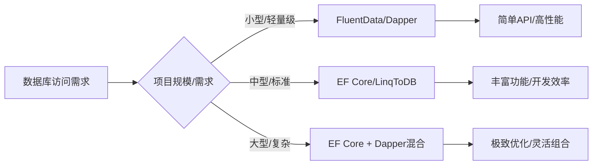

### 简介

`FluentData` 是一个微型 `ORM（micro‑ORM）`，主打「`Fluent API`」风格，让开发者在保持对原生 `SQL` 完全控制的同时，享受链式调用的便捷性。

它与 `Dapper、Massive` 类似，但在提供动态对象、强类型映射、多结果集及自定义实体工厂等功能方面更为完善，且无需修改现有业务实体即可接入。

**核心特性**

* 流畅的 `API`：通过链式调用实现直观的数据库操作

* 多数据库支持：支持 SQL Server、MySQL、Oracle、SQLite 等

* 高性能：接近原生 `ADO.NET` 的性能

* 事务管理：支持本地和分布式事务

* 存储过程支持：简化存储过程调用

* 灵活的映射：支持自定义对象映射

* 参数化查询：防止 `SQL` 注入

* 批量操作：高效的批量插入和更新

### 安装与配置

```csharp
// NuGet 安装
Install-Package FluentData

// 创建 DbContext
public class AppDbContext : DbContext
{
    public AppDbContext() : base(new SqlServerProvider(), "ConnectionString")
    {
        // 配置选项
        Configuration.AutoCommit = false;
        Configuration.PrefixParametersWithAtSign = true;
    }
}
```

### 核心 CRUD 用法

#### 查询

* 多条记录

```csharp
// 返回 List<T>
var list = db.Sql("SELECT * FROM Users WHERE Age > @min")
             .Parameter("min", 18)
             .QueryMany<User>();
```

* 单条记录

```csharp
var user = db.Sql("SELECT * FROM Users WHERE Id = @id")
             .Parameter("id", 1)
             .QuerySingle<User>();
```

* 动态类型

```csharp
var dyn = db.Sql("SELECT Name, Age FROM Users")
            .QueryMany<dynamic>();
```

#### 插入

```csharp
// 方式一：指定表名与列
int newId = db.Insert("Users")
              .Column("Name", "Alice")
              .Column("Age", 28)
              .ExecuteReturnLastId<int>();

// 方式二：POCO
int id2 = db.Insert<User>()
            .AppendData(new User { Name = "Bob", Age = 30 })
            .ExecuteReturnLastId<int>();
```

#### 更新

```csharp
int rows = db.Update("Users")
             .Column("Age", 29)
             .Where("Id", 1)
             .Execute();
```

#### 删除

```csharp
int deleted = db.Delete("Users")
                .Where("Age", 100, Operator.LessThan)
                .Execute();
```

### 高级功能详解

#### 查询构建器

```csharp
using (var context = new DbContext().ConnectionString("MyConnectionString", new SqlServerProvider()))
{
    // 使用查询构建器
    var users = context.Schema("dbo")
        .Table("Users")
        .Where("Age", Conditions.GreaterThan, 18)
        .And("Status", Conditions.Equal, "Active")
        .OrderBy("CreatedAt", SortDirection.Descending)
        .QueryMany<User>();

    // 分页查询
    var pagedUsers = context.Schema("dbo")
        .Table("Users")
        .Where("Age", Conditions.GreaterThan, 18)
        .Page(1, 10)
        .QueryMany<User>();
}
```

#### 事务管理

```csharp
using (var context = new DbContext().ConnectionString("MyConnectionString", new SqlServerProvider()))
{
    using (var transaction = context.BeginTransaction())
    {
        try
        {
            // 插入操作
            context.Sql("INSERT INTO Users (Name, Age) VALUES (@Name, @Age)")
                .Parameter("Name", "Transaction User")
                .Parameter("Age", 30)
                .Execute();

            // 更新操作
            context.Sql("UPDATE Users SET Age = Age + 1 WHERE Name LIKE @Name")
                .Parameter("Name", "User%")
                .Execute();

            // 提交事务
            transaction.Commit();
        }
        catch (Exception)
        {
            // 回滚事务
            transaction.Rollback();
            throw;
        }
    }
}
```

#### 存储过程调用

```csharp
var result = context.StoredProcedure("GetProductsByCategory")
                   .Parameter("CategoryId", 5)
                   .QueryMany<Product>();
```

#### 复杂映射

* 自动映射

```csharp
var products = context.Sql(@"
    SELECT p.*, c.Name AS CategoryName 
    FROM Products p
    JOIN Categories c ON p.CategoryId = c.Id")
    .QueryMany<Product>();
```

* 自定义映射

```csharp
var products = context.Sql("SELECT * FROM Products")
    .QueryMany<Product>(CustomMapper);

private void CustomMapper(Product product, IDataReader reader)
{
    product.Id = reader.GetInt32("Id");
    product.Name = reader.GetString("ProductName"); // 自定义列名映射
    // ...
}
```

* 多结果集处理

```csharp
using (var command = context.MultiResultSql)
{
    var products = command.Sql("SELECT * FROM Products").QueryMany<Product>();
    var categories = command.Sql("SELECT * FROM Categories").QueryMany<Category>();
    
    var multi = command.Execute();
    
    return new {
        Products = multi[0].ToList<Product>(),
        Categories = multi[1].ToList<Category>()
    };
}
```

### 性能优化技巧

#### 参数化查询

```csharp
// 推荐方式（自动参数化）
context.Sql("SELECT * FROM Products WHERE Price > @0 AND CategoryId = @1", minPrice, categoryId)

// 避免（SQL 注入风险）
context.Sql($"SELECT * FROM Products WHERE Price > {minPrice}") 
```

#### 批量操作

```csharp
using (var batch = context.Batch)
{
    foreach (var product in products)
    {
        batch.Sql("INSERT INTO Products (Name, Price) VALUES (@0, @1)")
             .Parameters(product.Name, product.Price)
             .Execute();
    }
    
    batch.Commit();
}
```

#### 缓存查询结果

```csharp
var products = context.Sql("SELECT * FROM Products")
    .Cache("all_products", 60) // 缓存60分钟
    .QueryMany<Product>();
```

#### 异步支持

```csharp
var task = context.Sql("SELECT * FROM LargeTable")
    .QueryManyAsync<Product>();
    
var products = await task;
```

### 多数据库支持

#### MySQL 配置

```csharp
var context = new DbContext()
    .ConnectionString("Server=localhost;Database=test;Uid=root;Pwd=123456;", 
        new MySqlProvider());
```

#### SQLite 配置

```csharp
var context = new DbContext()
    .ConnectionString("Data Source=MyDatabase.sqlite;Version=3;", 
        new SqLiteProvider());
```

#### Oracle 配置

```csharp
var context = new DbContext()
    .ConnectionString("User Id=user;Password=pass;Data Source=//server:1521/SERVICE_NAME", 
        new OracleProvider());
```

### 总结与建议

#### FluentData 适用场景：

* 小型项目或微服务

* 需要轻量级数据库访问层的应用

* 对性能有要求但不需要完整 `ORM` 功能

* 维护使用 `FluentData` 的遗留系统

#### 现代替代方案推荐：

* `Dapper` - 高性能 `Micro-ORM` 的首选

* `EF Core` - 全功能 `ORM` 的最佳选择

* `RepoDB` - `FluentData` 的精神继承者（活跃维护）

