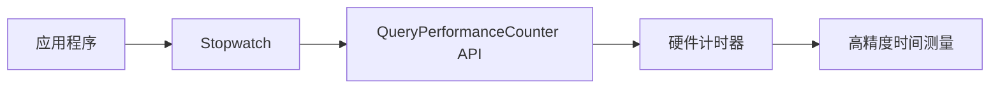

### 简介

`Stopwatch` 是 `.NET` 提供的高精度计时器，位于 `System.Diagnostics` 命名空间。

底层依赖操作系统的高分辨率性能计数器（`Performance Counter`），当硬件支持时，其精度可达纳秒级；在不支持时退回到环境时钟（毫秒级）。

主要用途包括：

* 性能测量（`Benchmark`）

* 代码片段耗时分析

* 定时任务、超时检测

### 核心原理与特性

#### 工作原理

`Stopwatch` 使用底层硬件计时器（通常是 `CPU` 的高分辨率性能计数器）提供纳秒级精度的时间测量：



#### 关键特性

* 高精度：最高可达纳秒级（取决于硬件）

* 低开销：专门优化的计时实现

* 独立计时：不受系统时间调整影响

* 线程安全：可在多线程环境中安全使用

#### 核心属性

|  属性   |  类型   |  描述  |
| --- | --- | --- |
|  `IsRunning`   |   `bool`  |  指示计时器是否正在运行   |
|  `Elapsed`   |   `TimeSpan`  |  当前测量的总时间
   |
|   `ElapsedMilliseconds`  |   `long`  |   总毫秒数（整数）  |
|   `ElapsedTicks`  |   `long`  |   计时器滴答计数  |
|   `Frequency`  |   `static long`  |   每秒的计时器滴答数
  |

### 核心 API

| 成员                  | 说明                                                                                                  |
| --------------------- | ----------------------------------------------------------------------------------------------------- |
| `Start()`             | 启动或继续计时（若已停止，则接着累加）。                                                              |
| `Stop()`              | 暂停计时，保留已累计时间。                                                                            |
| `Reset()`             | 重置累计时间为零，但不改变运行状态（运行中依旧在计时）。                                              |
| `Restart()`           | 等同于 `Reset()` + `Start()`，常用于重复测量。                                                        |
| `IsRunning` (bool)    | 当前是否在运行状态。                                                                                  |
| `Elapsed`             | 返回 `TimeSpan` 类型的累计运行时间。                                                                  |
| `ElapsedMilliseconds` | 累计运行总毫秒（取整）。                                                                              |
| `ElapsedTicks`        | 累计运行计数器刻度数（与硬件计时器相关）。                                                            |
| 静态属性 `Frequency`  | 性能计数器频率（每秒刻度数），用于将刻度转换为时间；<br>`IsHighResolution` 表示是否为高分辨率计数器。 |

### 典型用法

#### 基本测量

```csharp
var sw = Stopwatch.StartNew();    // 等同于 new Stopwatch(); sw.Start();
DoWork();
sw.Stop();
Console.WriteLine($"耗时：{sw.Elapsed.TotalMilliseconds} ms");
```

#### 分段测量（Laps）

```csharp
var sw = new Stopwatch();
sw.Start();

// 第一段
DoStep1();
Console.WriteLine($"Step1: {sw.ElapsedMilliseconds} ms");

// 第二段
DoStep2();
Console.WriteLine($"Step2: {sw.ElapsedMilliseconds} ms");

// 重置累计，再测
sw.Restart();
DoOther();
Console.WriteLine($"Other: {sw.Elapsed.TotalMilliseconds} ms");
```

#### 多次重复测量

```csharp
var sw = new Stopwatch();
for (int i = 0; i < 5; i++)
{
    sw.Restart();
    DoWork();
    Console.WriteLine($"Run {i}: {sw.ElapsedMilliseconds} ms");
}
```

#### 精确时间计算

```csharp
// 纳秒级计算
long start = Stopwatch.GetTimestamp();
// 执行操作...
long end = Stopwatch.GetTimestamp();
double elapsedNs = (end - start) * 1_000_000_000 / (double)Stopwatch.Frequency;
```

### 进阶技巧

#### 测量异步方法

```csharp
var sw = Stopwatch.StartNew();
await SomeAsyncOperation();
sw.Stop();
Console.WriteLine($"Async 耗时：{sw.ElapsedMilliseconds} ms");
```

#### 嵌套测量

```csharp
var swTotal = Stopwatch.StartNew();
var swA = new Stopwatch(); swA.Start();
DoA(); swA.Stop();
var swB = Stopwatch.StartNew();
DoB(); swB.Stop();
swTotal.Stop();
Console.WriteLine($"A: {swA.Elapsed}  B: {swB.Elapsed}  Total: {swTotal.Elapsed}");
```

#### 避免 GC 干扰

* 对短时测量可先进行一次“热身”（预调用方法和计时器）以加载 JIT、内存分配等。

* 可以在测量前后调用 `GC.Collect()`; `GC.WaitForPendingFinalizers()`;，以减少 `GC` 的随机停顿对结果的影响。

#### 性能测试框架

```csharp
public static TimeSpan MeasurePerformance(Action action, int iterations = 1000)
{
    // 预热
    action();
    GC.Collect();
    GC.WaitForPendingFinalizers();
    
    var sw = Stopwatch.StartNew();
    for (int i = 0; i < iterations; i++)
    {
        action();
    }
    sw.Stop();
    
    return TimeSpan.FromTicks(sw.ElapsedTicks / iterations);
}

// 使用示例
var avgTime = MeasurePerformance(() => 
{
    // 测试的代码块
    var result = Enumerable.Range(0, 1000).Sum();
}, 10000);

Console.WriteLine($"平均执行时间: {avgTime.TotalMilliseconds:F6} ms");
```

### 高级应用场景

#### 性能监控中间件

```csharp
public class PerformanceMonitorMiddleware
{
    private readonly RequestDelegate _next;
    
    public PerformanceMonitorMiddleware(RequestDelegate next)
    {
        _next = next;
    }
    
    public async Task Invoke(HttpContext context)
    {
        var sw = Stopwatch.StartNew();
        
        await _next(context);
        
        sw.Stop();
        context.Response.Headers["X-Execution-Time"] = sw.ElapsedMilliseconds.ToString();
        
        // 记录到日志系统
        LogPerformance(context.Request.Path, sw.Elapsed);
    }
}

// 在Startup中注册
app.UseMiddleware<PerformanceMonitorMiddleware>();
```

#### 算法复杂度分析

```csharp
public void AnalyzeAlgorithmComplexity()
{
    for (int n = 1000; n <= 1000000; n *= 10)
    {
        int[] data = Enumerable.Range(0, n).ToArray();
        
        var sw = Stopwatch.StartNew();
        Array.Sort(data); // 测试排序算法
        sw.Stop();
        
        Console.WriteLine($"n={n}, 时间={sw.ElapsedTicks} ticks");
    }
}
```

