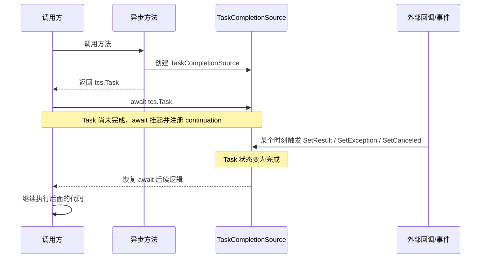
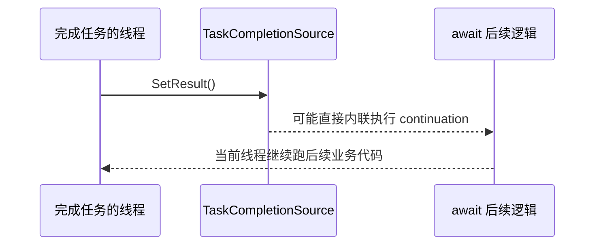
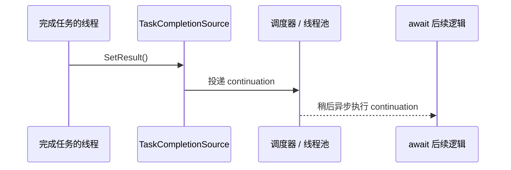

### 简介

在 `.NET` 异步编程里，`Task` 大多数时候都是“自动完成”的。

比如：

* `async` 方法执行完了，返回的 `Task` 自动完成；
* `HttpClient.GetAsync` 底层 I/O 完成了，`Task` 自动完成；
* `Task.Run` 里的委托跑完了，`Task` 自动完成。

但还有一类场景，不是“代码块执行完就结束”，而是：

* 某个回调什么时候被触发，不确定；
* 某个事件什么时候到来，不确定；
* 某个外部信号什么时候准备好，不确定；
* 你需要自己决定这个异步操作什么时候成功、失败或取消。

这时候，`Task` 就不能只靠“自动执行”来产生了，而需要一个“手动完成器”。

`TaskCompletionSource<T>` 就是干这个的。

一句话先给结论：

> `TaskCompletionSource<T>` 的作用，不是启动任务，而是手动控制一个 `Task<T>` 什么时候完成。

这篇文章重点讲清楚几件事：

* `TaskCompletionSource<T>` 到底是什么；
* 它和 `Task.Run`、`async/await` 的边界在哪里；
* 回调、事件为什么经常要靠它桥接成 `Task`；
* `SetResult`、`SetException`、`SetCanceled` 到底意味着什么；
* 为什么很多代码都应该优先用 `TrySet*`；
* `RunContinuationsAsynchronously` 为什么是实战里的关键选项；
* 使用 `TaskCompletionSource<T>` 最容易踩的坑有哪些。

### 先拆几个最容易混淆的点

#### 1. `TaskCompletionSource<T>` 不负责执行工作

很多人第一次看到它，会误以为它和 `Task.Run` 差不多，也是“创建一个异步任务”。

其实不是。

`Task.Run` 的重点是：

* 把一个委托扔到线程池执行；
* 由运行时去调度这段代码；
* 最终把执行结果包装成一个 `Task`。

而 `TaskCompletionSource<T>` 的重点是：

* 先生成一个还没完成的 `Task<T>`；
* 什么时候完成，不由委托自动决定；
* 而是由你在外部手动调用 `SetResult` / `SetException` / `SetCanceled` 来决定。

所以它更像：

* 一个 `Task` 的生产者控制器；
* 而不是一个工作执行器。

#### 2. 它不等于“开线程”

`TaskCompletionSource<T>` 本身不会新开线程，也不会自动占用线程。

例如：

```csharp
var tcs = new TaskCompletionSource<string>();
```

这行代码只是创建了一个“尚未完成的任务源”，并没有开始任何后台工作。

后面如果有别的线程、回调、事件、定时器或 I/O 完成信号去调用：

```csharp
tcs.SetResult("ok");
```

等待这个 `Task` 的代码才会继续。

#### 3. 它最适合做“桥接”

`TaskCompletionSource<T>` 最常见的价值，不是替代 `async/await`，而是补上 `Task` 世界和“非 `Task` 世界”之间的缺口。

比如：

* 老式回调 API；
* 事件通知模型；
* 某些底层协议回包；
* 自定义同步原语；
* 一个操作的完成由多个条件共同决定。

这些场景天然不是 `Task` 形式，但业务代码又很希望能直接：

```csharp
await SomethingAsync();
```

这时就需要 `TaskCompletionSource<T>` 来做桥接。

### `TaskCompletionSource<T>` 到底是什么？

可以把它拆成两部分理解：

#### 1. 它持有一个 `Task<T>`

通过 `Task` 属性，你可以拿到一个供外部等待的任务：

```csharp
var tcs = new TaskCompletionSource<int>();
Task<int> task = tcs.Task;
```

调用方拿到的只是这个 `Task<int>`，并不知道也不应该知道背后的完成细节。

#### 2. 它掌握这个 `Task<T>` 的完成权

你可以显式控制三种完成方式：

```csharp
tcs.SetResult(123);
tcs.SetException(new InvalidOperationException("failed"));
tcs.SetCanceled();
```

也就是说，`TaskCompletionSource<T>` 的本质是：

> 让我自己成为这个 `Task<T>` 的完成者。

这套模型很像生产者和消费者：

* 生产者：`TaskCompletionSource<T>`，负责发出完成信号；
* 消费者：`await tcs.Task` 的代码，负责等待结果。

### 它和 `Task.Run` 到底有什么区别？

这是最常见、也最值得单独拉出来讲的点。

| 对比项 | `Task.Run` | `TaskCompletionSource<T>` |
| --- | --- | --- |
| 核心职责 | 调度代码执行 | 手动控制 `Task` 完成 |
| 是否自带执行委托 | 是 | 否 |
| 是否通常依赖线程池 | 是 | 不一定 |
| 适合场景 | `CPU` 密集型工作、包装同步阻塞代码 | 回调桥接、事件桥接、自定义异步协调 |
| 完成时机 | 委托跑完后自动完成 | 由 `Set*` / `TrySet*` 手动决定 |

最简单的判断方式是：

* 你要“让一段代码异步跑起来”，优先想 `Task.Run`；
* 你要“把一个外部信号转换成可 await 的任务”，优先想 `TaskCompletionSource<T>`。

### 基础用法先跑通

先看一个最小示例：

```csharp
public static async Task DemoAsync()
{
    var tcs = new TaskCompletionSource<int>();

    _ = Task.Run(async () =>
    {
        await Task.Delay(1000);
        tcs.SetResult(42);
    });

    int result = await tcs.Task;
    Console.WriteLine(result);
}
```

这段代码真正重要的不是 `Task.Run`，而是流程：

1. 创建一个未完成的 `TaskCompletionSource<int>`；
2. 把 `tcs.Task` 暴露给等待方；
3. 将来某个时刻手动调用 `SetResult(42)`；
4. `await tcs.Task` 恢复执行，拿到结果。

这里的 `Task.Run` 只是为了模拟“未来某个时刻有外部信号到来”，真实项目里它更可能来自：

* Socket 回调；
* 消息队列回包；
* UI 事件；
* 定时器；
* 某个订阅通知。

### `await tcs.Task` 时到底发生了什么？

理解 `TaskCompletionSource<T>`，最好别只停留在“能用”。

看下面这段代码：

```csharp
var tcs = new TaskCompletionSource<string>();

var task = WaitAsync();
tcs.SetResult("ok");

async Task WaitAsync()
{
    string value = await tcs.Task;
    Console.WriteLine(value);
}
```

执行流程可以概括成这样：

1. 创建 `TaskCompletionSource<string>` 时，内部先有了一个未完成的 `Task<string>`。
2. `await tcs.Task` 发现任务还没完成，于是当前方法先挂起，并把“后续怎么恢复执行”注册到这个 `Task` 上。
3. 之后某个时刻，外部代码调用 `SetResult("ok")`。
4. 这个 `Task` 被标记为成功完成，等待它的 continuation 开始恢复。
5. `await` 后面的代码继续往下执行，拿到结果 `"ok"`。

所以更准确地说：

* `await` 做的是“注册后续逻辑并在未完成时先返回”；
* `SetResult` 做的是“宣布任务已经完成，可以恢复等待方了”。

这也是为什么 `TaskCompletionSource<T>` 特别适合桥接回调和事件。

因为回调、事件这类模型，本质上都缺一个东西：

* 一个能被 `await` 直接等待的完成信号。

而 `TaskCompletionSource<T>` 刚好把这个信号补出来了。

### 一张图看懂 `TaskCompletionSource<T>` 的工作流程

如果你想把上面的过程快速记成一张图，可以直接看下面这个时序图：



这张图最关键的信息只有两点：

* `await` 的本质不是“卡住线程等结果”，而是“先挂起，等 `Task` 完成后再恢复”；
* `TaskCompletionSource<T>` 的本质不是“执行异步工作”，而是“在合适的时机把这个 `Task` 变成已完成”。

### 三种完成方式分别意味着什么？

#### 1. 成功完成：`SetResult`

```csharp
var tcs = new TaskCompletionSource<string>();
tcs.SetResult("done");

string result = await tcs.Task;
```

此时：

* `Task` 状态变成成功完成；
* `await` 直接拿到返回值；
* 后续 continuation 会被触发。

#### 2. 异常完成：`SetException`

```csharp
var tcs = new TaskCompletionSource<string>();
tcs.SetException(new InvalidOperationException("bad state"));

string result = await tcs.Task;
```

此时 `await` 会重新抛出异常。

也就是说，`SetException` 不是“记录一下错误”，而是明确告诉等待方：

> 这次异步操作失败了，应该按异常路径处理。

#### 3. 取消完成：`SetCanceled`

```csharp
var tcs = new TaskCompletionSource<string>();
tcs.SetCanceled();

string result = await tcs.Task;
```

此时 `await` 会抛出与取消相关的异常。

这条路径和异常路径看起来相似，但语义不一样：

* `SetException`：操作失败了；
* `SetCanceled`：操作没有继续执行下去，属于取消。

如果你手里有对应的 `CancellationToken`，也可以带上它：

```csharp
tcs.SetCanceled(cancellationToken);
```

这样等待方能保留更完整的取消上下文。

### 为什么实战里更推荐 `TrySet*`

`SetResult`、`SetException`、`SetCanceled` 都有一个共同前提：

* 这个 `Task` 之前还没完成过。

如果已经有别的线程或别的回调先一步完成了它，再调 `Set*` 就会抛异常。

所以在这些场景里，通常更推荐：

* 多个竞争路径都可能完成任务；
* 超时、取消、正常结果可能同时抢完成权；
* 事件或回调可能重复触发；
* 并发环境下存在竞态。

示例：

```csharp
var tcs = new TaskCompletionSource<string>();

_ = Task.Run(async () =>
{
    await Task.Delay(1000);
    tcs.TrySetResult("success");
});

_ = Task.Run(async () =>
{
    await Task.Delay(500);
    tcs.TrySetCanceled();
});
```

这里最终只有一个分支会成功完成任务，另一个分支会返回 `false`，但不会抛异常。

因此更务实的经验是：

* 明确只有单一路径完成时，可以用 `Set*`；
* 只要存在竞争，优先用 `TrySet*`。

### 最经典的场景：把回调 API 包成 `Task`

假设你有一个老式 API：

```csharp
public void BeginLoadUser(Action<User> onSuccess, Action<Exception> onError)
{
    // 某个库内部完成后回调
}
```

如果直接使用，调用方通常会写成回调嵌套。

更现代的写法往往希望是：

```csharp
User user = await LoadUserAsync();
```

这时就可以这样桥接：

```csharp
public Task<User> LoadUserAsync()
{
    var tcs = new TaskCompletionSource<User>(
        TaskCreationOptions.RunContinuationsAsynchronously);

    BeginLoadUser(
        user => tcs.TrySetResult(user),
        ex => tcs.TrySetException(ex));

    return tcs.Task;
}
```

这个例子里，`TaskCompletionSource<User>` 做了两件事：

* 把原本的回调模型转换成 `Task<User>`；
* 把成功和失败语义自然映射进 `await` 流程。

于是上层代码就能写成：

```csharp
var user = await LoadUserAsync();
```

这也是 `TaskCompletionSource<T>` 最标准、最有价值的用法之一。

### 第二个高频场景：把事件变成可等待任务

比如你想“等待下一条消息到来”：

```csharp
public Task<string> WaitNextMessageAsync(MessageClient client)
{
    var tcs = new TaskCompletionSource<string>(
        TaskCreationOptions.RunContinuationsAsynchronously);

    void OnMessage(object? sender, MessageEventArgs e)
    {
        client.MessageReceived -= OnMessage;
        tcs.TrySetResult(e.Text);
    }

    client.MessageReceived += OnMessage;

    return tcs.Task;
}
```

调用方就可以：

```csharp
string message = await WaitNextMessageAsync(client);
```

但这种写法有一个很关键的细节：

* 事件一旦完成，要及时解绑；
* 否则可能造成重复触发、内存泄漏，甚至错误完成别的等待操作。

如果还需要支持异常和取消，就要把清理逻辑补完整。

### 再看一个更接近实战的版本：事件 + 取消

```csharp
public Task<string> WaitNextMessageAsync(
    MessageClient client,
    CancellationToken cancellationToken = default)
{
    var tcs = new TaskCompletionSource<string>(
        TaskCreationOptions.RunContinuationsAsynchronously);

    EventHandler<MessageEventArgs>? handler = null;
    CancellationTokenRegistration registration = default;

    handler = (sender, e) =>
    {
        client.MessageReceived -= handler;
        registration.Dispose();
        tcs.TrySetResult(e.Text);
    };

    client.MessageReceived += handler;

    if (cancellationToken.CanBeCanceled)
    {
        registration = cancellationToken.Register(() =>
        {
            client.MessageReceived -= handler;
            tcs.TrySetCanceled(cancellationToken);
        });
    }

    return tcs.Task;
}
```

这里要注意三点：

* 事件完成后要解绑；
* 取消时也要解绑；
* `CancellationTokenRegistration` 也应该及时释放。

否则代码“逻辑上能跑”，但长期运行会留下资源和行为问题。

### 一个更像生产代码的包装模板

很多时候，真正难的不是“怎么把回调转成 `Task`”，而是怎么把收尾逻辑放对位置。

下面这个模板更接近实际项目里的写法：

```csharp
public Task<string> SendAndWaitAsync(
    Request request,
    CancellationToken cancellationToken = default)
{
    var tcs = new TaskCompletionSource<string>(
        TaskCreationOptions.RunContinuationsAsynchronously);

    EventHandler<ResponseEventArgs>? handler = null;
    CancellationTokenRegistration registration = default;

    void Cleanup()
    {
        _client.ResponseReceived -= handler;
        registration.Dispose();
    }

    handler = (sender, e) =>
    {
        if (e.RequestId != request.Id)
        {
            return;
        }

        Cleanup();
        tcs.TrySetResult(e.Payload);
    };

    _client.ResponseReceived += handler;

    if (cancellationToken.CanBeCanceled)
    {
        registration = cancellationToken.Register(() =>
        {
            Cleanup();
            tcs.TrySetCanceled(cancellationToken);
        });
    }

    try
    {
        _client.Send(request);
    }
    catch (Exception ex)
    {
        Cleanup();
        tcs.TrySetException(ex);
    }

    return tcs.Task;
}
```

这个模板里有几个关键点：

* 先订阅，再发请求，避免响应回来得太快而错过事件；
* 统一抽一个 `Cleanup`，避免成功、失败、取消三条路径清理不一致；
* 回调里先过滤无关消息，再尝试完成 `TCS`；
* 发送请求本身如果同步抛错，也要把 `Task` 走到异常完成，而不是让等待方永远挂住。

### `TaskCompletionSource<T>` 和超时控制怎么配合？

超时控制也是它的高频用法。

例如，我们想等待某个外部响应，但最多等 5 秒：

```csharp
public async Task<string> WaitResponseAsync()
{
    var tcs = new TaskCompletionSource<string>(
        TaskCreationOptions.RunContinuationsAsynchronously);

    using var cts = new CancellationTokenSource(TimeSpan.FromSeconds(5));

    using var registration = cts.Token.Register(() =>
    {
        tcs.TrySetException(new TimeoutException("等待响应超时。"));
    });

    StartRequest(response =>
    {
        tcs.TrySetResult(response);
    });

    return await tcs.Task;
}
```

这里本质上是两个完成路径在竞争：

* 正常回包；
* 超时触发。

所以使用 `TrySet*` 才更稳妥。

不过要特别注意一个边界：

> 你让 `TaskCompletionSource<T>` 超时完成，并不等于底层真实操作一定被取消了。

这点非常重要。

比如：

* 你只是让等待方不再继续等；
* 但底层网络请求、设备操作、第三方 SDK 任务，可能还在继续跑。

所以“超时了”分成两个层面：

* 等待逻辑超时；
* 底层操作真的被取消。

如果你需要两者都成立，就必须把取消信号继续传到底层系统，而不能只完成一个 `TCS`。

### `RunContinuationsAsynchronously` 为什么这么重要？

这是 `TaskCompletionSource<T>` 最容易被忽视，也最容易在生产环境出问题的一点。

先看现象：

当你调用：

```csharp
tcs.SetResult(value);
```

如果没有额外选项，等待这个任务的 continuation 有可能就在当前线程上同步执行。

这会带来几个风险：

* 让触发完成的线程顺带执行一大段后续逻辑；
* 回调链条彼此嵌套，增加栈深度；
* 某些锁、串行队列或单线程上下文里，更容易形成卡死或延迟放大。

所以更稳妥的构造方式通常是：

```csharp
var tcs = new TaskCompletionSource<string>(
    TaskCreationOptions.RunContinuationsAsynchronously);
```

这个选项的意义是：

* 即使任务被完成了；
* 后续 continuation 也尽量异步调度出去；
* 而不是直接在当前 `SetResult` 的线程里内联执行。

这并不是说“任何时候都必须加”，但在绝大多数通用库、基础设施代码、并发协调代码里，它通常都是更安全的默认选择。

可以把它理解成：

> 不要让“完成任务的人”顺手把“等待任务后的整段业务逻辑”也一起跑掉。

### 一张图看懂 `RunContinuationsAsynchronously` 的区别

这个选项抽象上不复杂，但很多人第一次读文字说明时，很难立刻建立画面感。

可以直接看下面这组对比图。

未开启 `RunContinuationsAsynchronously`：



开启 `RunContinuationsAsynchronously`：



如果把这张图翻成更直白的话，就是：

* 没开 `RunContinuationsAsynchronously` 时，`SetResult()` 的那个线程，可能顺手把 `await` 后面的代码也一起执行了；
* 开了之后，完成任务和执行 continuation 这两件事会尽量拆开，后续逻辑改为异步调度。

这也是为什么在这些场景里，它通常更值得加上：

* 锁内部完成任务；
* 事件回调线程里完成任务；
* 单线程上下文或串行执行器里完成任务；
* 通用库、基础设施组件、并发协调组件。

### 一个典型坑：在锁里完成 `TaskCompletionSource<T>`

看一个简化例子：

```csharp
private readonly object _lock = new();
private TaskCompletionSource<bool>? _waiter;

public Task WaitAsync()
{
    lock (_lock)
    {
        _waiter ??= new TaskCompletionSource<bool>();
        return _waiter.Task;
    }
}

public void Signal()
{
    lock (_lock)
    {
        _waiter?.SetResult(true);
        _waiter = null;
    }
}
```

这段代码的问题在于：

* `SetResult(true)` 可能同步执行 continuation；
* continuation 又可能回过头来访问同一个对象；
* 于是锁竞争、重入、阻塞链条都会变复杂。

更稳妥的思路通常是：

* 要么使用 `RunContinuationsAsynchronously`；
* 要么先把待完成对象拿到锁外，再执行完成动作。

例如：

```csharp
private readonly object _lock = new();
private TaskCompletionSource<bool>? _waiter;

public Task WaitAsync()
{
    lock (_lock)
    {
        _waiter ??= new TaskCompletionSource<bool>(
            TaskCreationOptions.RunContinuationsAsynchronously);
        return _waiter.Task;
    }
}

public void Signal()
{
    TaskCompletionSource<bool>? waiter;

    lock (_lock)
    {
        waiter = _waiter;
        _waiter = null;
    }

    waiter?.TrySetResult(true);
}
```

这样会安全很多。

### 常见坑 1：把它当成“异步工作启动器”

错误方向通常长这样：

```csharp
public Task DoWorkAsync()
{
    var tcs = new TaskCompletionSource<bool>();
    return tcs.Task;
}
```

如果后面根本没有任何地方去完成这个 `tcs`，那这个任务就会永远挂着。

所以使用 `TaskCompletionSource<T>` 时，一定要先问自己：

* 谁来完成它？
* 正常路径在哪里完成？
* 异常路径在哪里完成？
* 取消路径在哪里完成？
* 是否存在永远不完成的分支？

如果这些问题答不上来，通常说明这里还不该上 `TaskCompletionSource<T>`。

### 常见坑 2：忘记处理异常路径

很多包装代码只写了成功回调：

```csharp
public Task<string> GetDataAsync()
{
    var tcs = new TaskCompletionSource<string>();

    BeginOperation(result =>
    {
        tcs.TrySetResult(result);
    });

    return tcs.Task;
}
```

如果底层 API 还有失败回调、错误事件或断开通知，而你没接进去，结果往往是：

* 上层代码一直等；
* 任务永远不完成；
* 问题很难排查。

因此包装时必须把可能的结束路径补全：

* 成功；
* 失败；
* 取消；
* 超时；
* 资源释放或连接关闭。

### 常见坑 3：事件桥接后忘记解绑

这在 UI、消息总线、长连接、订阅模型里非常常见。

如果你写了：

```csharp
client.MessageReceived += handler;
```

但完成后没有：

```csharp
client.MessageReceived -= handler;
```

后果可能包括：

* 同一个等待器被重复触发；
* 旧对象迟迟不能回收；
* 多次调用方法后，订阅越来越多；
* 某次消息错误地完成了别的请求。

所以事件桥接里，“解绑”不是锦上添花，而是正确性的一部分。

### 常见坑 4：错误理解“取消”

很多人会把这两件事混成一件事：

* `tcs.TrySetCanceled()`；
* 真正取消底层操作。

实际上，前者只是告诉等待方：

* 这个 `Task` 以取消语义结束了。

但底层操作如果没有感知 `CancellationToken`，它依然可能继续运行。

所以当你用 `TaskCompletionSource<T>` 做取消包装时，要明确自己做的是哪一层：

* 只是取消等待；
* 还是连底层工作一起取消。

如果只是前者，最好在注释或方法命名上把语义写清楚，避免误导调用方。

### 常见坑 5：在高并发下使用 `Set*` 导致额外异常

只要存在“谁先完成都行”的竞争关系，就不要轻易写：

```csharp
tcs.SetResult(value);
```

因为只要别的路径先完成了，这里就会抛 `InvalidOperationException`。

更通用、更稳妥的模式通常是：

```csharp
if (tcs.TrySetResult(value))
{
    // 只有真正赢得完成权时，才做一次性的收尾逻辑
}
```

这样异常噪音更少，也更方便在竞态场景下做清理。

### 它和 `async/await` 是什么关系？

可以这样理解：

* `async/await` 负责把异步流程写得像同步代码；
* `TaskCompletionSource<T>` 负责把“原本不是 `Task` 的完成信号”变成 `Task`。

两者不是替代关系，而是协作关系。

很多时候，真正的完整写法是：

```csharp
public async Task<string> ReceiveWithTimeoutAsync(CancellationToken cancellationToken)
{
    var message = await WaitNextMessageAsync(_client, cancellationToken);
    return message.Trim();
}
```

其中：

* `WaitNextMessageAsync` 内部靠 `TaskCompletionSource<string>` 桥接事件；
* 外层业务方法继续用 `async/await` 组织流程。

所以更准确地说：

> `TaskCompletionSource<T>` 是给 `async/await` 提供“可等待对象来源”的底层工具之一。

### 它和 `ValueTaskSource` 有什么关系？

如果你已经看到 `ValueTask`、`IValueTaskSource` 那一层，会发现两者有一点相似：

* 都涉及“手动控制异步完成”；
* 都不是直接执行工作；
* 都是异步基础设施的一部分。

但定位不一样：

* `TaskCompletionSource<T>`：给你一个手动完成的 `Task<T>`，易用、通用；
* `IValueTaskSource` / `ManualResetValueTaskSourceCore<T>`：给高性能组件做更底层、更可复用的异步承载，复杂很多。

所以在绝大多数业务和普通框架代码里：

* 能用 `TaskCompletionSource<T>` 解决的问题，通常没必要上 `ValueTaskSource`。

### 什么场景特别适合用它？

如果你遇到下面这些问题，基本都可以优先想到 `TaskCompletionSource<T>`：

* 把回调风格 API 包成 `Task`；
* 把事件模型转成 `await`；
* 等待某个外部信号；
* 把多条竞争路径合并成一个等待点；
* 自己实现一个异步协调原语；
* 给旧接口补上超时、取消、组合等待能力。

反过来说，如果你的需求只是：

* 跑一段 `CPU` 计算；
* 把同步代码临时丢到后台；

那就不该优先想到 `TaskCompletionSource<T>`，而更可能是：

* `Task.Run`；
* 线程池；
* 真正的异步 I/O API。

### 总结

`TaskCompletionSource<T>` 最重要的价值，不是“又一种创建任务的方法”，而是：

* 让你手动控制 `Task` 的完成；
* 让非 `Task` 世界的信号，能自然接入 `async/await`；
* 让成功、失败、取消都能被统一表示成标准异步语义。

实战里最该记住的几点是：

* 它不是工作执行器，而是任务完成控制器；
* 回调、事件、外部信号桥接，是它最核心的用途；
* 只要存在竞争，优先用 `TrySet*`；
* 通用库和并发协调代码里，通常应该考虑 `RunContinuationsAsynchronously`；
* 超时或取消一个 `TCS`，不等于底层操作真的被取消了。

如果你已经理解了 `Task`、`async/await`，那 `TaskCompletionSource<T>` 就是下一步必须掌握的关键拼图。

因为从这一层开始，你才真正拥有了：

> “不是只会等待异步，而是能自己定义异步完成方式”的能力。
