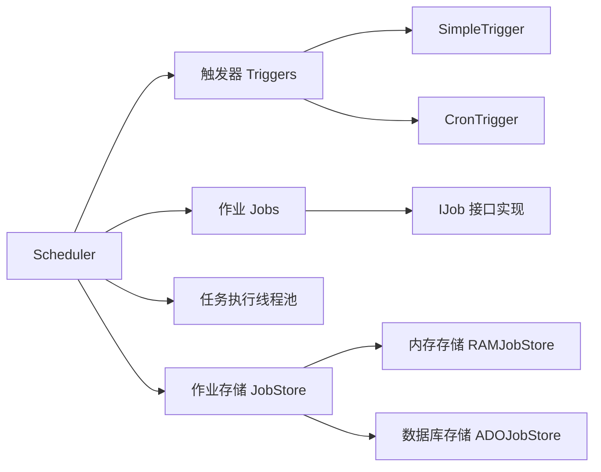
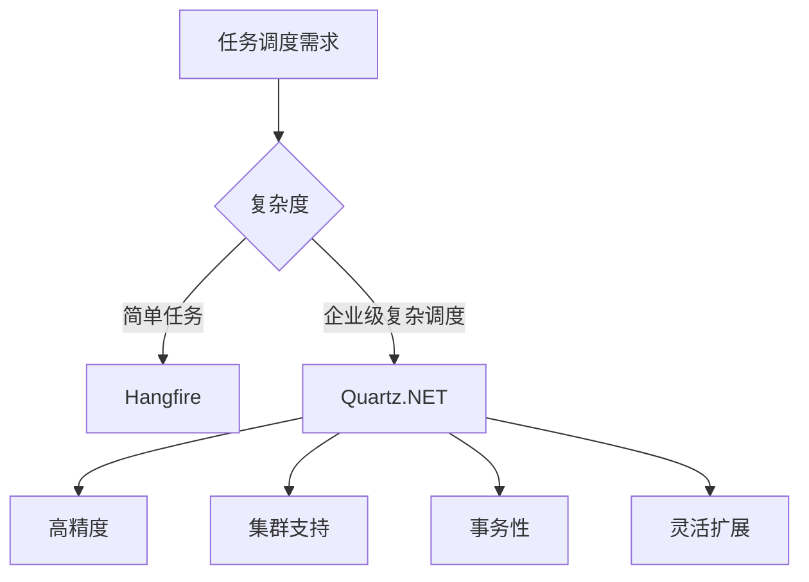

### 简介

* `Quartz.NET` 是一个功能齐全的、开源的任务调度框架，移植自 `Java` 世界的 `Quartz` 项目，专为 `.NET` 平台设计。

* 核心职责：基于 `Job`（要执行的任务）和 `Trigger`（触发策略）模型，提供灵活的任务调度、持久化存储、集群部署、`Misfire`（错过触发）处理等功能。

* 典型应用场景：

    * 定时生成报表/邮件推送

    * 周期性清理临时数据

    * 分布式环境下的任务分担

    * 复杂触发策略（`Cron`、日历排除等）

#### 核心概念

1. `Job`（作业）

* 定义要执行的任务逻辑

* 实现 `IJob` 接口，重写 `Execute` 方法

2. `Trigger`（触发器）

* 定义任务执行的时间规则

* 支持简单触发、`Cron` 触发、日历触发等多种类型

3. `Scheduler`（调度器）

* 任务调度的核心组件

* 管理 `Job` 和 `Trigger` 的生命周期

* 负责触发任务执行

### 安装与基础配置

#### 安装 NuGet 包

```shell
# 核心包
Install-Package Quartz           

# ASP.NET Core 集成
Install-Package Quartz.Extensions.Hosting   

# SQL Server 存储
Install-Package Quartz.Plugins

# JSON 序列化（可选）
Install-Package Quartz.Serialization.SystemTextJson
```

#### 在 .NET 6+ 控制台/ASP.NET Core 中注册

```csharp
// Program.cs
var builder = WebApplication.CreateBuilder(args);

// 1. 添加 Quartz 服务
builder.Services.AddQuartz(q =>
{
    q.UseMicrosoftDependencyInjectionJobFactory(); // DI 支持
    // 全局配置示例：Clustering、StoreType、ThreadCount 等
    q.SchedulerName = "MyQuartzScheduler";
    q.UseSimpleTypeLoader();
    q.UseInMemoryStore();        // 内存存储，生产建议 UsePersistentStore()
    q.UseDefaultThreadPool(tp => { tp.MaxConcurrency = 10; });

    // 配置作业和触发器
    var jobKey = new JobKey("HelloJob", "Group1");
    q.AddJob<HelloJob>(opts => opts.WithIdentity(jobKey));
    
    q.AddTrigger(opts => opts
        .ForJob(jobKey)
        .WithIdentity("HelloJob-trigger")
        .WithCronSchedule("0/10 * * * * ?"));  // 每10秒执行一次
});
// 2. 注册 ASP.NET Core 托管服务
builder.Services.AddQuartzHostedService(q => q.WaitForJobsToComplete = true);

var app = builder.Build();
app.MapGet("/", () => "Quartz.NET Ready");
app.Run();
```

* `AddQuartz`：配置调度器工厂(`StdSchedulerFactory`)

* `UseMicrosoftDependencyInjectionJobFactory`：让 `Job` 支持构造函数注入

* `UseInMemoryStore vs UsePersistentStore`：内存模式适合开发测试，持久化模式生产必选

### 核心架构

#### 核心组件



#### 核心概念与接口

| 概念       | 接口/类                                          | 作用                                                |
| ---------- | ------------------------------------------------ | --------------------------------------------------- |
| 调度器     | `IScheduler`                                     | 调度器主入口，管理 Job、Trigger                     |
| Job        | `IJob`                                           | 业务任务，实现 `Task Execute(IJobExecutionContext)` |
| Trigger    | `ITrigger`（常用子类 `IJobDetail` + `ITrigger`） | 触发策略：`SimpleTrigger`、`CronTrigger`            |
| JobDetail  | `IJobDetail`                                     | Job 元数据：名称、分组、持久化选项等                |
| 日历       | `ICalendar`                                      | 可排除/包含特定日期，如节假日日历                   |
| JobDataMap | `JobDataMap`                                     | Job/Trigger 级别的键值对参数                        |

#### 定义 Job

```csharp
public class HelloJob : IJob
{
    public Task Execute(IJobExecutionContext context)
    {
        var name = context.JobDetail.JobDataMap.GetString("Name");
        Console.WriteLine($"[{DateTime.Now:O}] Hello, {name}!");
        return Task.CompletedTask;
    }
}
```

#### 构建 JobDetail 与 Trigger

```csharp
// 1. 构造 JobDetail
var job = JobBuilder.Create<HelloJob>()
    .WithIdentity("job1", "group1")
    .UsingJobData("Name", "Quartz")
    .StoreDurably()          // 持久化，即使无 Trigger 也保留
    .Build();

// 2. 构造 Trigger（Simple）
var trigger = TriggerBuilder.Create()
    .WithIdentity("trigger1", "group1")
    .StartNow()
    .WithSimpleSchedule(x => x
         .WithIntervalInSeconds(30)
         .RepeatForever()
         .WithMisfireHandlingInstructionIgnoreMisfires())
    .Build();

// 3. 构造 Trigger（Cron）
var cronTrigger = TriggerBuilder.Create()
    .WithIdentity("cronTrigger", "group1")
    .WithCronSchedule("0 0/5 8-18 ? * MON-FRI", // 周一至周五 8-18 点，每 5 分钟
         x => x.WithMisfireHandlingInstructionDoNothing())
    .Build();
```

### 基础使用

```csharp
using Quartz;
using Quartz.Impl;
using System.Threading.Tasks;

// 定义一个作业
public class HelloJob : IJob
{
    public Task Execute(IJobExecutionContext context)
    {
        Console.WriteLine("Hello from Quartz.NET!");
        return Task.CompletedTask;
    }
}

// 创建和配置调度器
public static async Task Main()
{
    // 创建调度器工厂
    ISchedulerFactory schedFact = new StdSchedulerFactory();
    
    // 获取调度器实例
    IScheduler sched = await schedFact.GetScheduler();
    
    // 启动调度器
    await sched.Start();
    
    // 创建作业
    IJobDetail job = JobBuilder.Create<HelloJob>()
        .WithIdentity("myJob", "group1")
        .Build();
    
    // 创建触发器（每10秒执行一次）
    ITrigger trigger = TriggerBuilder.Create()
        .WithIdentity("myTrigger", "group1")
        .StartNow()
        .WithSimpleSchedule(x => x
            .WithIntervalInSeconds(10)
            .RepeatForever())
        .Build();
    
    // 将作业与触发器关联到调度器
    await sched.ScheduleJob(job, trigger);
    
    // 等待一段时间后关闭调度器
    await Task.Delay(TimeSpan.FromMinutes(1));
    await sched.Shutdown();
}
```

#### 依赖注入获取 ISchedulerFactory

```csharp
app.MapGet("/start", async (ISchedulerFactory schedulerFactory) =>
{
    var scheduler = await schedulerFactory.GetScheduler();
    await scheduler.Start();
    return "Scheduler started!";
});
```

### 作业(Jobs)详解

#### 基本作业实现

```csharp
public class SampleJob : IJob
{
    private readonly ILogger<SampleJob> _logger;

    public SampleJob(ILogger<SampleJob> logger)
    {
        _logger = logger;
    }

    public async Task Execute(IJobExecutionContext context)
    {
        // 从JobDataMap获取参数
        var dataMap = context.MergedJobDataMap;
        string value = dataMap.GetString("paramName");
        
        _logger.LogInformation($"Job executed at {DateTime.Now}, value: {value}");
        
        // 模拟工作
        await Task.Delay(1000);
    }
}
```

#### 作业并发控制

```csharp
[DisallowConcurrentExecution] // 防止同一作业并发执行
public class NonConcurrentJob : IJob
{
    public Task Execute(IJobExecutionContext context)
    {
        // 长时间任务
        return Task.Delay(5000);
    }
}
```

#### 作业持久化

```csharp
[PersistJobDataAfterExecution] // 执行后保存JobDataMap
public class StatefulJob : IJob
{
    public Task Execute(IJobExecutionContext context)
    {
        var data = context.JobDetail.JobDataMap;
        int count = data.GetInt("count") + 1;
        data.Put("count", count);
        
        Console.WriteLine($"Execution count: {count}");
        return Task.CompletedTask;
    }
}
```

### 触发器(Triggers)详解

#### 简单触发器(SimpleTrigger)

* 简单的时间间隔触发

* 适用于固定频率的任务

```csharp
// 立即开始，每10秒执行一次，共执行5次
ITrigger trigger = TriggerBuilder.Create()
    .WithIdentity("trigger1", "group1")
    .StartNow()
    // 或者
    .StartAt(DateBuilder.FutureDate(10, IntervalUnit.Second))  // 10秒后开始
    .WithSimpleSchedule(x => x
        .WithIntervalInSeconds(10)
        .WithRepeatCount(4))
    .Build();
```

#### Cron 触发器(CronTrigger)

* 使用 `Cron` 表达式定义复杂的时间规则

* 适合需要精确控制执行时间的任务

```csharp
// 使用Cron表达式：每周一至周五上午9点到下午5点，每30分钟执行一次
ITrigger cronTrigger = TriggerBuilder.Create()
    .WithIdentity("cronTrigger", "group1")
    .WithCronSchedule("0 0/30 9-17 ? * MON-FRI")
    .Build();

// Cron 表达式示例：
// "0 0 12 * * ?"        每天中午12点
// "0 15 10 * * ?"       每天上午10:15
// "0 0/5 14 * * ?"      每天下午2点到2:55期间每5分钟
// "0 0 12 ? * WED"      每周三中午12点
```

#### 日历触发器(CalendarIntervalTrigger)

* 基于日历的间隔触发

* 例如每天、每月、每年执行

```csharp
// 排除节假日
var holidayCalendar = new HolidayCalendar();
holidayCalendar.AddExcludedDate(new DateTime(2023, 12, 25)); // 圣诞节

scheduler.AddCalendar("holidays", holidayCalendar, false, false);

ITrigger trigger = TriggerBuilder.Create()
    .WithIdentity("trigger3")
    .WithSchedule(CronScheduleBuilder.DailyAtHourAndMinute(9, 0))
    .ModifiedByCalendar("holidays") // 排除节假日
    .Build();
```

### 调度器生命周期

```csharp
// 获取调度器
var scheduler = await StdSchedulerFactory.GetDefaultScheduler();
// 启动
await scheduler.Start();

// 安排任务
await scheduler.ScheduleJob(job, trigger);

// 暂停/恢复
await scheduler.PauseJob(job.Key);
await scheduler.ResumeJob(job.Key);

// 删除
await scheduler.DeleteJob(job.Key);

// 关闭
await scheduler.Shutdown(waitForJobsToComplete: true);
```

### 持久化与集群部署

#### 集群配置要点

* 相同数据库：所有节点使用相同的数据库

* 唯一实例名：每个节点配置不同的实例 `ID`

* 负载均衡：节点自动分配任务

* 故障转移：节点宕机时任务自动转移到其他节点

#### 集群配置文件示例

```csharp
<!-- quartz.config -->
quartz.jobStore.type = Quartz.Impl.AdoJobStore.JobStoreTX, Quartz
quartz.jobStore.dataSource = default
quartz.jobStore.tablePrefix = QRTZ_
quartz.dataSource.default.connectionString = Server=.;Database=Quartz;User=sa;Password=123
quartz.dataSource.default.provider = SqlServer
quartz.scheduler.instanceId = AUTO
quartz.jobStore.clustered = true
```

#### 持久化存储（Persistent Store）

```csharp
q.UsePersistentStore(ps =>
{
    ps.UseProperties = true;
    ps.RetryInterval = TimeSpan.FromSeconds(15);
    ps.UseSqlServer("Server=.;Database=QuartzDb;Trusted_Connection=True;", options =>
    {
        options.TablePrefix = "QRTZ_";
        options.Schema = "dbo";
    });
    ps.UseJsonSerializer(); // 作业数据序列化
});
```

* 数据库脚本：在 `Quartz.NET GitHub` 仓库找到对应数据库的建表脚本

* 表结构：包含 `QRTZ_JOB_DETAILS、QRTZ_TRIGGERS、QRTZ_FIRED_TRIGGERS、QRTZ_CALENDARS、QRTZ_PAUSED_TRIGGER_GRPS` 等

#### 集群模式

```csharp
// 在 UsePersistentStore 中打开集群选项
ps.Clustered = true;
ps.ClusterCheckinInterval = TimeSpan.FromSeconds(20);
```

* `Clustered`：开启后，多实例会竞争触发执行，确保同一时刻只有一个节点执行某个 `Trigger`

* `Check-in`：各节点定期向数据库心跳，发现故障节点后，其未完成的 `Trigger` 可被其他节点拾取

### 高级特性与扩展

#### 作业数据传递

* 通过 `JobDataMap` 在作业和触发器之间传递数据

```csharp
// 创建作业时设置数据
IJobDetail job = JobBuilder.Create<EmailJob>()
    .UsingJobData("recipient", "user@example.com")
    .UsingJobData("subject", "重要通知")
    .Build();

// 在作业中获取数据
public class EmailJob : IJob
{
    public Task Execute(IJobExecutionContext context)
    {
        JobDataMap dataMap = context.JobDetail.JobDataMap;
        string recipient = dataMap.GetString("recipient");
        string subject = dataMap.GetString("subject");
        
        // 发送邮件逻辑
        return Task.CompletedTask;
    }
}
```

#### 持久化存储

* 使用 `ADO.NET` 或其他存储方式保存作业和触发器信息

* 确保应用重启后任务状态不丢失

```csharp
// 配置 SQL Server 持久化存储
var properties = new NameValueCollection
{
    ["quartz.scheduler.instanceName"] = "MyScheduler",
    ["quartz.jobStore.type"] = "Quartz.Impl.AdoJobStore.JobStoreTX, Quartz",
    ["quartz.jobStore.useProperties"] = "true",
    ["quartz.jobStore.dataSource"] = "myDS",
    ["quartz.jobStore.tablePrefix"] = "QRTZ_",
    ["quartz.jobStore.driverDelegateType"] = "Quartz.Impl.AdoJobStore.SqlServerDelegate, Quartz",
    ["quartz.dataSource.myDS.connectionString"] = "Server=localhost;Database=Quartz;User Id=sa;Password=password;",
    ["quartz.dataSource.myDS.provider"] = "SqlServer"
};

ISchedulerFactory schedFact = new StdSchedulerFactory(properties);
```

#### 日历排除

```csharp
// 排除周末
var weekendCalendar = new WeeklyCalendar();
weekendCalendar.SetDayExcluded(DayOfWeek.Saturday, true);
weekendCalendar.SetDayExcluded(DayOfWeek.Sunday, true);
await scheduler.AddCalendar("weekendOnly", weekendCalendar, replace: true, updateTriggers: true);

var weeklyTrigger = TriggerBuilder.Create()
    .WithIdentity("weeklyJob", "group1")
    .StartNow()
    .ModifiedByCalendar("weekendOnly") // 应用日历
    .WithSimpleSchedule(x => x.WithIntervalInHours(24).RepeatForever())
    .Build();
```

#### 作业监听器

```csharp
public class JobListener : IJobListener
{
    public string Name => "GlobalJobListener";

    public Task JobToBeExecuted(IJobExecutionContext context, CancellationToken token)
    {
        Console.WriteLine($"Job {context.JobDetail.Key} is about to be executed");
        return Task.CompletedTask;
    }

    public Task JobExecutionVetoed(IJobExecutionContext context, CancellationToken token)
    {
        return Task.CompletedTask;
    }

    public Task JobWasExecuted(IJobExecutionContext context, JobExecutionException exception, CancellationToken token)
    {
        Console.WriteLine($"Job {context.JobDetail.Key} completed in {context.JobRunTime.TotalMilliseconds}ms");
        return Task.CompletedTask;
    }
}

// 注册监听器
scheduler.ListenerManager.AddJobListener(new JobListener());
```

#### 触发器监听器

```csharp
public class TriggerListener : ITriggerListener
{
    public string Name => "GlobalTriggerListener";

    public Task TriggerFired(ITrigger trigger, IJobExecutionContext context, CancellationToken token)
    {
        // 触发器触发时
        return Task.CompletedTask;
    }

    public Task<bool> VetoJobExecution(ITrigger trigger, IJobExecutionContext context, CancellationToken token)
    {
        // 是否阻止作业执行
        return Task.FromResult(false);
    }
}
```

* 接口：`IJobListener、ITriggerListener、ISchedulerListener`

* 注册：在 `AddQuartz(q => { ... })` 或在运行时调用 `scheduler.ListenerManager` 添加

```csharp
public class MyJobListener : IJobListener
{
    public string Name => "GlobalJobListener";
    public Task JobToBeExecuted(IJobExecutionContext context) { /* 前置 */ return Task.CompletedTask; }
    public Task JobExecutionVetoed(IJobExecutionContext context) { /* 拦截 */ return Task.CompletedTask; }
    public Task JobWasExecuted(IJobExecutionContext context, JobExecutionException jobException) { /* 后置 */ return Task.CompletedTask; }
}
```

```csharp
q.AddJobListener<MyJobListener>(GroupMatcher<JobKey>.AnyGroup());
```

#### 错误处理与重试

```csharp
public class RetryableJob : IJob
{
    private readonly ILogger<RetryableJob> _logger;
    private readonly int _maxRetries = 3;

    public RetryableJob(ILogger<RetryableJob> logger)
    {
        _logger = logger;
    }

    public async Task Execute(IJobExecutionContext context)
    {
        int retryCount = context.Get("RetryCount") ?? 0;
        
        try
        {
            // 执行作业逻辑
            await PerformTask();
        }
        catch (Exception ex)
        {
            _logger.LogError(ex, $"作业执行失败，重试次数: {retryCount}");
            
            if (retryCount < _maxRetries)
            {
                // 重新调度作业进行重试
                context.RefireImmediately();
                context.Put("RetryCount", retryCount + 1);
            }
            else
            {
                _logger.LogCritical("作业重试次数已达上限");
                throw;
            }
        }
    }

    private Task PerformTask()
    {
        // 作业具体逻辑
        return Task.CompletedTask;
    }
}
```

### 性能优化

#### 调度器配置优化

```csharp
NameValueCollection props = new NameValueCollection
{
    // 线程池优化
    ["quartz.threadPool.type"] = "Quartz.Simpl.DefaultThreadPool",
    ["quartz.threadPool.threadCount"] = Environment.ProcessorCount * 2,
    ["quartz.threadPool.threadPriority"] = ThreadPriority.Normal,
    
    // 数据库优化
    ["quartz.jobStore.useProperties"] = "true", // 使用字符串存储
    ["quartz.jobStore.lockHandler.type"] = "Quartz.Impl.AdoJobStore.UpdateLockRowSemaphore, Quartz",
    ["quartz.jobStore.acquireTriggersWithinLock"] = "true",
    ["quartz.jobStore.driverDelegateType"] = "Quartz.Impl.AdoJobStore.SqlServerDelegate, Quartz",
    
    // 集群优化
    ["quartz.jobStore.clusterCheckinInterval"] = "10000", // 10秒检查
    ["quartz.scheduler.batchTriggerAcquisitionMaxCount"] = "10" // 批量获取触发
};
```

### 最佳实践

* `Job` 幂等：`Job` 可能因重试、集群切换而重复执行，务必设计幂等逻辑或去重策略。

* 合理设置 `Misfire`：不同场景对错过触发的容忍度不同，测试并选择恰当的 `Misfire` 策略。

* 数据库索引：在持久化模式下，为 `QRTZ_TRIGGERS.NextFireTime` 添加索引，提升调度器扫描效率。

* 心跳与故障切换：生产集群建议将 `ClusterCheckinInterval` 调低（如 10s），加快故障恢复。

* 隔离队列：将重型或异常多发的 `Job` 配到独立 `Scheduler/Queue`，避免干扰其他任务。

* 监控告警：对失败率、队列积压、调度延迟设置告警，及时排查。

* 版本升级：升级 `Quartz.NET` 时，务必先在测试集群执行数据库脚本，并验证集群切换正常。

### 与Hangfire对比

|  特性   |  Quartz.NET   |  Hangfire   |
| --- | --- | --- |
|  调度精度   |  秒级   |  分钟级   |
|  集群支持   |  完善   |  有限   |
|  持久化   |  支持多种数据库   |  支持多种数据库   |
|  可视化   |  需自行实现   |  内置Dashboard   |
|  学习曲线   |  较陡峭   |  平缓   |
|  轻量级   |  中等   |  轻量   |
|  作业类型   |  定时/日历/CRON   |  立即/延迟/周期   |
|  事务支持   |  强   |  弱   |
|  适用场景   |  企业级复杂调度   |  简单后台任务   |

### 总结

`Quartz.NET` 是 `.NET` 平台最强大的任务调度框架，适用于需要高精度、高可靠性的企业级调度场景。核心优势包括：

* 精确调度：支持秒级定时任务

* 集群容错：完善的分布式支持

* 灵活扩展：丰富的监听器和插件机制

* 持久可靠：数据库存储保证任务不丢失

* 复杂调度：支持日历、排除特殊日期等复杂场景



### 资源与扩展

* 官网：https://www.quartz-scheduler.net

* GitHub：https://github.com/quartznet/quartznet

* 文档：https://www.quartz-scheduler.net/documentation

* 扩展包：

    * `Quartz.Extensions.Hosting`：ASP.NET Core 托管服务。

    * `Quartz.Serialization.SystemTextJson`：JSON 序列化支持。

    * `Quartz.Plugins`：提供日志、异常处理等插件。