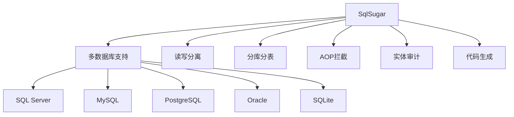

### 简介

* `SqlSugar` 是一个开源的高性能、易用的 `.NET ORM` 框架，支持 `.NET Framework`、`.NET Core/.NET 5+`。

* 核心特性：

    * 高性能：采用表达式树解析技术，执行效率高

    * 多数据库支持：支持 SQL Server、MySQL、PostgreSQL、Oracle、SQLite 等

    * 链式查询：提供流畅的链式查询语法

    * 事务管理：支持本地和分布式事务

    * CodeFirst 与 DbFirst：支持从代码生成数据库和从数据库生成实体类

    * 自动映射：支持复杂对象关系的自动映射

    * AOP 拦截：支持 SQL 执行前后的拦截处理

    * 分表分库：内置分表分库支持

    * 日志记录：支持 SQL 执行日志记录


* 性能优势

    * 接近原生 `ADO.NET` 的性能

    * 高效查询翻译：`LINQ` 表达式精准转换为 `SQL`

    * 智能缓存机制：自动缓存查询结果

    * 批量操作优化：支持 `BulkCopy` 快速插入

* 功能丰富性



### 安装与配置

#### 添加 NuGet 包

```shell
dotnet add package SqlSugarCore
```

#### 初始化 SqlSugarClient

```csharp
public class SqlSugarContext
{
    public SqlSugarClient Db;
    
    public SqlSugarContext()
    {
        Db = new SqlSugarClient(new ConnectionConfig()
        {
            ConnectionString = "Server=.;Database=DemoDB;User ID=sa;Password=123;",
            DbType = DbType.SqlServer,  // 数据库类型
            IsAutoCloseConnection = true,  // 自动释放连接
            InitKeyType = InitKeyType.Attribute  // 从特性读取主键信息
        });
        
        // 开发阶段输出SQL
        Db.Aop.OnLogExecuting = (sql, pars) => 
        {
            Console.WriteLine(sql);
        };
    }
}
```

#### DI 集成（.NET Core/.NET 6+）

```csharp
services.AddScoped<ISqlSugarClient>(provider => 
{
    return new SqlSugarClient(new ConnectionConfig()
    {
        ConnectionString = Configuration.GetConnectionString("Default"),
        DbType = DbType.MySql,
        IsAutoCloseConnection = true,
        InitKeyType = InitKeyType.Attribute
    });
});
```

#### CodeFirst 模式

使用 `CodeFirst` 模式可以从实体类自动生成数据库结构：

```csharp
// 启用 CodeFirst 自动创建表
db.CodeFirst.InitTables(typeof(User), typeof(Order));  // 传入实体类型

// 配置实体映射
db.CodeFirst.ConfigTable<User>(table =>
{
    table.TableName = "T_User";  // 指定表名
});

db.CodeFirst.ConfigColumn<User>(column =>
{
    if (column.PropertyName == "Name")
    {
        column.IsNullable = false;  // 设置字段不可为空
        column.Length = 50;         // 设置字段长度
    }
});
```

#### DbFirst 模式

使用 `DbFirst` 模式可以从现有数据库生成实体类：

```csharp
// 从数据库生成实体类
var dbFirst = new DbFirst(db);
dbFirst.CreateClassFile(@"D:\Models\", "MyNamespace");  // 生成实体类文件到指定目录
```

### 实体定义与映射

#### 基础实体配置

```csharp
[SugarTable("Users")]  // 指定表名
public class User
{
    [SugarColumn(IsPrimaryKey = true, IsIdentity = true)] // 主键自增
    public int Id { get; set; }
    
    [SugarColumn(Length = 50)]
    public string Name { get; set; }
    
    [SugarColumn(IsNullable = true)]
    public int? Age { get; set; }
    
    [SugarColumn(ColumnDataType = "varchar(100)")]
    public string Email { get; set; }
    
    [SugarColumn(IsIgnore = true)] // 不映射到数据库
    public string FullName => $"{Name} (ID:{Id})";
}
```

#### 关系映射

```csharp
public class Order
{
    [SugarColumn(IsPrimaryKey = true)]
    public Guid OrderId { get; set; }
    
    public int UserId { get; set; }
    
    [Navigate(NavigateType.OneToOne, nameof(UserId))]
    public User User { get; set; }  // 一对一导航
    
    [Navigate(NavigateType.OneToMany, nameof(OrderItem.OrderId))]
    public List<OrderItem> Items { get; set; } // 一对多导航
}

public class OrderItem
{
    [SugarColumn(IsPrimaryKey = true)]
    public Guid ItemId { get; set; }
    
    public Guid OrderId { get; set; }
    public string ProductName { get; set; }
}
```

### CRUD 操作详解

#### 插入数据

```csharp
using (var db = new SqlSugarContext().Db)
{
    // 单条插入
    var user = new User { Name = "Alice", Age = 25, Email = "alice@example.com" };
    int id = db.Insertable(user).ExecuteReturnIdentity();
    
    // 批量插入（高性能）
    var users = new List<User>
    {
        new User { Name = "Bob", Age = 30 },
        new User { Name = "Charlie", Age = 35 }
    };
    db.Insertable(users).ExecuteCommand();
    
    // BulkCopy 插入（10万+数据）
    db.Fastest<User>().BulkCopy(users);
}
```

#### 更新操作

```csharp
// 更新整个实体
var user = db.Queryable<User>().First(u => u.Id == 1);
user.Age = 26;
db.Updateable(user).ExecuteCommand();

// 更新指定列
db.Updateable<User>()
  .SetColumns(u => u.Age == 27)
  .Where(u => u.Id == 1)
  .ExecuteCommand();

// 条件更新
db.Updateable<User>()
  .SetColumns(u => new User { Age = u.Age + 1 })
  .Where(u => u.Age < 30)
  .ExecuteCommand();
```

#### 删除操作

```csharp
// 按主键删除
db.Deleteable<User>().Where(u => u.Id == 1).ExecuteCommand();

// 按条件删除
db.Deleteable<User>().Where("Age > @age", new { age = 40 }).ExecuteCommand();

// 逻辑删除（配置实体特性）
[SugarTable("Users")]
public class User
{
    [SugarColumn(IsSoftDelete = true)] // 逻辑删除标记
    public bool IsDeleted { get; set; }
}

// 执行删除时自动转为更新
db.Deleteable<User>().Where(u => u.Id == 2).ExecuteCommand();
```

#### 查询操作

```csharp
// 获取单个实体
var user = db.Queryable<User>().Single(u => u.Id == 1);

// 条件查询
var youngUsers = db.Queryable<User>()
                  .Where(u => u.Age < 30)
                  .OrderBy(u => u.Age, OrderByType.Desc)
                  .ToList();

// 分页查询
var page = db.Queryable<User>()
             .Where(u => u.Age > 18)
             .ToPageList(pageNumber: 1, pageSize: 10, ref totalCount);

// 原生 SQL 查询
var users = db.Ado.SqlQuery<User>("SELECT * FROM Users WHERE Age > @Age", 
                 new { Age = 18 });
```

#### 分页查询

```csharp
// 普通分页
var page = db.Queryable<User>()
             .OrderBy(u => u.Id)
             .ToPageList(pageIndex: 3, pageSize: 20, ref totalCount);

// 高性能 Seek 分页
var lastId = 100;
var page2 = db.Queryable<User>()
              .Where(u => u.Id > lastId)
              .OrderBy(u => u.Id)
              .Take(20)
              .ToList();
```

### 高级查询功能

#### 聚合查询

```csharp
var statistics = db.Queryable<User>()
    .Select(u => new
    {
        TotalCount = SqlFunc.AggregateCount(u.Id),
        AverageAge = SqlFunc.AggregateAvg(u.Age),
        MaxAge = SqlFunc.AggregateMax(u.Age),
        MinAge = SqlFunc.AggregateMin(u.Age)
    })
    .First();
```

#### 联表查询

```csharp
var query = db.Queryable<User>()
    .LeftJoin<Order>((u, o) => u.Id == o.UserId)
    .Where((u, o) => u.Age > 25 && o.Status == "Paid")
    .Select((u, o) => new
    {
        UserName = u.Name,
        OrderAmount = o.Amount
    });

var result = query.ToList();
```

#### 存储过程调用

```csharp
var parameters = new SugarParameter[]
{
    new SugarParameter("@userId", 1),
    new SugarParameter("@result", null, System.Data.DbType.Int32, ParameterDirection.Output)
};

db.Ado.UseStoredProcedure(() => 
{
    db.Ado.ExecuteCommand("sp_GetUserOrders", parameters);
    int result = parameters[1].Value.ObjToInt();
});
```

#### 读写分离配置

```csharp
var db = new SqlSugarClient(new List<ConnectionConfig>()
{
    // 主库
    new ConnectionConfig() { 
        ConfigId = "master", 
        ConnectionString = "主库连接字符串", 
        DbType = DbType.SqlServer 
    },
    // 从库1
    new ConnectionConfig() { 
        ConfigId = "slave1", 
        ConnectionString = "从库1连接字符串", 
        DbType = DbType.SqlServer,
        IsAutoCloseConnection = true 
    },
    // 从库2
    new ConnectionConfig() { 
        ConfigId = "slave2", 
        ConnectionString = "从库2连接字符串", 
        DbType = DbType.SqlServer,
        IsAutoCloseConnection = true 
    }
},
db => 
{
    // 设置从库
    db.GetConnection("slave1").IsSlave = true;
    db.GetConnection("slave2").IsSlave = true;
    
    // 负载均衡策略（轮询）
    db.SlaveConnectionConfigs = new List<SlaveConnectionConfig>(){
        new SlaveConnectionConfig(){ HitRate=10, ConnectionConfig= db.GetConnection("slave1") },
        new SlaveConnectionConfig(){ HitRate=20, ConnectionConfig= db.GetConnection("slave2") }
    };
});


// 写操作自动路由到主库
db.Insertable(user).ExecuteCommand();

// 读操作使用从库
var users = db.Queryable<User>().With(db => db.Slave()).ToList();
```

### 性能优化技巧

#### 查询优化

```csharp
// 只选择必要字段
var names = db.Queryable<User>().Select(u => u.Name).ToList();

// 禁用导航属性查询
db.Queryable<User>().Select(u => new User { Id = u.Id, Name = u.Name }).ToList();

// 使用索引提示（SQL Server）
var users = db.Queryable<User>().With(SqlWith.RowLock).ToList();
```

#### 批量操作优化

```csharp
// 批量插入（10万条数据约1秒）
db.Fastest<User>().BulkCopy(users);

// 批量更新（比EF快5-10倍）
db.Fastest<User>().BulkUpdate(users);

// 分块处理大数据
db.Storageable(users).SplitExecute(async (chunk) => 
{
    await db.Fastest<User>().BulkCopyAsync(chunk);
});
```

#### 缓存策略

```csharp
// 查询缓存（5分钟过期）
var products = db.Queryable<Product>()
    .WithCache()
    .Where(p => p.Price > 100)
    .ToList();
    
// 自定义缓存
var cacheKey = "expensive_products";
var cacheTime = 60; // 分钟
var products = db.Queryable<Product>()
    .WithCache(cacheKey, cacheTime)
    .Where(p => p.Price > 100)
    .ToList();
```

#### 使用编译查询

```csharp
var compiledQuery = db.CompileQuery(u => 
    db.Queryable<User>().Where(x => x.Age > u).ToList());

var result = compiledQuery(18);  // 执行编译后的查询
```

#### 执行计划分析

```csharp
var query = db.Queryable<User>().Where(u => u.Age > 18);
Console.WriteLine(query.ToSqlString()); // 输出生成的SQL
```

### 高级功能应用

#### 事务管理

```csharp
try
{
    db.Ado.BeginTran();  // 开始事务
    
    // 执行多个数据库操作
    var user = new User { Name = "Transaction User", Age = 30 };
    db.Insertable(user).ExecuteReturnIdentity();
    
    var order = new Order { UserId = user.Id, Amount = 100.00, Status = "Paid" };
    db.Insertable(order).ExecuteCommand();
    
    db.Ado.CommitTran();  // 提交事务
}
catch (Exception ex)
{
    db.Ado.RollbackTran();  // 回滚事务
    throw ex;
}
```

#### 分表分库

```csharp
// 配置分表规则
db.SplitTables().Init<Order>(
    (year, month) => $@"Order_{year}_{month.ToString().PadLeft(2, '0')}"
);

// 自动路由到分表
db.Insertable(new Order{...}).SplitTable().ExecuteCommand();

// 跨表查询
var orders = db.Queryable<Order>()
    .SplitTable(startDate, endDate) // 指定时间范围
    .Where(o => o.UserId == 1)
    .ToList();
```

```csharp
// 按月分表
var table = db.SplitHelper<Order>().GetTable(DateTime.Now.ToString("yyyyMM"));

// 插入分表
db.Insertable(order).AS(table).ExecuteCommand();

// 查询分表
var orders = db.Queryable<Order>().AS(table).Where(o => o.UserId == 1).ToList();
```

#### AOP 拦截

```csharp
db.Aop.OnLogExecuting = (sql, pars) => 
{
    // SQL执行前记录
    File.AppendAllText("sql.log", sql + Environment.NewLine);
};

db.Aop.OnError = exp => 
{
    // 错误处理
    Log.Error(exp.Message);
};

db.Aop.DataExecuting = (oldValue, entityInfo) => 
{
    // 数据操作前拦截
    if (entityInfo.PropertyName == "CreateTime")
    {
        entityInfo.SetValue(DateTime.Now);
    }
};
```

#### 实体审计

```csharp
public class EntityBase
{
    [SugarColumn(IsOnlyIgnoreInsert = true)]
    public DateTime CreateTime { get; set; }
    
    [SugarColumn(IsOnlyIgnoreInsert = true)]
    public string CreateUser { get; set; }
    
    [SugarColumn(IsOnlyIgnoreUpdate = true)]
    public DateTime? UpdateTime { get; set; }
    
    [SugarColumn(IsOnlyIgnoreUpdate = true)]
    public string UpdateUser { get; set; }
}

// 自动填充审计字段
db.Aop.DataExecuting = (oldValue, entityInfo) => 
{
    if (entityInfo.OperationType == DataFilterType.Insert)
    {
        if (entityInfo.PropertyName == "CreateTime")
            entityInfo.SetValue(DateTime.Now);
        if (entityInfo.PropertyName == "CreateUser")
            entityInfo.SetValue(GetCurrentUser());
    }
    else if (entityInfo.OperationType == DataFilterType.Update)
    {
        if (entityInfo.PropertyName == "UpdateTime")
            entityInfo.SetValue(DateTime.Now);
        if (entityInfo.PropertyName == "UpdateUser")
            entityInfo.SetValue(GetCurrentUser());
    }
};
```

### 进阶特性

#### Code‑First

在实体上用 `[SugarColumn]` 标记表名、主键、自增等；启动时调用 `db.CodeFirst.InitTables(typeof(User), typeof(...))` 自动建表或同步结构。

#### Db‑First

通过 `db.DbMaintenance.GetTableInfoList()`、`GetColumnInfosByTableName()` 获取数据库表结构，用脚本或工具生成实体类。

#### 多租户与读写分离

```csharp
db.Aop.OnExecuting = (sql, pars) => {
    // 根据上下文（如当前租户 ID）动态切换 ConnectionString
    db.Ado.Connection.ConnectionString = GetConnStringByTenant();
};
db.Ado.EnableReadSlave(); // 开启读从库，自动负载均衡
```

#### 动态 SQL 与表达式

```csharp
var q = db.Queryable<User>()
          .WhereIF(ageMin > 0, u => u.Age >= ageMin)
          .WhereIF(!string.IsNullOrEmpty(name), u => u.Name.Contains(name));
```

#### 批量操作与 BulkCopy

```csharp
// 高性能批量插入
db.Fastest<User>().BulkCopy(listOfUsers);

// 批量更新/删除
db.Updateable(list)
  .WhereColumns(u => new { u.Id })
  .ExecuteCommand();

// 批量更新
db.Fastest<User>().BulkUpdate(users);

// 批量删除
db.Deleteable<User>(users).ExecuteCommand();
```

### 最佳实践

#### 仓储模式实现

```csharp
public interface IRepository<T> where T : class, new()
{
    ISqlSugarClient Db { get; }
    List<T> GetAll();
    T GetById(int id);
    int Insert(T entity);
    bool Update(T entity);
    bool Delete(int id);
}

public class Repository<T> : IRepository<T> where T : class, new()
{
    public ISqlSugarClient Db { get; }
    
    public Repository(ISqlSugarClient db)
    {
        Db = db;
    }
    
    public List<T> GetAll() => Db.Queryable<T>().ToList();
    
    public T GetById(int id) => Db.Queryable<T>().InSingle(id);
    
    public int Insert(T entity) => Db.Insertable(entity).ExecuteReturnIdentity();
    
    public bool Update(T entity) => Db.Updateable(entity).ExecuteCommand() > 0;
    
    public bool Delete(int id) => Db.Deleteable<T>().In(id).ExecuteCommand() > 0;
}
```

#### 分页封装

```csharp
public class PagedResult<T>
{
    public int TotalCount { get; set; }
    public List<T> Items { get; set; }
}

public PagedResult<T> GetPagedList(Expression<Func<T, bool>> where, 
    int pageIndex, 
    int pageSize,
    Expression<Func<T, object>> orderBy = null,
    OrderByType orderType = OrderByType.Asc)
{
    var query = Db.Queryable<T>().Where(where);
    
    if (orderBy != null)
    {
        query = orderType == OrderByType.Asc 
            ? query.OrderBy(orderBy) 
            : query.OrderBy(orderBy, OrderByType.Desc);
    }
    
    var totalCount = 0;
    var items = query.ToPageList(pageIndex, pageSize, ref totalCount);
    
    return new PagedResult<T>
    {
        TotalCount = totalCount,
        Items = items
    };
}
```

#### 单元测试

```csharp
public class UserServiceTests
{
    [Fact]
    public void AddUser_ShouldWork()
    {
        // 使用内存数据库
        var db = new SqlSugarClient(
            new ConnectionConfig()
            {
                DbType = DbType.Sqlite,
                ConnectionString = "DataSource=:memory:",
                IsAutoCloseConnection = true
            });
        
        db.CodeFirst.InitTables<User>();
        
        var service = new UserService(db);
        var result = service.AddUser(new User { Name = "Test" });
        
        Assert.True(result > 0);
        Assert.Equal(1, db.Queryable<User>().Count());
    }
}
```

### 总结

`SqlSugar` 是一个功能强大、性能优异且易用的 `.NET ORM` 框架，结合 LINQ、Fluent API 和 SQL 查询方式，适合高性能 CRUD、大数据处理、SAAS 应用和国产数据库项目。与 FluentData 相比，SqlSugar 提供更丰富的功能（如导航属性、多租户）和更活跃的社区支持，性能相近但功能远超；与 EF Core 相比，SqlSugar 性能更高、语法更简洁；与 Dapper 相比，SqlSugar 在批量操作和功能完整性上更胜一筹。凭借其活跃的社区和免费文档，SqlSugar 是国内 .NET 开发者的首选 ORM。