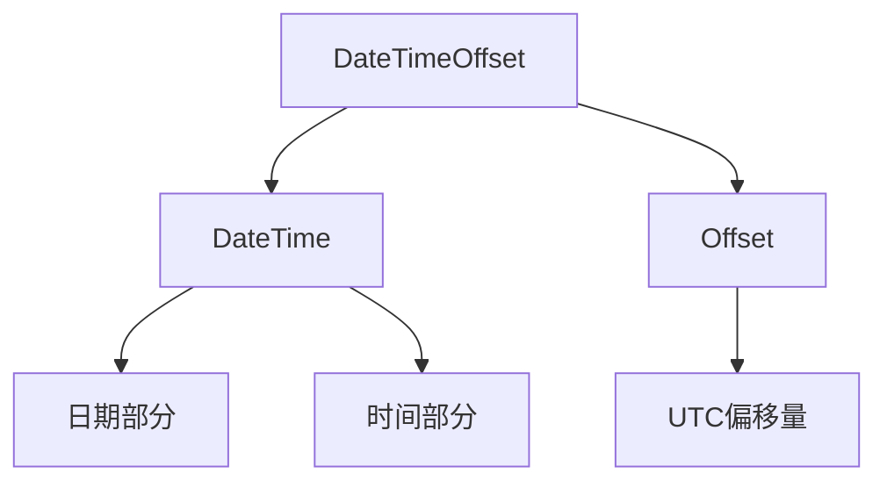

### 简介

`DateTimeOffset` 是 `System` 命名空间中的结构体，用于表示特定时间点及其相对于协调世界时（`UTC`）的偏移量。相比 `DateTime`，它更适合处理跨时区场景，确保时间数据在全球化应用中的一致性和精确性。

* 定义：`System.DateTimeOffset` 表示带有固定时区偏移量的点时间。

* 用途：既保留了 `UTC` 时间戳，也携带了相对于 `UTC` 的偏移量（`Offset`），在分布式、多时区场景下更可靠。

* 内部存储：

    * `DateTime _dateTime`（`Kind` 固定为 `Unspecified`）

    * `TimeSpan _offset`（-14h 到 +14h 范围）

```csharp
var dto = new DateTimeOffset(2025, 8, 8, 14, 30, 0, TimeSpan.FromHours(+8));
```



### DateTimeOffset 结构详解

#### 内部表示

```csharp
public struct DateTimeOffset : IComparable, IFormattable, ... 
{
    private readonly DateTime _dateTime;
    private readonly short _offsetMinutes;
    
    // 属性
    public DateTime DateTime { get; }       // 日期时间部分
    public DateTime UtcDateTime { get; }    // UTC 等效时间
    public TimeSpan Offset { get; }         // 偏移量
    public long Ticks { get; }              // 自 0001-01-01 的滴答数
    public DateTime Date { get; }           // 日期部分
    public int Year { get; }                // 年
    // ... 其他属性类似 DateTime
}
```

### 核心API

#### 属性

| 属性                 | 说明                                                              |
| -------------------- | ----------------------------------------------------------------- |
| `DateTime`           | 去除偏移量的本地时间（`DateTimeKind.Unspecified`）                |
| `UtcDateTime`        | 按 `Offset` 转换到 UTC 的 `DateTime`（`Kind.Utc`）                |
| `Offset`             | 相对于 UTC 的偏移量（`TimeSpan`）                                 |
| `LocalDateTime`      | 按当前系统时区再次转换的本地时间（`DateTimeKind.Local`）          |
| `Date`               | `DateTime.Date` 部分，保留偏移量                                  |
| `Year/Month/Day`     | 年、月、日                                                        |
| `Hour/Minute/Second` | 小时、分钟、秒                                                    |
| `Ticks`              | 自 `0001-01-01T00:00:00` 起的刻度数（100 ns 为单位，不含偏移）    |
| `Now`                | 当前本地时间带本地偏移（等同 `new DateTimeOffset(DateTime.Now)`） |
| `UtcNow`             | 当前 UTC 时间，偏移量为 `TimeSpan.Zero`                           |

#### 方法

* `Add(TimeSpan)`：添加时间跨度。

* `AddDays(double)、AddHours(double)` 等：添加特定单位。

* `Subtract(DateTimeOffset)`：计算时间差（返回 `TimeSpan`）。

* `ToString(string)`：格式化输出。

* `ToUniversalTime()`：转换为 `UTC`。

* `ToOffset(TimeSpan)`：转换为指定偏移。

* `Parse(string)、TryParse(string, out DateTimeOffset)`：解析字符串。

#### 静态方法

* `DateTimeOffset.Compare(DateTimeOffset, DateTimeOffset)`：比较两个时间。

* `DateTimeOffset.ParseExact(string, string, IFormatProvider)`：精确解析。

### 构造与转换

#### 常用构造器

```csharp
// 指定本地时间和偏移
var dto1 = new DateTimeOffset(2025,8,8,14,30,0, TimeSpan.FromHours(+8));

// 从 DateTime 创建（注意 Kind）
var dtLocal = DateTime.Now;  // Kind.Local
var dto2 = new DateTimeOffset(dtLocal);

// 从 UTC DateTime 创建
var dtUtc = DateTime.UtcNow;
var dto3 = new DateTimeOffset(dtUtc).ToOffset(TimeSpan.Zero);
```

#### 偏移转换

```csharp
// 将 dto 转到另一个时区偏移（仅改变 Offset，不更改瞬时时间）
var dtoTokyo = dto.ToOffset(TimeSpan.FromHours(+9));

// 获取共同的绝对时刻
DateTimeOffset a = dto1, b = dtoTokyo;
bool sameInstant = a.ToUniversalTime() == b.ToUniversalTime();  // true
```

#### 与 DateTime 相互转换

```csharp
// DateTimeOffset -> DateTime (Unspecified)
DateTime dtUnspecified = dto.DateTime;

// DateTimeOffset -> UTC DateTime
DateTime dtUtc = dto.UtcDateTime;

// DateTimeOffset -> Local DateTime
DateTime dtLocal2 = dto.LocalDateTime;

// DateTime -> DateTimeOffset
var dtoFromDt = new DateTimeOffset(dtUnspecified, TimeZoneInfo.Local.GetUtcOffset(dtUnspecified));
```

### 格式化与解析

#### 标准格式字符串

| 格式符 | 说明       | 示例输出                          |
| ------ | ---------- | --------------------------------- |
| "o"    | 往返格式   | 2023-10-05T14:30:00.0000000+08:00 |
| "r"    | RFC1123    | Thu, 05 Oct 2023 14:30:00 +0800   |
| "u"    | 通用可排序 | 2023-10-05 06:30:00Z              |
| "s"    | 可排序     | 2023-10-05T14:30:00               |
| "g"    | 常规短格式 | 10/5/2023 2:30 PM                 |
| "G"    | 常规长格式 | 10/5/2023 2:30:00 PM              |

#### 格式化

* 标准格式

```csharp
dto.ToString("o");  // 2025-08-08T14:30:00.0000000+08:00
dto.ToString("u");  // 2025-08-08 14:30:00Z
```

* 自定义格式

```csharp
dto.ToString("yyyy-MM-dd HH:mm zzz");   // 2025-08-08 14:30 +08:00
dto.ToString("yyyy-MM-dd HH:mm K");     // K 同 zzz
```

#### 解析

* `Parse / TryParse`

```csharp
DateTimeOffset.Parse("2025-08-08T14:30:00+08:00");
DateTimeOffset.TryParse("2025-08-08 06:30:00Z", out var dto);
```

* `ParseExact / TryParseExact`

```csharp
DateTimeOffset.ParseExact("2025/08/08 14:30 +0800",
    "yyyy/MM/dd HH:mm zzz", CultureInfo.InvariantCulture);
DateTimeOffset.TryParseExact(input, 
    new[]{ "o","yyyy-MM-dd HH:mm zzz"}, 
    CultureInfo.InvariantCulture, DateTimeStyles.AssumeUniversal, out dto);
```

### 比较与运算

```csharp
var a = new DateTimeOffset(2025,8,8,10,0,0,TimeSpan.FromHours(+1));
var b = new DateTimeOffset(2025,8,8,18,0,0,TimeSpan.FromHours(+9));
// 绝对瞬时时间相同
bool eq = a.ToUniversalTime() == b.ToUniversalTime();  // true

// 差值
TimeSpan diff = b - a;  // Zero
```

* 支持 `+/- TimeSpan、- DateTimeOffset`（结果 `TimeSpan`）

* 支持 `Compare(), Equals()`, 运算符 `<, >` 等基于 UTC 比较

### 与 DateTime 的比较

| 特性                   | `DateTime`                                 | `DateTimeOffset`                           |
| ---------------------- | ------------------------------------------ | ------------------------------------------ |
| 时区信息               | 仅有 `Kind`，不含偏移量                    | 明确定义了相对于 UTC 的偏移量              |
| 存储一致性             | 若用本地 `DateTime.Now` 存库，会丢失上下文 | 可存储为 ISO 8601 带偏移字符串，恢复无歧义 |
| 夏令时问题             | 依赖系统时区转换，歧义转化                 | 偏移固定，不受夏令时影响                   |
| 跨系统/跨语言互操作性  | 存 UTC 时需额外约定                        | 标准化输出带偏移，易互操作                 |
| 推荐用于多时区业务场景 | 较麻烦                                     | 首选                                       |

### 资源和文档

* `DateTimeOffset`：https://learn.microsoft.com/en-us/dotnet/api/system.datetimeoffset

* `TimeZoneInfo`：https://learn.microsoft.com/en-us/dotnet/api/system.timezoneinfo