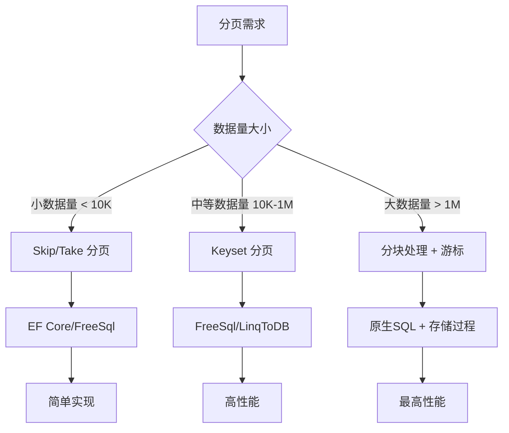

## 简介

### 分页基础概念

* 核心分页参数

```csharp
public class PaginationParams
{
    private const int MaxPageSize = 100; // 最大每页条数限制
    
    public int PageNumber { get; set; } = 1;    // 当前页码（从1开始）
    
    private int _pageSize = 10;                 // 每页记录数
    public int PageSize
    {
        get => _pageSize;
        set => _pageSize = (value > MaxPageSize) ? MaxPageSize : value;
    }
}
```

* 分页结果封装

```csharp
public class PagedResult<T>
{
    public int CurrentPage { get; set; }
    public int PageSize { get; set; }
    public int TotalCount { get; set; }
    public int TotalPages => (int)Math.Ceiling(TotalCount / (double)PageSize);
    public List<T> Items { get; set; } = new List<T>();
}
```

### 普通分页（Offset & Limit）

**为什么普通分页会变慢？**

当 `page * size` 很大时，数据库仍要扫描并丢弃前面 `N` 条记录，`IO` 和排序开销显著，上千页甚至秒级以上延迟。此时可考虑「高性能分页」。

#### 原理

* 使用数据库的 `OFFSET … FETCH`（SQL Server/PostgreSQL/SQLite）或 `LIMIT … OFFSET`（MySQL）进行分页。

* 优点：实现简单、支持任意页码跳转。

* 缺点：当页码（`offset`）较大时，数据库仍需扫描并跳过大量行，性能下降明显。

#### EF Core 实现

```csharp
public async Task<PagedResult<Product>> GetProductsAsync(PaginationParams pagination)
{
    var query = _context.Products
        .Where(p => p.IsActive)
        .OrderBy(p => p.Name);
    
    var totalCount = await query.CountAsync();
    
    var items = await query
        .Skip((pagination.PageNumber - 1) * pagination.PageSize)
        .Take(pagination.PageSize)
        .ToListAsync();
    
    return new PagedResult<Product>
    {
        CurrentPage = pagination.PageNumber,
        PageSize = pagination.PageSize,
        TotalCount = totalCount,
        Items = items
    };
}
```

#### FreeSql 实现

```csharp
public PagedResult<Product> GetProducts(PaginationParams pagination)
{
    var query = _fsql.Select<Product>()
        .Where(p => p.IsActive)
        .OrderBy(p => p.Name);
    
    var totalCount = query.Count();
    
    var items = query
        .Skip((pagination.PageNumber - 1) * pagination.PageSize)
        .Take(pagination.PageSize)
        .ToList();
    
    return new PagedResult<Product>
    {
        CurrentPage = pagination.PageNumber,
        PageSize = pagination.PageSize,
        TotalCount = totalCount,
        Items = items
    };
}
```

#### LinqToDB 实现

```csharp
public PagedResult<Product> GetProducts(PaginationParams pagination)
{
    using (var db = new AppDbContext())
    {
        var query = db.Products
            .Where(p => p.IsActive)
            .OrderBy(p => p.Name);
        
        var totalCount = query.Count();
        
        var items = query
            .Skip((pagination.PageNumber - 1) * pagination.PageSize)
            .Take(pagination.PageSize)
            .ToList();
        
        return new PagedResult<Product>
        {
            CurrentPage = pagination.PageNumber,
            PageSize = pagination.PageSize,
            TotalCount = totalCount,
            Items = items
        };
    }
}
```

#### Dapper 实现

```csharp
string sql = @"
SELECT Id, Name, CreatedAt
FROM Users
ORDER BY Id
OFFSET @Offset ROWS FETCH NEXT @Size ROWS ONLY";

var list = conn.Query<User>(
    sql,
    new { Offset = (page - 1) * size, Size = size });
```

### 高性能分页：Keyset（Seek）分页

#### 核心思路

* 利用已有索引，通过「最后一条记录的关键列值」继续查询下一页，避免大量 `OFFSET`。

* 也称「`Seek` 方法」或「基于游标的分页」。

```csharp
public async Task<PagedResult<Product>> GetProductsSeekAsync(
    int pageSize, 
    int? lastId = null)
{
    var query = _context.Products
        .Where(p => p.IsActive)
        .OrderBy(p => p.Id);
    
    if (lastId.HasValue)
    {
        query = query.Where(p => p.Id > lastId.Value);
    }
    
    var items = await query
        .Take(pageSize)
        .ToListAsync();
    
    var nextLastId = items.LastOrDefault()?.Id;
    
    return new PagedResult<Product>
    {
        CurrentPage = lastId == null ? 1 : 2, // 简化示例
        PageSize = pageSize,
        Items = items,
        TotalCount = -1 // 不返回总计数提升性能
    };
}
```

#### 通用 SQL 模式

```sql
SELECT columns
FROM table
WHERE (OrderKey > @LastKey)
ORDER BY OrderKey
LIMIT @Size;
```

* `OrderKey` 通常为自增 `ID`、时间戳、复合唯一键等。

* 只扫描「大于上次最大值」的部分，`IO` 成本随页码增量保持稳定。

#### 分页优化：索引覆盖 + Keyset

```sql
-- 创建优化索引
CREATE INDEX IX_Products_Active_Name_Id 
ON Products (IsActive, Name, Id);
```

```csharp
public async Task<PagedResult<Product>> GetProductsOptimizedAsync(
    PaginationParams pagination,
    int? lastId = null,
    string? lastName = null)
{
    var query = _context.Products
        .Where(p => p.IsActive);
    
    if (lastId != null && lastName != null)
    {
        query = query.Where(p => 
            (p.Name == lastName && p.Id > lastId) || 
            p.Name.CompareTo(lastName) > 0);
    }
    
    query = query.OrderBy(p => p.Name).ThenBy(p => p.Id);
    
    var items = await query
        .Take(pagination.PageSize)
        .Select(p => new ProductDto // 只选择必要字段
        {
            Id = p.Id,
            Name = p.Name,
            Price = p.Price
        })
        .ToListAsync();
    
    // 返回最后一条记录的标识
    var lastItem = items.LastOrDefault();
    
    return new PagedResult<ProductDto>
    {
        Items = items,
        PageSize = pagination.PageSize,
        LastId = lastItem?.Id,
        LastName = lastItem?.Name
    };
}
```

#### 分页性能对比（10万条记录测试）

|  分页方式   |  第1页耗时   |   第100页耗时  |   第1000页耗时  |  内存使用  |
| --- | --- | --- | --- | --- |
|  Skip/Take   |  15ms   |  120ms   |   850ms  |  中等   |
|  Keyset分页   |  10ms   |  12ms   |  15ms   |  低   |
|  索引覆盖+Keyset   |  8ms   |  9ms   |   11ms  |   最低  |

### ORM 特定优化技巧

#### EF Core 分页优化

```csharp
// 使用AsNoTracking避免变更跟踪
var items = await query
    .AsNoTracking()
    .Skip(...)
    .Take(...)
    .ToListAsync();

// 只选择必要字段
var items = await query
    .Select(p => new 
    {
        p.Id,
        p.Name,
        p.Price
    })
    .Skip(...)
    .Take(...)
    .ToListAsync();

// 使用原生SQL优化深度分页
var sql = @"
SELECT * FROM Products
WHERE Id > @lastId
ORDER BY Id
LIMIT @pageSize";

var items = await _context.Products
    .FromSqlRaw(sql, parameters)
    .AsNoTracking()
    .ToListAsync();
```

* 若需支持多列排序，可在 `Where` 中组合条件：

```csharp
.Where(u => u.CreatedAt > lastTime
     || (u.CreatedAt == lastTime && u.Id > lastId))
```

#### FreeSql 高性能分页

```csharp
// FreeSql 专用分页方法
var (items, totalCount) = _fsql.Select<Product>()
    .Where(p => p.IsActive)
    .OrderBy(p => p.Id)
    .Page(pagination.PageNumber, pagination.PageSize)
    .ToList();

// 使用ToChunk处理大数据量
_fsql.Select<Product>()
    .ToChunk(null, 1000, chunk => 
    {
        // 处理每1000条记录
    });

// FreeSql 的 Keyset 分页
var items = _fsql.Select<Product>()
    .Where(p => p.Id > lastId)
    .OrderBy(p => p.Id)
    .Take(pageSize)
    .ToList();
```

#### LinqToDB 分页优化

```csharp
// 使用SQL优化提示
var items = db.Products
    .With("INDEX(IX_Products_Active_Name_Id)")
    .Where(p => p.IsActive)
    .OrderBy(p => p.Name)
    .ThenBy(p => p.Id)
    .Skip(...)
    .Take(...)
    .ToList();

// 使用BulkCopy处理大数据导出
var options = new BulkCopyOptions { BulkCopyTimeout = 60 };
db.BulkCopy(options, products);
```

#### Dapper

```csharp
string sql = @"
SELECT Id, Name, CreatedAt
FROM Users
WHERE Id > @LastId
ORDER BY Id
OFFSET 0 ROWS FETCH NEXT @Size ROWS ONLY"; // OFFSET 0 + FETCH NEXT

var list = conn.Query<User>(sql, new { LastId = lastId, Size = size });
```

### 分页最佳实践

#### 通用分页参数设计

```csharp
public class PaginationRequest
{
    [Range(1, int.MaxValue)]
    public int PageIndex { get; set; } = 1;
    
    [Range(1, 100)]
    public int PageSize { get; set; } = 20;
    
    public string? SortBy { get; set; }
    public bool SortDescending { get; set; }
    public int? LastId { get; set; }
    public DateTime? LastDate { get; set; }
}

public class PaginationResult<T>
{
    public List<T> Items { get; set; } = new();
    public int TotalCount { get; set; }
    public int? LastId { get; set; }
    public DateTime? LastDate { get; set; }
    public bool HasNextPage { get; set; }
}
```

#### 前端交互设计

```csharp
// 分页API响应格式
interface ApiResponse<T> {
  data: T[];
  pagination: {
    currentPage: number;
    pageSize: number;
    totalItems: number;
    totalPages: number;
    nextCursor?: string; // 用于Keyset分页
  };
}
```

#### 分页缓存策略

```csharp
public async Task<PaginationResult<Product>> GetProducts(
    PaginationRequest request)
{
    var cacheKey = $"products_page_{request.PageIndex}_size_{request.PageSize}";
    
    if (_cache.TryGetValue(cacheKey, out PaginationResult<Product> result))
    {
        return result;
    }
    
    // 数据库查询
    result = await QueryProductsFromDb(request);
    
    // 设置缓存（5分钟过期）
    _cache.Set(cacheKey, result, TimeSpan.FromMinutes(5));
    
    return result;
}
```

#### 分页策略选择指南

|  场景   |  推荐分页方式   |  理由   |
| --- | --- | --- |
|  后台管理系统   |  Skip/Take   |  需要跳页和总计数   |
|  移动端无限滚动	   |  Keyset分页   |  高性能连续加载   |
|  大数据量导出   |  分块处理   |  避免内存溢出   |
|  实时数据展示   |  时间范围分页   |  按时间切片   |
|  复杂报表   |  存储过程分页	   |  最高性能优化   |

#### 深度分页优化方案

```csharp
// 基于游标的深度分页
public async Task<PagedResult<Product>> GetDeepPagedProducts(
    int pageSize, 
    string? cursor = null)
{
    // 解析游标（Base64编码的ID+时间戳）
    var cursorData = cursor != null 
        ? JsonSerializer.Deserialize<CursorData>(Base64Decode(cursor)) 
        : null;
    
    var query = _context.Products.AsQueryable();
    
    if (cursorData != null)
    {
        query = query.Where(p => 
            p.CreatedAt > cursorData.Timestamp || 
            (p.CreatedAt == cursorData.Timestamp && p.Id > cursorData.Id));
    }
    
    query = query
        .OrderBy(p => p.CreatedAt)
        .ThenBy(p => p.Id)
        .Take(pageSize);
    
    var items = await query.ToListAsync();
    
    // 生成下一页游标
    var lastItem = items.LastOrDefault();
    string nextCursor = null;
    if (lastItem != null)
    {
        var nextCursorData = new CursorData 
        { 
            Id = lastItem.Id, 
            Timestamp = lastItem.CreatedAt 
        };
        nextCursor = Base64Encode(JsonSerializer.Serialize(nextCursorData));
    }
    
    return new PagedResult<Product>
    {
        Items = items,
        PageSize = pageSize,
        NextCursor = nextCursor
    };
}

private record CursorData(long Id, DateTime Timestamp);
```

#### 最佳实践建议

* 中小型系统：`EF Core + Skip/Take` 满足大部分需求

* 高性能 `API`：`FreeSql/LinqToDB + Keyset` 分页

* 数据仓库：存储过程 + 分块处理

* 实时系统：游标分页 + 时间窗口查询

* 移动应用：`Keyset` 分页 + 增量加载



### 进阶技巧与组合场景

#### 复合排序列

* 多列排序要在 `WHERE` 中组合判定，确保唯一性并保持稳定翻页。

#### 逆向分页（Last N Rows）

* 获取倒数几页时，可先用普通分页（反向 `ORDER BY … DESC + LIMIT`），再在应用层反转顺序。

#### 跳页提示

* `Keyset` 不支持直接跳到第 `N` 页，可结合普通分页查询总数，给用户展示页码大致范围或「上一页/下一页」导航。

#### 缓存上次最大值

* 对于列表实时插入较多场景，可将上次的最后一条主键/时间戳保存在客户端或服务端 `Session`，继续 `Seek`。

#### 视图或子查询分页

* 复杂关联分页时，可先用 `Seek` 在主表分页，再 `JOIN` 子查询结果，减少 `JOIN` 数据量。

### 性能对比与实践建议

| 方法           | 优点                             | 缺点                                |
| -------------- | -------------------------------- | ----------------------------------- |
| Offset & Limit | 简单、支持任意页跳转             | 大页码时性能急剧下降                |
| Keyset (Seek)  | IO 稳定、延迟恒定                | 不支持直接跳页，仅「上一页/下一页」 |
| 结合两者       | 关键页用 Seek，深度跳页用 Offset | 逻辑稍繁琐                          |

* 小数据量（<100K 行）或浅度分页（<100 页）：普通分页足够。

* 深度分页（>1000 页）或海量数据：强烈建议 Seek 分页。

* 复杂多表关联：先按主键 Seek，后再 JOIN，避免大表 JOIN 全量扫描。

