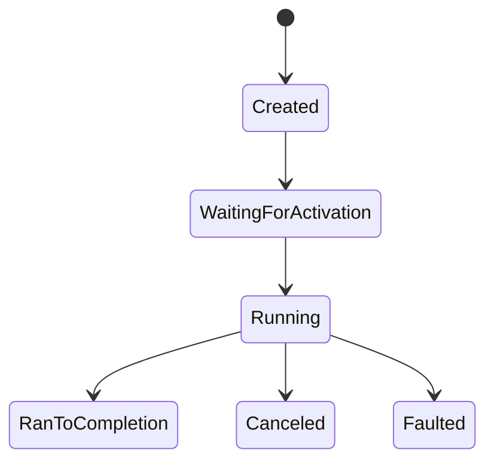
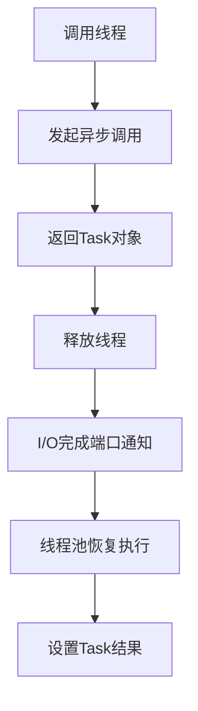

### 简介

异步编程是现代 `C#.NET` 开发的核心技术，它使应用程序能够在执行 `I/O` 操作时保持响应性，提高资源利用率并优化性能。`async/await` 和 `Task` 是 `.NET` 异步编程模型的基石，彻底改变了我们处理异步操作的方式。

#### 异步编程模型演进

* 基于回调

    * 例如 `BeginRead/EndRead`、事件模式。

    * 缺点：回调地狱（`Callback Hell`）、异常处理困难。

* 基于 `Task`

    * `.NET 4.0` 引入 `Task/Task<TResult>`，配合 `ContinueWith` 实现链式调用。

    * 还是显式回调，代码可读性一般。

* `async/await`

    * `C# 5.0` 引入，将异步方法编译成状态机，写法如同同步，提高可读性。

#### Task、Task<TResult> 与 ValueTask<TResult>

* `Task`：表示无返回值的异步操作。

* `Task<TResult>`：表示异步返回 `TResult`。

* `ValueTask<TResult>`（`.NET Core 2.1+`）：减少高频率、已完成任务的堆分配——如果方法常常同步完成，可用它提高性能，但使用不当会带来足够多的陷阱（只能 `await` 一次等）。

#### await 的行为与执行上下文

```csharp
// 同步上下文捕获示例（WPF/ASP.NET）
await SomeOperationAsync();  // 恢复到调用时的 SynchronizationContext

// 避免捕获上下文（库/性能优化）
await SomeOperationAsync().ConfigureAwait(false);
```

* 默认：`await` 会捕获当前上下文（`SynchronizationContext` 或 `TaskScheduler`），在 `UI` 线程或 `ASP.NET` 请求上下文继续执行。

* `ConfigureAwait(false)`：告诉编译器 不 捕获上下文，直接在线程池线程上恢复，减少死锁和性能开销，推荐在库中使用。

#### 使用规则

* `async` 方法必须返回：`Task / Task<T> / ValueTask<T> / void`（不推荐）。

* `await` 只能在 `async` 方法中使用。

* `await` 的本质是把后续代码注册为回调，不会阻塞当前线程。

#### Task vs Thread

| 对比项   | Task                 | Thread               |
| -------- | -------------------- | -------------------- |
| 创建开销 | 小（由线程池管理）   | 大                   |
| 用法     | 异步任务/非阻塞编程  | 真实物理线程         |
| 推荐场景 | I/O 密集型、轻量并发 | CPU 密集型或控制线程 |

#### 什么时候使用 async/await？

✅ 推荐场景：

* 数据库或 `API` 调用

* 读取/写入文件

* 消息队列

* 等待用户操作（如按钮点击）

❌ 不推荐：

* `CPU` 密集型任务（应使用 `Thread / Task.Run`）

* 不需要异步的简单函数

### 异步编程基础

#### 为什么需要异步编程

* 同步操作问题：

    * 线程阻塞等待 `I/O` 完成（数据库查询、文件读写、网络请求）

    * 资源浪费（线程池线程被占用）

    * 应用程序无响应（`UI` 线程阻塞）

* 异步操作优势：

    * 提高吞吐量（服务端应用）

    * 保持 `UI` 响应（客户端应用）

    * 高效利用线程池资源

#### 核心概念

* `Task`: 表示异步操作的抽象，可返回结果（`Task<TResult>`）

    * 表示一个异步操作的结果，类似于其他语言中的 `Promise` 或 `Future`。

    * 无返回值：使用 `Task`（相当于 `void` 的异步版本）。

    * 有返回值：使用 `Task<TResult>`（如 `Task<int>`）。

* `async`: 修饰方法，表明方法包含异步操作

* `await`: 挂起当前方法执行，等待异步操作完成

* `TPL`: `Task Parallel Library，.NET 4.0` 引入的任务并行库

* `ValueTask`: `Task` 的轻量级替代，减少堆分配

* `CancellationToken`: 用于取消异步操作的机制

### 基本用法示例

#### 异步方法定义

```csharp
// 无返回值的异步方法
public async Task DownloadDataAsync()
{
    // 模拟网络请求（实际应使用HttpClient）
    await Task.Delay(1000);
    Console.WriteLine("数据下载完成");
}

// 有返回值的异步方法
public async Task<string> GetDataAsync()
{
    await Task.Delay(1000);
    return "异步数据";
}
```

#### 调用异步方法

```csharp
public async Task RunAsync()
{
    // 等待无返回值的任务
    await DownloadDataAsync();

    // 等待有返回值的任务
    string data = await GetDataAsync();
    Console.WriteLine(data);
}
```

### Task 类型详解

#### 创建 Task 的常用方式

|  方法   |  使用场景   |  示例   |
| --- | --- | --- |
|  `new Task`   |  直接创建任务（不自动启动）   |  `var task = new Task(() => Compute(100))`   |
|  `Task.Run`   |  `CPU` 密集型后台任务   |  `Task.Run(() => CalculatePi(1000000))`   |
|  `Task.Delay`   |  异步等待指定时间   |  `await Task.Delay(1000);`   |
|  `Task.FromResult`   |  创建已完成任务   |  `Task.FromResult(42)`   |
|  `Task.FromException`   |  创建失败任务   |  `Task.FromException(new InvalidOperationException())`   |
|  `Task.Factory.StartNew`   |  高级任务创建（可指定调度器等）   |  `Task.Factory.StartNew(() => {}, TaskCreationOptions.LongRunning)`   |
|  `ValueTask.FromResult`   |  高性能场景（避免堆分配）   |  `return ValueTask.FromResult(0);`   |

#### Task 核心 API

* `Task.Wait()`: 阻塞等待任务完成，`task.Wait()`

* `await task`: 非阻塞等待, `var result = await task`

* `Task.WhenAll()`: 等待所有任务完成, `await Task.WhenAll(tasks)`

* `Task.WhenAny()`: 等待任意任务完成, `var first = await Task.WhenAny(tasks)`

* `Task.ContinueWith()`: 任务链式处理, `task.ContinueWith(t => ...)`

#### 任务状态管理

```csharp
var task = DownloadFileAsync("https://example.com/file.zip");

// 检查状态
if (task.Status == TaskStatus.RanToCompletion)
{
    Console.WriteLine("下载完成");
}
else if (task.Status == TaskStatus.Faulted)
{
    Console.WriteLine($"下载失败: {task.Exception?.Message}");
}

// 等待任务完成（多种方式）
await task; // 推荐方式
task.Wait(); // 阻塞当前线程（避免在UI线程使用）
task.Result; // 阻塞并获取结果（可能死锁）
```

#### Task 状态生命周期



### async/await 工作原理

#### 状态机原理

```csharp
public async Task DownloadAsync()
{
    var data = await httpClient.GetByteArrayAsync(url); // (1)
    await File.WriteAllBytesAsync(path, data); // (2)
}
```

编译器生成状态机：

```csharp
class StateMachine : IAsyncStateMachine
{
    int state = -1; // 跟踪执行位置
    TaskAwaiter<byte[]> awaiter1;
    TaskAwaiter awaiter2;
    
    void MoveNext()
    {
        switch(state) {
            case -1: // 初始状态
                awaiter1 = httpClient.GetByteArrayAsync(url).GetAwaiter();
                if(!awaiter1.IsCompleted) {
                    state = 0; // 设置恢复点
                    awaiter1.OnCompleted(MoveNext);
                    return;
                }
                goto case 0;
            case 0: // 第一个await后
                byte[] data = awaiter1.GetResult();
                awaiter2 = File.WriteAllBytesAsync(path, data).GetAwaiter();
                if(!awaiter2.IsCompleted) {
                    state = 1;
                    awaiter2.OnCompleted(MoveNext);
                    return;
                }
                goto case 1;
            case 1: // 第二个await后
                awaiter2.GetResult();
                break;
        }
    }
}
```

#### 执行上下文流



#### 执行流程

* 调用异步方法时同步执行到第一个 `await`

* 返回未完成的 `Task` 给调用者

* 后台异步操作完成后，线程池线程恢复状态机执行

* 最终设置 `Task` 结果状态

### 异步编程模式

#### 基本模式

```csharp
public async Task<int> ProcessDataAsync()
{
    // 步骤1: 异步获取数据
    var rawData = await FetchDataAsync();
    
    // 步骤2: 后台处理（CPU密集型）
    var processedData = await Task.Run(() => ProcessData(rawData));
    
    // 步骤3: 异步保存结果
    await SaveDataAsync(processedData);
    
    return processedData.Count;
}
```

#### 并行执行模式(WhenAll)

```csharp
public async Task<Results> GetAggregatedDataAsync()
{
    // 同时启动多个任务
    var userTask = GetUserDataAsync();
    var productTask = GetProductDataAsync();
    var orderTask = GetOrderDataAsync();
    
    // 等待所有任务完成
    await Task.WhenAll(userTask, productTask, orderTask);
    
    return new Results(
        userTask.Result, 
        productTask.Result, 
        orderTask.Result
    );
}
```

#### 首个完成模式(WhenAny)

```csharp
public async Task<string> GetFirstResponseAsync(params string[] urls)
{
    // 创建下载任务集合
    var downloadTasks = urls.Select(url => 
        DownloadStringAsync(url)).ToList();
    
    // 等待任意任务完成
    var completedTask = await Task.WhenAny(downloadTasks);
    
    return await completedTask;
}
```

#### 异步流（IAsyncEnumerable）

处理大量数据时避免阻塞：

```csharp
public async IAsyncEnumerable<int> GenerateNumbersAsync()
{
    for (int i = 0; i < 10; i++)
    {
        await Task.Delay(100);
        yield return i;
    }
}

// 消费异步流
await foreach (int number in GenerateNumbersAsync())
{
    Console.WriteLine(number);
}
```

### 异常处理

#### 异步异常传播

```csharp
public async Task ProcessAsync()
{
    try
    {
        await OperationThatMayFailAsync();
        await AnotherOperationAsync();
    }
    catch (HttpRequestException ex)
    {
        Console.WriteLine($"网络错误: {ex.Message}");
    }
    catch (OperationCanceledException)
    {
        Console.WriteLine("操作被取消");
    }
    catch (Exception ex)
    {
        Console.WriteLine($"未知错误: {ex}");
    }
}
```

#### 多任务异常处理

```csharp
public async Task ProcessMultipleAsync()
{
    var task1 = Operation1Async();
    var task2 = Operation2Async();
    
    try
    {
        await Task.WhenAll(task1, task2);
    }
    catch (Exception ex)
    {
        // 获取所有异常
        var allExceptions = task1.Exception?.InnerExceptions
            .Concat(task2.Exception?.InnerExceptions ?? Enumerable.Empty<Exception>());
        
        Console.WriteLine($"共 {allExceptions?.Count()} 个错误");
    }
}
```

### 取消机制

#### CancellationToken 使用

```csharp
public async Task DownloadWithCancelAsync(
    string url, 
    CancellationToken cancellationToken)
{
    using var httpClient = new HttpClient();
    
    try
    {
        // 传递取消令牌
        var response = await httpClient.GetAsync(url, cancellationToken);
        response.EnsureSuccessStatusCode();
        
        // 在操作中检查取消请求
        cancellationToken.ThrowIfCancellationRequested();
        
        // 处理响应...
    }
    catch (OperationCanceledException)
    {
        Console.WriteLine("下载已取消");
    }
}
```

#### 取消令牌源

```csharp
var cts = new CancellationTokenSource();

// 设置超时自动取消
cts.CancelAfter(TimeSpan.FromSeconds(30));

// 手动取消
var cancelButton = new Button();
cancelButton.Click += (s, e) => cts.Cancel();

try
{
    await DownloadLargeFileAsync("https://example.com/bigfile.zip", cts.Token);
}
catch (OperationCanceledException)
{
    Console.WriteLine("下载已取消");
}
finally
{
    cts.Dispose();
}
```

#### 取消机制高级应用

```csharp
public async Task ProcessDataAsync(
    IEnumerable<DataItem> items, 
    CancellationToken cancellationToken,
    IProgress<int> progress)
{
    int processed = 0;
    foreach (var item in items)
    {
        // 检查取消请求
        cancellationToken.ThrowIfCancellationRequested();
        
        await ProcessItemAsync(item, cancellationToken);
        
        // 更新进度
        processed++;
        progress?.Report(processed * 100 / items.Count());
    }
}

// 使用示例
var cts = new CancellationTokenSource();
var progress = new Progress<int>(p => Console.WriteLine($"进度: {p}%"));
try
{
    await ProcessDataAsync(data, cts.Token, progress);
}
catch (OperationCanceledException)
{
    Console.WriteLine("处理被取消");
}
```

### 高级技巧与最佳实践

#### 使用Task.Run处理 CPU 密集型任务

```csharp
public async Task ProcessDataAsync()
{
    // 将CPU密集型任务放到后台线程
    await Task.Run(() =>
    {
        // 执行耗时的计算
        for (int i = 0; i < 1000000; i++)
        {
            // ...
        }
    });
}
```

#### 避免死锁

```csharp
// 危险代码（UI线程死锁）
public string GetData()
{
    return GetDataAsync().Result; // 阻塞UI线程
}

// 解决方案1：全异步
public async Task<string> GetDataWrapperAsync()
{
    return await GetDataAsync();
}

// 解决方案2：配置上下文
public string GetDataSafe()
{
    return Task.Run(async () => 
        await GetDataAsync().ConfigureAwait(false)).Result;
}
```

#### ConfigureAwait 优化

```csharp
public async Task ProcessDataAsync()
{
    // 不捕获上下文（后台任务）
    var data = await FetchDataAsync().ConfigureAwait(false);
    
    // 处理数据（不需要原始上下文）
    var result = Process(data);
    
    // 需要返回UI线程更新UI
    await Dispatcher.InvokeAsync(() => 
        UpdateUI(result));
}
```

#### ValueTask 优化

```csharp
public ValueTask<int> CalculateAsync()
{
    if (cachedResultAvailable)
    {
        // 避免分配Task对象
        return ValueTask.FromResult(cachedValue);
    }
    
    return new ValueTask<int>(ComputeAsync());
}

private async Task<int> ComputeAsync()
{
    // 实际计算逻辑
    await Task.Delay(100);
    return 42;
}
```

#### 异步流 (IAsyncEnumerable)

```csharp
public async IAsyncEnumerable<string> ReadLinesAsync(string filePath)
{
    using var reader = new StreamReader(filePath);
    
    while (!reader.EndOfStream)
    {
        var line = await reader.ReadLineAsync();
        yield return line;
    }
}

// 消费异步流
await foreach (var line in ReadLinesAsync("data.txt"))
{
    Console.WriteLine(line);
}
```

#### 通道 (System.Threading.Channels)

```csharp
var channel = Channel.CreateBounded<Data>(100);

// 生产者
public async Task ProduceDataAsync()
{
    while (hasMoreData)
    {
        var data = await FetchNextDataAsync();
        await channel.Writer.WriteAsync(data);
    }
    channel.Writer.Complete();
}

// 消费者
public async Task ConsumeDataAsync()
{
    await foreach (var item in channel.Reader.ReadAllAsync())
    {
        await ProcessItemAsync(item);
    }
}
```

#### 异步锁 (SemaphoreSlim)

```csharp
private readonly SemaphoreSlim _dbSemaphore = new SemaphoreSlim(10);

public async Task AccessDatabaseAsync()
{
    await _dbSemaphore.WaitAsync();
    try
    {
        // 受限资源访问
        await dbContext.SaveChangesAsync();
    }
    finally
    {
        _dbSemaphore.Release();
    }
}
```

### 异步编程在不同场景的应用

#### ASP.NET Core Web API

```csharp
[ApiController]
[Route("api/[controller]")]
public class ProductsController : ControllerBase
{
    private readonly IProductService _productService;

    public ProductsController(IProductService productService)
    {
        _productService = productService;
    }

    [HttpGet]
    public async Task<ActionResult<IEnumerable<Product>>> GetProducts(
        [FromQuery] int page = 1, 
        [FromQuery] int pageSize = 20)
    {
        var products = await _productService.GetProductsAsync(page, pageSize);
        return Ok(products);
    }

    [HttpPost]
    public async Task<ActionResult<Product>> CreateProduct(Product product)
    {
        var createdProduct = await _productService.CreateProductAsync(product);
        return CreatedAtAction(nameof(GetProduct), 
            new { id = createdProduct.Id }, createdProduct);
    }
}
```

#### 客户端应用 (WPF/WinForms)

```csharp
private async void LoadDataButton_Click(object sender, EventArgs e)
{
    try
    {
        loadingIndicator.Visible = true;
        var data = await dataService.GetDataAsync();
        dataGridView.DataSource = data;
    }
    catch (Exception ex)
    {
        MessageBox.Show($"加载失败: {ex.Message}");
    }
    finally
    {
        loadingIndicator.Visible = false;
    }
}
```

#### 后台服务

```csharp
public class Worker : BackgroundService
{
    protected override async Task ExecuteAsync(CancellationToken stoppingToken)
    {
        while (!stoppingToken.IsCancellationRequested)
        {
            try
            {
                await ProcessBatchAsync(stoppingToken);
                await Task.Delay(TimeSpan.FromMinutes(5), stoppingToken);
            }
            catch (OperationCanceledException)
            {
                // 正常退出
            }
            catch (Exception ex)
            {
                Log.Error(ex, "处理批次失败");
                await Task.Delay(TimeSpan.FromMinutes(1), stoppingToken);
            }
        }
    }
}
```

### 异步编程陷阱与解决方案

#### 死锁问题

```csharp
// 危险代码（UI线程死锁）
public string GetData()
{
    return GetDataAsync().Result; // 阻塞UI线程
}

// 解决方案1：全异步
public async Task<string> GetDataWrapperAsync()
{
    return await GetDataAsync();
}

// 解决方案2：配置上下文
public string GetDataSafe()
{
    return Task.Run(async () => 
        await GetDataAsync().ConfigureAwait(false)).Result;
}
```

#### async void 问题

```csharp
// 错误：异常无法捕获
public void Button_Click(object sender, EventArgs e)
{
    SaveDataAsync(); // 缺少await
}

// 解决方案1：使用async void但要处理异常
public async void Button_ClickSafe(object sender, EventArgs e)
{
    try
    {
        await SaveDataAsync();
    }
    catch (Exception ex)
    {
        MessageBox.Show($"保存失败: {ex.Message}");
    }
}

// 解决方案2：使用async Task
private async Task SaveDataAsync() { ... }
```

#### 上下文丢失问题

```csharp
public class MyService
{
    // 错误：捕获了错误的上下文
    public async Task ProcessAsync()
    {
        await Task.Delay(100);
        // 可能在不正确的上下文中执行
    }
    
    // 解决方案：使用ConfigureAwait(false)
    public async Task ProcessSafeAsync()
    {
        await Task.Delay(100).ConfigureAwait(false);
        // 在适当的上下文中执行
    }
}
```

### 性能优化

* 避免不必要的状态机

    * 如果方法内没有 `await`，就不要标记 `async`；直接返回 `Task`。

* 使用 `ConfigureAwait(false)`

    * 在库代码中，减少上下文切换。

* 复用 `HttpClient、Task`

    * 避免每次创建新实例；

* 注意 `ValueTask<T>`

    * 频繁同步完成场景可减少分配，但只能 `await` 一次，并且不能 `WhenAll`。

