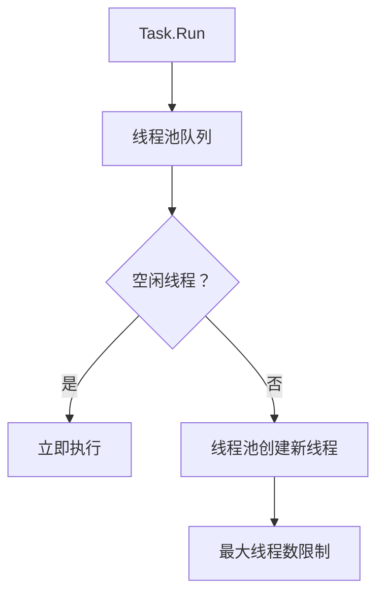
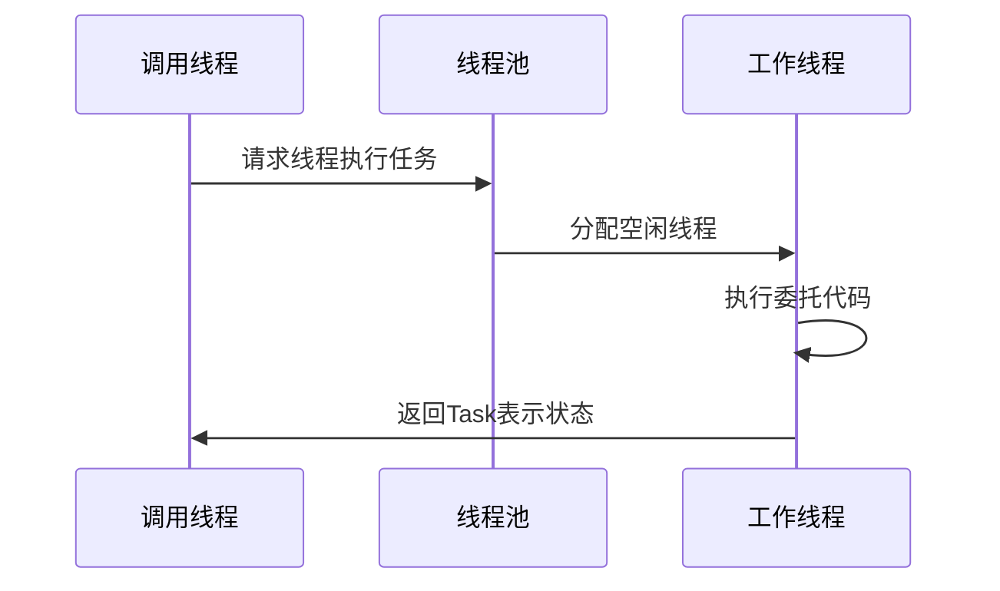
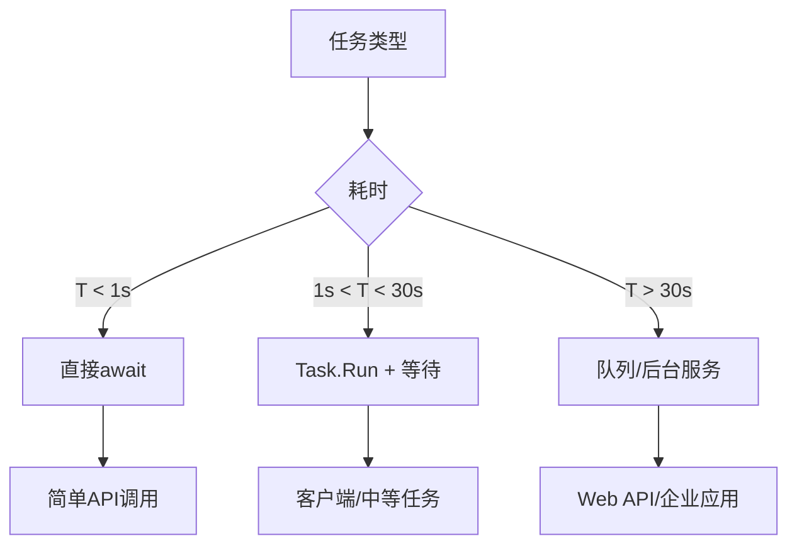

### 简介

`Task.Run` 的核心作用是：将工作放到线程池的工作线程上执行。

**适用场景**

* `CPU` 密集型操作（如计算、加密）。

* 同步 `API` 的异步包装（将同步方法转为异步）。

**示例分析**

```csharp
// 将CPU密集型操作放到线程池
var task = Task.Run(() =>
{
    // 在线程池线程上执行
    return ComputeIntensively(); // 计算密集型操作
});

await task; // 等待任务完成
```

等价于：

```csharp
Task.Factory.StartNew(
    () => ComputeIntensively(), 
    CancellationToken.None,
    TaskCreationOptions.DenyChildAttach, 
    TaskScheduler.Default
);
```

**执行流程**

* 线程分配：`Task.Run` 会从线程池请求一个工作线程。

* 执行任务：指定的委托在该线程上运行。

* 返回结果：任务完成后，结果通过 `Task` 返回。

**线程池行为**

* 将委托排入线程池队列

* 使用线程池线程（非全新线程）

* 线程数量：线程池会根据负载动态调整线程数，但有上限（默认约为CPU核心数 * 1023）。

* 线程复用：任务完成后，线程不会销毁，而是返回线程池等待下一个任务。



**执行环境：**

* 默认使用 `TaskScheduler.Default`

* 不继承调用方同步上下文

* 不传播调用方执行上下文（除非指定）

### Task.Run 的工作原理



### 核心机制详解

#### 线程池调度

```csharp
Task.Run(() => 
{
    // 此代码在线程池线程执行
    for (int i = 0; i < 1000000; i++) 
    {
        // 密集计算...
    }
});
```

* 不保证专用线程：使用线程池中的可用线程

* 可能重用线程：同一线程可能执行多个任务

* 非实时调度：任务可能不会立即执行

#### 执行上下文流动

```csharp
var currentCulture = CultureInfo.CurrentCulture;

Task.Run(() => 
{
    // 自动捕获并应用调用上下文
    Console.WriteLine(currentCulture.Name); // 输出 en-US
});
```

#### 重载方法详解

```csharp
// 基本形式（无返回值）
Task.Run(Action action);

// 带返回值
Task<TResult> Run<TResult>(Func<TResult> function);

// 支持取消
Task Run(Action action, CancellationToken cancellationToken);

// 异步委托支持
Task Run(Func<Task> function);
```

### Task.Run 最佳实践

#### 适用场景

* CPU 密集型工作

```csharp
// 正确：卸载计算到后台
var result = await Task.Run(() => 
    RenderComplexScene(sceneParameters));
```

* 避免阻塞 UI 线程

```csharp
// WPF/Maui 示例
private async void ProcessButton_Click(object sender, EventArgs e)
{
    // 保持UI响应
    progressBar.IsIndeterminate = true;
    
    // 后台处理
    await Task.Run(() => ProcessLargeDataset());
    
    // 返回UI线程更新
    resultLabel.Text = "处理完成";
    progressBar.IsIndeterminate = false;
}
```

* 并行计算

```csharp
var tasks = new List<Task>();
foreach (var data in datasets)
{
    tasks.Add(Task.Run(() => ProcessDataset(data)));
}
await Task.WhenAll(tasks);
```

#### 不适用场景

* I/O 密集型操作

```csharp
// 错误：应该使用真正的异步API
await Task.Run(() => File.WriteAllText("data.txt", content));

// 正确：使用异步API
await File.WriteAllTextAsync("data.txt", content);
```

* 短期操作

```csharp
// 错误：不值得线程切换开销
await Task.Run(() => x + y);

// 正确：直接同步计算
var result = x + y;
```

#### 高级模式

* 自定义调度器

```csharp
var customScheduler = new LimitedConcurrencyLevelTaskScheduler(2);
Task.Factory.StartNew(() => 
{
    // 使用自定义调度器
}, CancellationToken.None, TaskCreationOptions.None, customScheduler);
```

* 长时间运行任务

```csharp
Task.Factory.StartNew(() => 
{
    // 长时间操作...
}, CancellationToken.None, TaskCreationOptions.LongRunning, TaskScheduler.Default);
```

### 耗时任务处理策略详解

#### 决策树   



#### Web API 中的处理方案

* 方案1：快速响应 + 后台处理（<30s）

```csharp
[HttpPost("import")]
public async Task<IActionResult> ImportData([FromBody] ImportRequest request)
{
    // 启动后台任务（不等待）
    _ = Task.Run(async () => 
    {
        await ProcessImportAsync(request.Data);
    });
    
    // 立即返回202 Accepted
    return Accepted(new { jobId = Guid.NewGuid() });
}
```

* 方案2：队列 + 后台服务（>30s）

```csharp
// 控制器
[HttpPost("export")]
public IActionResult StartExport([FromBody] ExportRequest request)
{
    var jobId = _jobService.CreateExportJob(request);
    return Accepted(new { jobId });
}

// 后台服务
public class ExportBackgroundService : BackgroundService
{
    protected override async Task ExecuteAsync(CancellationToken stoppingToken)
    {
        while (!stoppingToken.IsCancellationRequested)
        {
            var job = await _queue.DequeueAsync(stoppingToken);
            await ExportDataAsync(job, stoppingToken);
        }
    }
}
```

#### 客户端应用处理

`WPF/Maui` 示例

```csharp
private async void StartExport_Click(object sender, EventArgs e)
{
    try
    {
        progressRing.IsActive = true;
        
        // 使用Task.Run防止UI冻结
        await Task.Run(() => ExportToExcel(largeDataset));
        
        ShowMessage("导出成功!");
    }
    catch (Exception ex)
    {
        ShowError($"导出失败: {ex.Message}");
    }
    finally
    {
        progressRing.IsActive = false;
    }
}
```

#### Nginx 超时问题解决方案

```csharp
// 中间件解决方案
public class LongTaskMiddleware
{
    private readonly RequestDelegate _next;
    private readonly IBackgroundTaskQueue _queue;

    public LongTaskMiddleware(RequestDelegate next, IBackgroundTaskQueue queue)
    {
        _next = next;
        _queue = queue;
    }

    public async Task Invoke(HttpContext context)
    {
        // 检测长任务路由
        if (context.Request.Path.StartsWithSegments("/long-task"))
        {
            var jobId = Guid.NewGuid().ToString();
            
            // 加入队列
            _queue.Enqueue(async token => 
            {
                await ProcessLongTask(context.Request, token);
            });
            
            context.Response.StatusCode = 202; // Accepted
            await context.Response.WriteAsJsonAsync(new { jobId });
            return;
        }
        
        await _next(context);
    }
}
```

### 性能优化指南

#### Task.Run 使用准则

|  场景   |  推荐做法   |  理由   |
| --- | --- | --- |
|  CPU 密集型工作	   |  ✅ 使用 Task.Run   |  释放调用线程   |
|  I/O 操作   |  ❌ 避免使用   |  应使用真正的异步 API   |
|  UI 线程保持响应	   | ✅ 用于 >50ms 操作    |  防止界面冻结   |
|  微服务通信   |  ❌ 避免使用   |  使用 HTTP 客户端异步方法   |
|  并行数据处理   |  ✅ 结合 Parallel.ForEachAsync	   |  高效并行化   |

#### 性能考虑

* 线程池耗尽：过度使用 `Task.Run` 可能导致线程池饱和，引发上下文切换开销。

* `IOCP` vs 线程池：IO 密集型任务利用 IO 完成端口（`IOCP`），无需线程池线程；CPU 密集型任务必须占用线程池线程。

```csharp
// 错误：将IO密集型操作放到线程池，浪费资源
await Task.Run(() => File.ReadAllTextAsync("path"));

// 正确：直接使用异步方法
await File.ReadAllTextAsync("path");
```