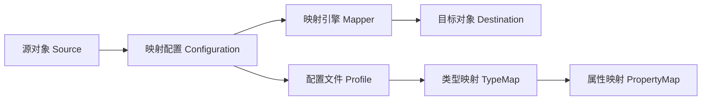
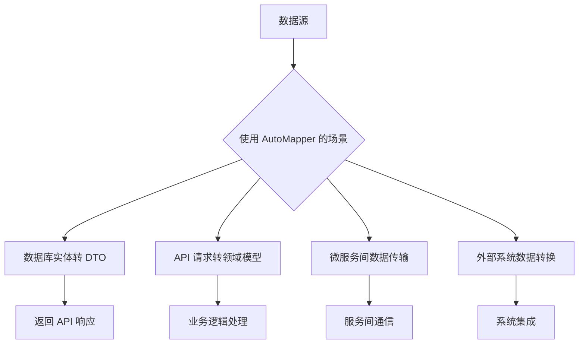

### 简介

* `AutoMapper` 是一个开源的对象映射库，旨在通过约定（`Convention`）和配置，将一个对象的属性值自动映射到另一个对象上，减少手写样板代码。

* 典型场景：`DTO↔Entity`、`ViewModel↔DTO`、不同层级模型转换等。

* 核心优势：

    * 零侵入：映射配置与业务实体解耦，无需修改原有类；

    * 基于约定：默认按同名属性映射，并支持深度嵌套；

    * 可扩展：支持自定义转换逻辑、条件映射、`AfterMap/BeforeMap` 钩子；

    * 性能优化：使用表达式树预编译映射函数，运行时调用开销极低。

* 核心价值

    * 消除手动映射：避免大量 `dest.Name = src.Name` 代码

    * 类型解耦：分离数据模型（`Entity`）与传输模型（`DTO`）

    * 配置复用：一次配置，多处使用

    * 复杂转换：处理嵌套对象、自定义转换逻辑

* 主要组件

|  组件   |  作用   |  示例   |
| --- | --- | --- |
|  `Mapper`   |  映射操作入口   |  `mapper.Map<Dest>(src)`   |
|  `Profile`   |  映射配置容器   |  继承 `Profile` 类   |
|  `Configuration`   |  全局配置对象   |  `MapperConfiguration`   |
|   `ValueResolver`  |  自定义值解析器   |  实现 `IValueResolver`   |

* 核心架构




### 安装与配置

#### 安装 NuGet 包

```shell
Install-Package AutoMapper
Install-Package AutoMapper.Extensions.Microsoft.DependencyInjection
```

#### 注册到 DI（ASP.NET Core/.NET 6+）

在 `Program.cs` 或 `Startup.cs` 中：

```csharp
// 手动注册
builder.Services.AddAutoMapper(cfg => {
    // 可集中在此处添加 Profile
    cfg.AddProfile<UserProfile>();
}, AppDomain.CurrentDomain.GetAssemblies());

// ASP.NET Core 配置
builder.services.AddAutoMapper(typeof(Startup)); // 自动扫描程序集
```

* `AddAutoMapper(...)` 会扫描指定程序集中的 `Profile` 派生类并注册。

* 注册后即可通过构造函数注入 `IMapper`。

### 核心用法

#### 定义 Profile

```csharp
public class UserProfile : Profile
{
    public UserProfile()
    {
        // 简单映射：同名属性自动映射
        CreateMap<UserEntity, UserDto>();

        // 双向映射
        CreateMap<UserDto, UserEntity>();

        // 自定义成员映射
        CreateMap<Order, OrderDto>()
            .ForMember(dest => dest.Total,
                       opt => opt.MapFrom(src => src.Quantity * src.UnitPrice));
    }
}
```

* `CreateMap<TSource, TDestination>()`：声明一组映射规则。

* `.ForMember(...)`：对单个目标属性进行自定义配置。

#### 注册配置文件

```csharp
// 注册配置文件
services.AddAutoMapper(Assembly.GetExecutingAssembly());
```

#### 使用 IMapper

```csharp
public class UserService
{
    private readonly IMapper _mapper;
    public UserService(IMapper mapper) => _mapper = mapper;

    public UserDto GetUser(int id)
    {
        var entity = _repo.GetById(id);
        // 单个对象映射
        return _mapper.Map<UserDto>(entity);
    }

    public List<UserDto> GetAll()
    {
        var list = _repo.GetAll();
        // 列表映射
        return _mapper.Map<List<UserDto>>(list);
    }

    public void Save(UserDto dto)
    {
        // 更新实体
        var entity = _mapper.Map<UserEntity>(dto);
        _repo.Update(entity);
    }
}
```

### 约定映射

`AutoMapper` 默认会按照以下规则自动映射：

* 属性名相同
 
    源类型和目标类型中同名的属性会自动映射。

* 类型兼容

    只要类型兼容（如 `int→long、string→DateTime` 等），就会自动转换。

* 嵌套映射

    支持嵌套对象的自动映射。

```csharp
// 定义源模型
public class UserDto
{
    public string FullName { get; set; }
    public int Age { get; set; }
    public DateTime BirthDate { get; set; }
}

// 定义目标模型
public class UserViewModel
{
    public string Name { get; set; }
    public int YearsOld { get; set; }
    public DateTime DateOfBirth { get; set; }
}

// 简化的映射配置（使用约定）
var config = new MapperConfiguration(cfg =>
{
    cfg.CreateMap<UserDto, UserViewModel>();  // 自动映射属性名相同的字段
});

// 等效于：
cfg.CreateMap<UserDto, UserViewModel>()
    .ForMember(dest => dest.Name, opt => opt.MapFrom(src => src.FullName))
    .ForMember(dest => dest.YearsOld, opt => opt.MapFrom(src => src.Age))
    .ForMember(dest => dest.DateOfBirth, opt => opt.MapFrom(src => src.BirthDate));
```

### 基础映射场景

#### 简单对象映射

```csharp
var config = new MapperConfiguration(cfg => 
    cfg.CreateMap<User, UserDto>());

var mapper = config.CreateMapper();
UserDto dto = mapper.Map<UserDto>(userEntity);
```

#### 集合映射

```csharp
List<User> users = GetUsers();
List<UserDto> dtos = mapper.Map<List<UserDto>>(users);
```

#### 反向映射

```csharp
CreateMap<User, UserDto>().ReverseMap();

// 支持反向转换
User entity = mapper.Map<User>(userDto);
```

#### 嵌套对象映射

```csharp
public class Order {
    public User Customer { get; set; }
}

public class OrderDto {
    public UserDto Customer { get; set; }
}

// 自动递归映射嵌套对象
CreateMap<Order, OrderDto>();
CreateMap<User, UserDto>();
```

### 高级映射技术

#### 自定义属性映射

```csharp
CreateMap<User, UserDto>()
    // 简单转换
    .ForMember(dest => dest.FullName, 
               opt => opt.MapFrom(src => $"{src.FirstName} {src.LastName}"))
               
    // 条件映射
    .ForMember(dest => dest.IsAdult,
               opt => opt.Condition(src => src.Age >= 18))
               
    // 忽略特定属性
    .ForMember(dest => dest.Password, opt => opt.Ignore());
```

#### 条件映射

```csharp
CreateMap<Product, ProductDto>()
    .ForAllMembers(opt => 
        opt.Condition((src, dest, srcMember) => srcMember != null));
```

* 只有当源属性值非 `null` 时，才执行映射。

#### 忽略属性

```csharp
cfg.CreateMap<UserDto, UserViewModel>()
    .ForMember(dest => dest.SomeProperty, opt => opt.Ignore());  // 忽略目标属性
```

#### 继承与多态映射

```csharp
// 基类
public class AnimalDto
{
    public string Name { get; set; }
}

// 派生类
public class DogDto : AnimalDto
{
    public string Breed { get; set; }
}

// 目标基类
public class AnimalViewModel
{
    public string AnimalName { get; set; }
    public string Type { get; set; }
}

// 目标派生类
public class DogViewModel : AnimalViewModel
{
    public string DogBreed { get; set; }
}

// 配置映射
cfg.CreateMap<AnimalDto, AnimalViewModel>()
    .ForMember(dest => dest.AnimalName, opt => opt.MapFrom(src => src.Name));

cfg.CreateMap<DogDto, DogViewModel>()
    .IncludeBase<AnimalDto, AnimalViewModel>()
    .ForMember(dest => dest.DogBreed, opt => opt.MapFrom(src => src.Breed))
    .ForMember(dest => dest.Type, opt => opt.MapFrom(src => "Dog"));

// 映射
var dogDto = new DogDto { Name = "Buddy", Breed = "Golden Retriever" };
var dogViewModel = mapper.Map<DogViewModel>(dogDto);
```

#### 全局转换

```csharp
var config = new MapperConfiguration(cfg =>
{
    // 全局字符串修剪
    cfg.ForAllPropertyMaps(
        pm => pm.DestinationType == typeof(string),
        (pm, c) => c.AddTransform<string>(s => s?.Trim()));
});
```

#### BeforeMap / AfterMap 钩子

```csharp
CreateMap<User, UserDto>()
    .BeforeMap((src, dest) => src.Name = src.Name.ToUpper())
    .AfterMap((src, dest) => dest.Display = $"{dest.Name} ({dest.Id})");
```

#### 自定义类型转换器

```csharp
public class DateTimeToStringConverter : ITypeConverter<DateTime, string>
{
    public string Convert(DateTime source, string dest, ResolutionContext ctx)
        => source.ToString("yyyy-MM-dd");
}

CreateMap<DateTime, string>().ConvertUsing<DateTimeToStringConverter>();
```

#### 使用 ValueResolver

```csharp
public class TotalPriceResolver : IValueResolver<Order, OrderDto, decimal>
{
    public decimal Resolve(Order source, OrderDto destination, decimal member, ResolutionContext context)
        => source.Items.Sum(item => item.Price * item.Quantity);
}

// 配置解析器
CreateMap<Order, OrderDto>()
    .ForMember(dest => dest.Total, 
               opt => opt.MapFrom<TotalPriceResolver>());
```

#### 投影（ProjectTo）

* 在 `EF Core、LINQ` 查询中可直接生成 `SQL` 投影：

```csharp
var dtos = dbContext.Users
             .ProjectTo<UserDto>(_mapper.ConfigurationProvider)
             .ToList();
```

#### 使用特性标记映射

```csharp
public class UserDto
{
    [AutoMapFrom(typeof(User))]
    public int Id { get; set; }
    
    [SourceMember("FullName")]
    public string DisplayName { get; set; }
}

// 启用特性配置
cfg.AddMaps(typeof(UserDto).Assembly);
```

#### 动态类型映射

```csharp
var source = new { Name = "Alice", Age = 30 };
var dest = _mapper.Map<User>(source); // 动态转强类型

// 配置动态映射
CreateMap(typeof(ExpandoObject), typeof(User));
```

#### 自定义类型转换器

```csharp
public class MoneyConverter : ITypeConverter<decimal, string>
{
    public string Convert(decimal source, string destination, ResolutionContext context)
        => source.ToString("C");
}

// 全局注册
CreateMap<decimal, string>().ConvertUsing<MoneyConverter>();
```

#### 条件映射配置

```csharp
// 根据环境配置不同映射
var config = new MapperConfiguration(cfg => 
{
    if (env.IsDevelopment())
    {
        cfg.CreateMap<User, UserDevDto>();
    }
    else
    {
        cfg.CreateMap<User, UserProdDto>();
    }
});
```

#### 验证映射配置

```csharp
// 验证所有映射配置
config.AssertConfigurationIsValid();

// 验证特定映射
config.AssertConfigurationIsValid<UserDto, UserViewModel>();
```

### 最佳实践与性能优化

* 配置集中管理：所有映射配置放在 `Profiles` 文件夹

* 严格验证配置：启动时调用 `AssertConfigurationIsValid()`

* 避免过度配置：只为真正需要映射的类型创建配置

* 使用依赖注入：通过 `DI` 获取 `IMapper` 实例

* 分离关注点：不在映射中编写业务逻辑

* 性能敏感场景：对高频调用路径手动优化

#### 配置验证

```csharp
var config = new MapperConfiguration(cfg => {
    cfg.CreateMap<User, UserDto>();
    cfg.ValidateMappings(); // 确保所有属性都被映射
});

config.AssertConfigurationIsValid(); // 启动时验证配置
```

#### 单例模式使用

```csharp
// 正确：全局使用同一个 Mapper 实例
private static readonly IMapper _mapper;

static MyService()
{
    var config = new MapperConfiguration(cfg => cfg.AddProfile<AppProfile>());
    _mapper = config.CreateMapper();
}

// 错误：每次创建新配置（性能差）
var mapper = new Mapper(new MapperConfiguration(...));
```

#### 配置编译

```csharp
var config = new MapperConfiguration(cfg => cfg.CreateMap<Source, Destination>());
config.CompileMappings(); // 显式编译映射
```

#### 使用静态实例

```csharp
public static class MapperInstance
{
    public static IMapper Mapper { get; }
    
    static MapperInstance()
    {
        var config = new MapperConfiguration(cfg => {
            // 配置映射
        });
        Mapper = config.CreateMapper();
    }
}
```

#### API响应映射

```csharp
// 统一API响应格式
public class ApiResponse<T>
{
    public T Data { get; set; }
    public bool Success { get; set; }
    public string Message { get; set; }
}

// 在控制器中使用
public IActionResult GetOrder(int id)
{
    var order = _repository.GetOrder(id);
    var dto = _mapper.Map<OrderDto>(order);
    return Ok(new ApiResponse<OrderDto> { Data = dto });
}
```

#### 忽略未映射属性

```csharp
// 全局配置
var config = new MapperConfiguration(cfg => 
{
    cfg.CreateMissingTypeMaps = false; // 禁用自动创建映射
    cfg.ShouldMapProperty = p => p.GetMethod.IsPublic; // 只映射公共属性
});
```

#### 循环引用处理

```csharp
CreateMap<Parent, ParentDto>()
    .ForMember(dest => dest.Children, opt => opt.Ignore()); // 忽略循环引用属性
```

#### 调试映射

启用日志记录映射错误

```csharp
cfg.CreateMap<User, UserDto>().ValidateInlineMaps = true;
```

#### 避免循环引用

使用 `MaxDepth` 或 `PreserveReferences` 处理嵌套对象

```csharp
CreateMap<User, UserDto>().MaxDepth(2);
```

### 典型应用场景



* API 开发：Entity → DTO

```csharp
[HttpGet]
public ActionResult<UserDto> GetUser(int id)
{
    var user = _userRepo.Get(id);
    return _mapper.Map<UserDto>(user);
}
```

* 命令处理：DTO → Command

```csharp
public class CreateUserHandler
{
    public void Handle(CreateUserCommand command)
    {
        var user = _mapper.Map<User>(command);
        _repo.Add(user);
    }
}
```

* 数据导入：Excel/CSV 数据 → 领域模型

```csharp
var records = ReadCsv("data.csv");
var entities = _mapper.Map<List<Entity>>(records);
```

### AutoMapper 的优缺点

* 优点

    * 减少样板代码：自动映射减少手动赋值的工作量。

    * 灵活配置：支持复杂映射、嵌套对象、集合和投影。

      * `DI` 集成：与 `ASP.NET Core DI` 无缝集成，适合现代架构。

    * 性能优化：使用表达式树，性能接近手动映射。

    * 社区支持：活跃的社区，文档详细（https://docs.automapper.org）。

    * 扩展性：支持自定义解析器、类型转换器和 `Profile` 组织。

* 缺点

    * 学习曲线：复杂映射配置（如嵌套、条件映射）需要熟悉 `Fluent API`。

    * 性能开销：虽然优化过，但仍比手动映射略慢。

    * 配置错误：错误配置可能导致运行时异常，需严格测试。

    * 调试复杂：大型项目中，复杂映射规则可能难以调试。

### 资源与扩展

* 官网：https://automapper.org

* GitHub：https://github.com/AutoMapper/AutoMapper

* 文档：https://docs.automapper.org

* 扩展包：

    * `AutoMapper.Extensions.Microsoft.DependencyInjection：ASP.NET Core DI` 集成。

    * `AutoMapper.Collection`：优化集合映射。

    * `AutoMapper.EF6`：Entity Framework 6 投影支持。