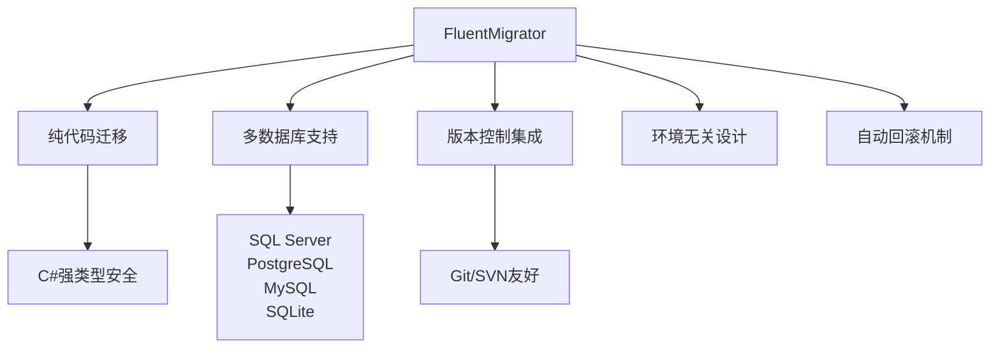

### 简介

#### 概念定位

* `FluentMigrator` 是一个基于 `“流式 API”`（`Fluent API`）的 `.NET` 数据库版本迁移框架。

* 核心目标：以代码形式对数据库结构（`Schema`）进行增量变更管理，支持 `SQL Server、PostgreSQL、MySQL、SQLite、Oracle` 等多种数据库。

* 核心优势：

    1. 可读性高：以链式方法描述表、列、索引等，而非手写 `SQL`；

    2. 可编程：可借助 `C#` 逻辑（条件、循环）来生成迁移；

    3. 可版本化：每个迁移都有唯一版本号，保证在不同环境中有序执行；

    4. 可回滚：内置 `Down` 方法，支持自动回退。

#### 核心价值

1. 传统 SQL 脚本管理的痛点

|  问题   |  影响   |  FluentMigrator 解决方案   |
| --- | --- | --- |
|  脚本执行顺序混乱   |  数据库状态不一致   |  版本号强制顺序执行   |
|  环境差异处理困难   |  开发/测试/生产不一致   |  代码统一管理所有环境   |
|  回滚机制缺失   |  错误修复困难   |  支持 Up/Down 双向迁移   |
|  状态追踪困难   |  不知当前数据库版本   |  内置版本追踪表   |
|  团队协作冲突   |  合并冲突频发   |  代码合并更简单   |

2. 核心优势



### 安装与配置

1. `NuGet` 引入

在项目（建议单独建一个 `Migrations` 项目）中安装：

```shell
dotnet add package FluentMigrator
dotnet add package FluentMigrator.Runner
dotnet add package FluentMigrator.Runner.SqlServer
dotnet add package FluentMigrator.Runner.MySql
```

注意先得有 `ADO` 驱动包，例如：`MySql.Data`

```xml
<Project Sdk="Microsoft.NET.Sdk">

    <PropertyGroup>
        <OutputType>Exe</OutputType>
        <TargetFramework>net9.0</TargetFramework>
        <ImplicitUsings>enable</ImplicitUsings>
        <Nullable>enable</Nullable>
    </PropertyGroup>

    <ItemGroup>
      <PackageReference Include="FluentMigrator" Version="7.1.0" />
      <PackageReference Include="FluentMigrator.Runner" Version="7.1.0" />
      <PackageReference Include="FluentMigrator.Runner.MySql" Version="7.1.0" />
      <PackageReference Include="MySql.Data" Version="9.4.0" />
    </ItemGroup>

</Project>
```

若要在 `.NET Core CLI` 中使用，可额外安装：

```shell
dotnet tool install --global FluentMigrator.DotNet.Cli
```

2. 配置 `Runner`

在 `.NET Core` 控制台或 `ASP.NET Core` 的 `Program.cs` 中：

```csharp
using FluentMigrator.Runner;

var serviceProvider = new ServiceCollection()
    .AddFluentMigratorCore()
    .ConfigureRunner(rb => rb
        .AddSqlServer()                                    // 指定数据库类型
        .WithGlobalConnectionString(Configuration.GetConnectionString("Default"))
        .ScanIn(typeof(Program).Assembly).For.Migrations()
    )
    .AddLogging(lb => lb.AddFluentMigratorConsole())       // 控制台日志
    .BuildServiceProvider();

// 执行迁移
using var scope = serviceProvider.CreateScope();
var runner = scope.ServiceProvider.GetRequiredService<IMigrationRunner>();
runner.MigrateUp();   // 或 runner.MigrateDown(targetVersion);
```


### 核心概念

* `Migration`（迁移类）

    * 每个迁移类继承自 `Migration`，通过 `Version` 属性或构造参数指定版本号（通常为 `yyyyMMddHHmm` 形式）。

    * 重写 `Up()` 和 `Down()` 方法，分别描述版本升级和降级的操作。

* `Runner`（运行器）

    * `IMigrationRunner` 提供执行、回滚、版本查询等功能。

    * 通过依赖注入或 `CLI` 工具触发。

* 版本表

    * 默认在数据库中维护一张 `VersionInfo` 表，用于存储已执行的迁移版本号集合。

### 创建与执行迁移

#### 编写迁移

```csharp
[Migration(202507150901)]
public class CreateUsersTable : Migration
{
    public override void Up()
    {
        Create.Table("Users")
            .WithColumn("Id").AsInt32().PrimaryKey().Identity()
            .WithColumn("Username").AsString(100).NotNullable()
            .WithColumn("Email").AsString(200).Nullable()
            .WithColumn("CreatedAt").AsDateTime().WithDefault(SystemMethods.CurrentUTCDateTime);
    }

    public override void Down()
    {
        Delete.Table("Users");
    }
}
```

* `Create.Table()、.WithColumn()、.AsXxx()`：流式构造表结构。

* `SystemMethods.CurrentUTCDateTime`：框架内置常用 `SQL` 函数。

#### 执行迁移（CLI）

常用命令参数

|  参数   |  说明   |  示例   |
| --- | --- | --- |
|  `-c`   |  连接字符串   |  `-c "Server=.;Database=Test;..."`   |
|  `-p`   |  数据库提供程序   |  `-p sqlserver2016`   |
|  `-a`   |  迁移程序集   |  `-a "Migrations.dll"`   |
|  `-t`   |  版本号   |  `-t 202306010002`   |
|  `-o`   |   输出 SQL 到文件  |  `-o migrations.sql`   |
|  `--preview`   |  预览模式   |  `--preview`   |

### 迁移文件详解

#### 基本迁移结构

```csharp
[Migration(202305010001)] // 唯一版本号
public class InitialSchema : Migration
{
    public override void Up()
    {
        // 升级操作
        Create.Table("Users")
            .WithColumn("Id").AsInt32().PrimaryKey().Identity()
            .WithColumn("Name").AsString(100).NotNullable()
            .WithColumn("CreatedAt").AsDateTime().NotNullable().WithDefault(SystemMethods.CurrentDateTime);
    }

    public override void Down()
    {
        // 回滚操作
        Delete.Table("Users");
    }
}
```

#### 常用操作示例

创建表

```csharp
Create.Table("Products")
    .WithColumn("Id").AsInt32().PrimaryKey().Identity()
    .WithColumn("Name").AsString(100).NotNullable()
    .WithColumn("Price").AsDecimal(10, 2).NotNullable()
    .WithColumn("CategoryId").AsInt32().ForeignKey("Categories", "Id");
```

修改表结构

```csharp
Alter.Table("Users")
    .AddColumn("LastLogin").AsDateTime().Nullable()
    .AlterColumn("Name").AsString(150).NotNullable();
```

创建索引

```csharp
Create.Index("IX_Users_Email")
    .OnTable("Users")
    .OnColumn("Email").Ascending()
    .WithOptions().Unique()
    .WithOptions().NonClustered();
```

数据迁移

```csharp
Insert.IntoTable("AuditLog")
    .Row(new { Action = "PriceUpdate", UserId = 1, Timestamp = DateTime.UtcNow });
```

执行自定义 `SQL`

```csharp
[Migration(2025071505)]
public class CustomSqlMigration : Migration
{
    public override void Up()
    {
        Execute.Sql("UPDATE Users SET Age = Age + 1 WHERE Name LIKE 'J%'");
    }

    public override void Down()
    {
        Execute.Sql("UPDATE Users SET Age = Age - 1 WHERE Name LIKE 'J%'");
    }
}
```

### 高级特性

#### 事务控制

```csharp
[Migration(202306010003, TransactionBehavior.None)] // 禁用事务
public class LargeDataMigration : Migration
{
    public override void Up()
    {
        // 大数据迁移操作（分批次执行）
        Execute.WithConnection((conn, trans) => 
        {
            // 手动事务控制
            using var cmd = conn.CreateCommand();
            cmd.CommandText = "INSERT ...";
            cmd.ExecuteNonQuery();
        });
    }
}
```

#### 环境特定迁移

```csharp
[Migration(202306150004)]
[Tags("Development", "Staging")] // 只应用于特定环境
public class AddTestData : Migration
{
    public override void Up()
    {
        if (ApplicationEnvironment.Current == "Development")
        {
            Insert.IntoTable("Users")
                .Row(new { Name = "TestUser", Email = "test@example.com" });
        }
    }
}
```

#### 条件迁移

* 使用 `IfDatabase()` 适配不同数据库：

```csharp
IfDatabase("SqlServer").Create.Table("Users").WithColumn("Id").AsInt32();
```

#### 集成 CI/CD

* 在启动时运行迁移，或使用 `dotnet fm` 工具

```shell
dotnet fm migrate -p sqlite -c "Data Source=test.db" -a Migrations.dll
```

#### 自定义迁移基类

```csharp
public abstract class AuditMigration : Migration
{
    protected void AddAuditColumns(string tableName)
    {
        Alter.Table(tableName)
            .AddColumn("CreatedBy").AsString(50).NotNullable().WithDefaultValue("system")
            .AddColumn("CreatedAt").AsDateTime().NotNullable().WithDefault(SystemMethods.CurrentDateTime)
            .AddColumn("UpdatedBy").AsString(50).Nullable()
            .AddColumn("UpdatedAt").AsDateTime().Nullable();
    }
}

[Migration(202307010005)]
public class AddAuditToProducts : AuditMigration
{
    public override void Up() => AddAuditColumns("Products");
}
```

#### 数据库特定语法

```csharp
public override void Up()
{
    IfDatabase("sqlserver").Create.Column("RowVersion").OnTable("Users").AsCustom("ROWVERSION");
    IfDatabase("postgres").Create.Column("RowVersion").OnTable("Users").AsInt64().WithDefaultValue(0);
}
```

### 回滚与版本控制

* 回滚策略

    * `runner.MigrateDown(long version)`：回退到指定版本，所有高于该版本的 Up 操作都会执行其 Down。

    * `runner.Rollback(int steps)`：回退指定步数。

* 版本表管理

    * 迁移执行后，`Runner` 会在 `VersionInfo` 表中插入记录。

    * 手动清理、或在测试数据库初始化时，可先 `runner.ListMigrations()`、再 `runner.MigrateDown(0)` 全部回滚。

### 进阶特性

#### 标签（Tags）

* 可给迁移打标签，按环境有选择地执行：

```csharp
[Migration(202507150901, TransactionBehavior.Default, "dev","test")]
public class DevOnlyMigration : Migration { … }
```

* `Runner` 执行时传入 `Tags = new[] { "test" }`，只运行标记匹配的迁移。

#### 事务控制

* 默认每个 `Up()/Down()` 在单个事务中执行，可通过   `TransactionBehavior.None` 禁用事务包裹。


#### 自定义脚本与模板

* 在 `Up()` 中可调用 `Execute.Sql("…")`，执行任意 `SQL`。

* 支持加载嵌入资源脚本：

```csharp
Execute.EmbeddedScript("Namespace.Scripts.SeedData.sql");
```

#### 多数据库分支

* 通过条件判断在 `Up()` 中针对不同 `RunnerContext.Provider` 执行不同逻辑，实现一个迁移类多库支持。

#### Preview 与 Dry‑Run

* 使用日志器拦截生成的 `SQL`，而不真正执行，适合代码 `review` 或审计。

### 与 Entity Framework 迁移对比

|  特性   |  FluentMigrator   |  EF Core Migrations   |
| --- | --- | --- |
|  数据库支持   |  广泛（20+种）   |  主流数据库   |
|  ORM 依赖   |  无   |  依赖 EF Core   |
|  迁移控制  |  精确控制   |  自动生成   |
|  复杂操作   |  支持原生 SQL   |  限制较多   |
|  版本管理   |  显式版本号   |  自动排序   |
|  回滚能力   |  完整 Down 脚本   |  部分支持   |
|  适用场景   |  复杂企业系统   |  EF Core 项目   |

### 最佳实践

1. 版本号规范

    * 建议使用 `UTC` 时间戳（如 `202507150901`），保证版本唯一且可排序。

2. 小步提交

    * 每个迁移专注一个功能点，避免合并冲突。

3. 编写 `Down`

    * 同步维护 `Down()` 方法，以便紧急回退；如果不支持，可在类上标记跳过回滚。

4. 环境隔离

    * 在测试/本地环境使用内存或专用数据库，避免干扰生产。

5. 审计与审查

    * 将迁移代码纳入代码审查流程，必要时开启 `Dry‑Run`，打印 `SQL` 预览。

6. 脚本化种子数据

    * 如需初始化必备字典表，可在迁移中引入嵌入式 `SQL` 脚本而非硬编码。

### 资源与扩展

* GitHub：https://github.com/fluentmigrator/fluentmigrator

* 文档：https://fluentmigrator.github.io

* NuGet 包：

    * `FluentMigrator`：核心迁移框架。

    * `FluentMigrator.Runner`：运行器。

    * `FluentMigrator.Runner.SqlServer`：SQL Server 支持。

* 扩展工具：

    * `Alt.FluentMigrator.VStudio`：Visual Studio 集成，简化迁移生成。

    * `dotnet-fm`：命令行工具，执行迁移。